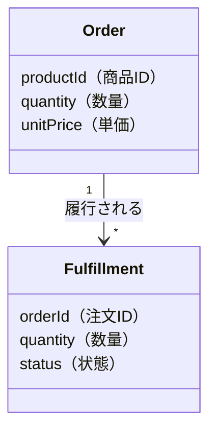

# Concept Design — 概念設計の壁打ち

現実世界の出来事をどんな概念で捉え、どう名付けるかを、コードを書く前にユーザーと対話して固めるスキル。

参考: [概念設計が、その後のコードの命運を左右する](https://zenn.dev/takeshi_teshima/articles/bae79b2f0f97be)（takeshi_teshima）

## 前提・心構え

概念設計とは「何をいくつ、いくらで買ったか」を **Order** と名付け、「その約束をどう履行したか」を **Fulfillment** と名付ける、という営みである。`Order` に `shippingStatus` を持たせた世界線では、配送中の破損に「0円注文の追加」で帳尻を合わせることになり、以後すべてのコードが「本物の購入」と「交換品」を区別するルールを背負う。概念を正しく切った世界線では、破損時に Fulfillment を1つ追加するだけで現実を正確に表現できる。

良い概念設計は3つの利益をもたらす。

1. **未来仕様の自動実装** — 分割発送の要望が来ても「一つの Order に複数の Fulfillment」で自然に対応できる
2. **バグの予防** — 購買データに配送上の事象が混入しないため、「交換品は売上から除外する」といった条件分岐の必要性そのものが消える
3. **コードの自明性** — 「Bookshelf が Book を並べる」という表現は、何年後に読んでも設計意図が残る

このスキルの仕事は、画面・API・DB の話に落とす**前**に概念を固めることである。実装の話が始まりそうになったら概念の話に引き戻す。

## 対話の進め方（全 Step 共通）

- **一度に質問しすぎない。** 1回のやり取りで聞くのは 1〜2 論点まで。各 Step に列挙されている項目は「その Step で埋めるべきチェックリスト」であり、まとめて一度に投げる質問リストではない。ユーザーの説明で既に埋まっている項目は聞き直さず、残りを 1〜2 論点ずつ順に聞く
- 選択式で聞ける論点は AskUserQuestion ツールを使う（利用できない環境では、チャットで番号付きの選択肢を提示する）
- ユーザーの発言を**現場の言葉のまま**記録する。「受注」「出荷」「再送」のような語彙の違いは Step 2 の重要な材料になる
- 各 Step の終わりに「ここまでの理解」を短くまとめてユーザーに提示し、ズレがないか確認してから次に進む
- **判断に迷ったら概念テストで決める。** 概念を分けるべきか、どの名前を採用するかなど、どの Step でも判断に迷ったら感覚で決めない。候補ごとに Step 4 の要領で要望を言い直してみて、最も自然に語れるものを選ぶ
- ユーザーが既に十分な情報を出している Step はスキップしてよい。ただし Step 4（概念テスト）だけは省略しない

## Step 0: 文脈把握 — 既存概念を知る

新しい概念は既存概念との関係の中に置かれる。プロジェクトに以下があるか確認し、**見つかったものだけ**読んで、**現在システムに存在する概念の一覧**を頭に入れる（全部揃っている必要はない）。

- 設計ドキュメント（`docs/design*.md` など）
- ADR（`docs/adr/` など）
- DB スキーマ定義・共有型定義（Drizzle スキーマ、`shared` パッケージの型など）
- 既存の概念設計ドキュメント（`docs/concept/` — このスキルの過去の成果物）
- ロール一覧（`docs/concept/roles.md` — このスキルが維持するファイル。なければ Step 6 で作る）

1つも見つからないプロジェクトなら、ユーザーに「いまシステムにある主要な概念（エンティティ）を3〜5個挙げてください」と聞くだけでよい。

## Step 1: 現実の言語化 — 何が起きるのかを聞く

要望を機能の言葉ではなく**現実世界の出来事**として言語化してもらう。聞くこと：

1. **現実世界で何が起きるのか？** — 「ユーザーが◯◯できるようにしたい」ではなく「顧客が『何を、いくつ、いくらで買う』と宣言する」「倉庫が『何を、いくつ届けたか』を記録する」のレベルまで具体化する
2. **関係者は誰か？** — この出来事を扱う人・部門・外部システムをすべて挙げてもらう。`docs/concept/roles.md` があれば既知ロールを提示し、「今回関わるのはどれか」「新しく登場するロールはいるか」の差分だけ聞く。新ロールが出たら一文定義と関心事を確認する
3. **時間軸はどうなっているか？** — 出来事は一度きりか、繰り返すか、後から覆るか（キャンセル・再試行・差し戻し）

「後から覆るケース」は概念の切れ目が露出しやすい急所なので必ず聞く。ここで得た回答は Step 4 の概念テストの材料としてそのまま使い回してよい（同じことを二度聞かない）。

## Step 2: 概念の候補出し — 2つの手掛かり

Step 1 の材料から、切り出すべき概念の候補を挙げる。手掛かりは2つ。

### 手掛かり A: 関係者ごとのメンタルモデルの違い

担当する人・組織・システムコンポーネントが違うなら、頭の中のモデルも違っていないかと疑う。同じ「注文」でも、注文受付担当には「顧客が何を、いくつ、いくらで買ったか」に見え、物流担当には「何を、いくつ、まだ届ける必要があるか」に見える。**扱う人が変わった途端に語彙も操作も関心事も変わる場所には、概念の境界が隠れている。**

個人開発など関係者が1人しかいない場合は、「利用者視点／管理者視点／外部システム視点」のように**ロール**で読み替えて同じ問いを立てる。

### 手掛かり B: 変更の主体・理由・タイミング

**別々の主体が、別々の理由で、別々のタイミングに変更するものは、異なる概念の可能性が高い。**「このデータを書き換えるのは誰か？　いつか？　なぜか？」を属性ごとに問う。注文受付システムが書くフィールドと、倉庫・配送システムが書くフィールドが同じレコードに同居していたら、分離を検討する。

候補が出たら「分離パターンカタログ」（末尾）に類例がないか照合し、あればユーザーに提示して議論の足場にする。

## Step 3: 命名の吟味 — 「それしかない名前」を探す

**「まあこれで通じる」名前ではなく、できるだけ「それしかない名前」を探す。** 命名は単なるラベル付けではなく、関係者が現実をどう概念として認識するかを左右し、そのコードで何ができて何ができないかまで大まかに決めてしまう。

手順：

1. 概念が指す現実を丁寧に言語化する — 「顧客が『何を、いくつ、いくらで買う』と宣言した明細」「その約束のうち『何を、いくつ届けるか』を表す履行の単位」
2. 現場の言葉を観察する — 営業は「受注」、倉庫は「出荷」、サポートは「再送」と呼んでいるなら、同じレコードの状態を違う言葉で呼んでいるのではなく、**最初から違う対象を頭に浮かべている**のかもしれない
3. 候補名ごとに、その名前が許す責務・許さない責務を言ってみる — 「Fulfillment という名前を選んだなら、そこに『顧客がいくらで払ったか』を持たせてよいはずがない」。名前そのものが責務の境界を教えてくれる
4. 複数候補で迷ったら AskUserQuestion で提示する。各候補に「この名前だと◯◯を持つのが自然／不自然になる」という含意を添える

## Step 4: 概念テスト — 既存概念で言い直す（省略不可）

要望を画面・API・DB の話へ落とす前に、**いまシステムに存在する概念（＋今回の新概念）だけを使って言い直してみる。**

1. 「ユーザーに何をできるようにしたいのか」を確認する
2. その要望に関わるロール（利用者・管理者・外部システムなど、Step 2 で挙げた関係者）を挙げる
3. 「そのときシステムの世界では、**誰が、何に対して、何をする**ことになるのか」を正確な言葉で書き下す。**複数ロールに関わる要望は、ロールごとに言い直しを書く**（単一ロールの要望まで機械的に全ロール分書く必要はない）
4. その文章が、それぞれの概念にとって**「本来できて当然のこと」**になっているかを見る。**ロール間で同じ概念の説明が食い違う場合**（受付担当の文では「買った明細」なのに、倉庫担当の文では「届けるべきもの」になる等）**は、1つの概念が二役をしている兆候**なので Step 2 に戻って分離を検討する

判定例（書籍アプリで「本を好きな順に本棚に並べたい」）：

- ❌ 「Book が、自分が棚の何番目に表示されるかを持つ」 — 少し妙である。Book は棚を知る立場にない
- ✅ 「Bookshelf が Book を並べる」「Bookshelf 上に Book の Placement がある」 — ずっと自然

言い直しが不自然なら Step 2〜3 に戻って概念を切り直す。**自然に語れるなら、実装も破綻しない可能性が高い。** 将来ありそうな要望を 2〜3 個ユーザーに挙げてもらい、それぞれ概念テストにかけると設計の頑健さが確認できる。

## Step 5: KISS/YAGNI チェック — 過剰設計になっていないか

概念を切り出すことは YAGNI 違反ではないか、を最後に**エージェント自身がセルフチェック**する（ユーザーへの質問ではない）。整合の原則：

> **まず現実を無理なく表現できる概念を置く。その制約の内側で、必要な機能に対して最もシンプルで直接的な実装を選ぶ。**

- 「いま必要なコード量が最小の方」を選ぶのが KISS/YAGNI ではない。フラグ1つで済ませた帳尻合わせは、以後コードと運用のあちこちに波及し続ける
- 逆に、**現実に存在しない出来事のための概念**を「いつか使うかも」で置くのは YAGNI 違反。概念は現実の言い直し（Step 1）に根拠があるものだけ置く
- 判断に迷ったら「この概念は現実のどの出来事に対応するか？」を自分に問う。答えられなければ削る候補としてユーザーに提案し、削るかどうかの最終判断はユーザーに委ねる

## Step 6: ドキュメント書き出し

概念モデルが固まったら `docs/concept/{kebab-case-name}.md` に書き出す（ディレクトリがなければ作成する）。**チャットにドラフト全文を貼り付けない。**

- ファイル名は機能名ではなく**主要な概念の組**を kebab-case で表す（例: `order-fulfillment.md`、`loan.md`）
- 以下のフォーマットに従う。`{...}` は記入指示、表中の Order/Fulfillment などは**記入例**であり、実際の内容にすべて置き換える
- 概念間の関係図は **Mermaid の `classDiagram`** で描く（GitHub・VS Code でそのままレンダリングされる）。ルール：
  - 概念＝クラス、「持つもの」＝属性、関係＝多重度付きの関連線。概念一覧の表と内容を一致させる
  - 各メンバ（属性）は英語名の後ろに全角括弧で日本語訳を添える（例: `title（タイトル）`）
  - メソッド・継承・実装都合の型は書かない。図は実装のクラス図ではなく概念の地図である
  - 関連線にはラベル（「履行される」「並べる」など、関係を表す動詞）を付ける
- 「概念テストの記録」の関係ロール列には `docs/concept/roles.md` のロール名をそのまま使う。**roles.md がなければ、今回登場したロールだけで新規作成する**。既にある場合も、新ロール・新しい語彙の発見があれば追記する（最初から網羅しようとしない。概念設計に登場したロールだけを都度追記する）

フォーマット：

````markdown
# 概念設計: {対象の日本語名}

## 背景

{どんな要望・違和感からこの設計を行ったか。1〜3文}

## 概念一覧

| 概念 | 一文定義 | 責務（持つもの） | 持たないもの |
|------|---------|----------------|-------------|
| Order | 顧客が「何を、いくつ、いくらで買う」と宣言した明細 | productId, quantity, unitPrice | 配送状態 |
| Fulfillment | その約束のうち「何を、いくつ届けるか」を表す履行の単位 | orderId, quantity, status | 金額 |

## 概念間の関係



## 概念テストの記録

| 要望 | 関係ロール | 概念での言い直し | 判定 |
|------|-----------|----------------|------|
| 分割発送したい | 倉庫担当 | 一つの Order に複数の Fulfillment がある | ✅ 自然 |

{複数ロールに関わる要望は、ロールごとに行を分けて記録する}

## 命名の検討ログ

| 採用名 | 棄却案 | 理由 |
|--------|--------|------|
| Fulfillment | Shipping, Delivery | 配送手段に限らず「約束の履行」全般を表すため |

## 未決事項

- {今回決めなかったこと・いつ決めるか}
````

`docs/concept/roles.md` のフォーマット（表中の行は記入例）：

```markdown
# ロール一覧

概念設計ドキュメント（docs/concept/*.md）で使うロールの共通定義。
ロール名はここに書いたものを正とし、各ドキュメントで表記を揺らさない。

| ロール | 一文定義 | 関心事・使う語彙の例 |
|--------|---------|-------------------|
| 倉庫担当 | 商品を顧客へ出荷する担当者 | 出荷、在庫、「何をいくつ、まだ届ける必要があるか」 |
```

「関心事・使う語彙の例」列は Step 2 の手掛かり A（語彙が変わる場所に概念の境界が隠れている）の材料になるため、対話中に拾った現場の言葉を書き溜めておく。

## Step 7: サブエージェントレビュー → ユーザーへレビュー依頼

書き出したドキュメントを、**対話の文脈を持たないサブエージェント**にレビューさせる。対話を重ねた本体エージェントは自分の概念モデルが自然に見えてしまう（確証バイアス）ため、フレッシュな文脈からの攻撃で盲点を洗い出す。

general-purpose サブエージェントを1体起動し、**書き出した概念設計ドキュメントだけ**を読ませる（対話ログや他ファイルは渡さない。「読むのはこのファイルだけでよい」と明示する）。レビュー観点は以下を固定で指示する。

1. **概念テストの攻撃**: ドキュメントに書かれていない「ありそうな将来要望」を3〜5個自分で考案し、この概念モデルの語彙だけで自然に言い直せるか試す。不自然になるもの・帳尻合わせが必要になるものを報告する
2. **二役の検出**: 各概念が「別々の主体が、別々の理由で、別々のタイミングに変更するもの」を1つのモデルに同居させていないか
3. **命名の含意チェック**: 各概念の名前が、責務欄の内容を「持って当然」とし、「持たないもの」欄の内容を「持つはずがない」とする名前になっているか
4. **単体理解性**: 対話の文脈なしにドキュメントだけ読んで、概念モデルと設計意図が理解できるか（半年後の読者テスト）

指摘は「重大（概念の切り直しに関わる）／軽微（記述の改善）」に分類させて受け取る。

- 軽微な指摘は本体エージェントの判断でドキュメントに反映してよい
- 重大な指摘・判断が割れる指摘は、勝手に反映せず**ユーザーに提示して議論する**（必要なら Step 2〜4 に戻る）

レビュー反映後、ファイルパスをリンク形式でユーザーに伝え、サブエージェントの指摘と対応の要約を添えてレビューを依頼する。

```
[docs/concept/order-fulfillment.md](docs/concept/order-fulfillment.md) を作成しました。
サブエージェントレビューで◯件の指摘があり、△△を反映済みです。確認をお願いします。
```

指摘に基づいてファイルを直接修正する。アーキテクチャ上の意思決定として記録すべき内容（技術選定を伴う等）があれば、adr-creator スキルでの ADR 化を提案する。実装に進む場合は、このドキュメントの概念一覧を型定義の出発点にする（型定義の置き場所や TDD などの実装規約は、プロジェクトの CLAUDE.md・実装系スキルに従う）。

## 分離パターンカタログ

対話中、ユーザーの状況に似たパターンがあれば提示して議論の足場にする。いずれも「1つのモデルが二役をしている兆候」→「分離」の形。

### Order / Fulfillment — 約束と履行

- **兆候**: 注文レコードに `shippingStatus` がある。破損・再送のたびに 0 円注文などの帳尻合わせが生まれる
- **分離**: Order（何をいくつ、いくらで買うと宣言した明細）と Fulfillment（何をいくつ届けるかの履行単位）。再送は Fulfillment の追加にすぎない

### Subscription / Entitlement — 契約と利用権

- **兆候**: `status: "active" | "cancelled"` で機能を出し分けている。「解約後も月末まで使える」「未契約者に1か月無料付与」で破綻する
- **分離**: Subscription（契約、更新するか）と Entitlement（feature と validUntil を持つ利用権）。「契約している」と「利用権を持っている」は最初は一致していただけで、同じ事実ではない。無料付与は Entitlement を1つ作るだけ

### Document / Revision / Approval — 文書と版と承認

- **兆候**: `approved: boolean` を編集時に false へ戻している。戻し忘れがバグになる
- **分離**: Approval は Document 全体ではなく、ある Revision に対する判断。編集後の新 Revision は承認を「無効化された」のではなく、最初から一度も承認されていない。戻し忘れバグの存在余地そのものが消える

### Job / Execution — 仕事の定義と一度の実行

- **兆候**: `status: "running" | "succeeded" | "failed"` を持つ Job にリトライ仕様が来て、「1回目失敗・2回目成功の Job は failed か succeeded か」が答えられない
- **分離**: Job（実行させたい仕事の定義）と Execution（その一度の実行）。Retry という特殊な状態を作ったのではなく、Execution が二回あっただけ
