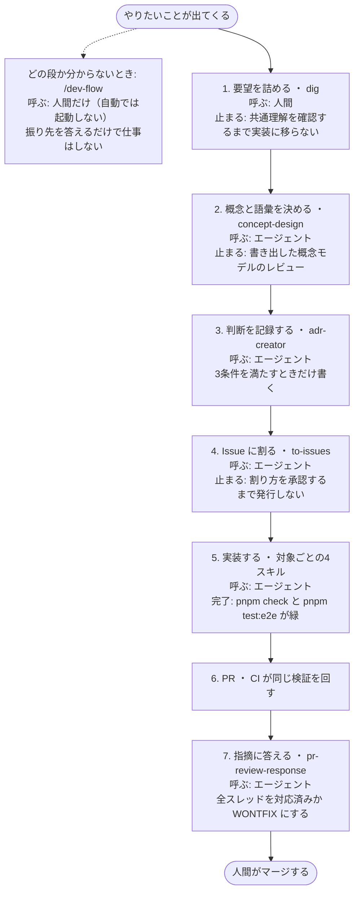
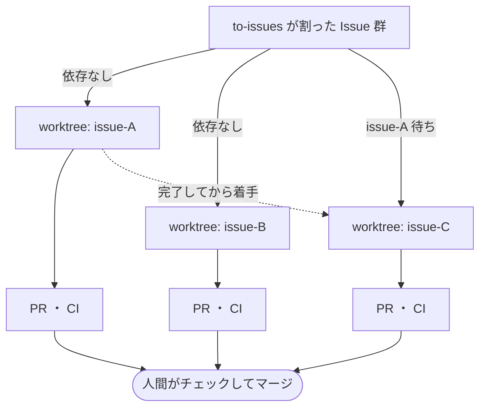

# たく日和

マーダーミステリー・TRPG 向けのセッション管理・卓建て補助 Web アプリです。

## API ドキュメント

**[https://dot-ma801.github.io/taku-biyori/api-doc/](https://dot-ma801.github.io/taku-biyori/api-doc/)**

ブランチごとの Redoc / Swagger UI へのリンクをまとめたページです。`docs/openapi.yml` を変更して push すると自動更新されます。

## 技術スタック

- **パッケージマネージャ**: pnpm (monorepo)
- **Frontend**: Vue 3 + TypeScript + Vite
  - ルーティング: Vue Router
  - 状態管理: Pinia
  - 認証: Better Auth（ソーシャルログインのみ）
  - テスト: Vitest (unit) + Playwright (e2e)
  - リント: ESLint (oxlint) + Prettier
- **Backend**: Hono.js + TypeScript
  - ORM: Drizzle ORM
  - 認証: Better Auth
  - DB: PostgreSQL（Neon）
  - テスト: Vitest
- **Shared**: フロントエンド・バックエンド共通型定義 (Zod)
- **デプロイ**: Vercel

## プロジェクト構成

```
packages/
├── frontend/     # Vue 3 フロントエンドアプリケーション
├── backend/      # Hono.js バックエンドサーバー
└── shared/       # 共通型定義・スキーマ (frontend/backend で共有)
```

## 開発の進め方

コーディングエージェントを中心に、**設計を先に固めてから実装に入る**流れで進めます。

**人間が明示的に呼ぶのは `/dev-flow` と `/dig` の2つだけ**です。残りは依頼の文面から
エージェントが自分で選びます。`/dev-flow` は振り先を答えるだけで、自分では何もしません。

### 全体の流れ



**「止まる」と書いた段は、人間が返事をするまでエージェントが先へ進みません。**
ここを飛ばすと、あとから画面を触って気づく手戻りに変わります。

段5は触る対象で分かれます。

| 対象                    | スキル                |
| ----------------------- | --------------------- |
| API エンドポイント      | `add-api-endpoint`    |
| テーブル・カラム・enum  | `db-schema-change`    |
| frontend の処理ロジック | `tdd-composable`      |
| `components/` の基本UI  | `add-basic-component` |

### 並列に進める



依存が「なし」の Issue は互いに衝突しないので、worktree を分けて同時に進められます。
依存があるもの、**「触るディレクトリ」が重なるものは同時に走らせません**。

```bash
git worktree add ../taku-biyori-issue-<番号> -b claude/issue-<番号>-<要約>
```

### 語彙

利用者に見せる言葉の正は **[`docs/concept/CONTEXT.md`](docs/concept/CONTEXT.md)** です。
一文定義・UI 表記・紛らわしい語の対比・ロールがここに集まっています。
設計の会話でこの表と食い違う言葉が出たら、その場で指摘して更新します。

### Issue の割り方

**1枚の Issue は型・API・画面・テストを貫く縦切り**にします。層（shared / backend / frontend）で
割ると下流が上流の完了を待つことになり、並列に進められません。

影響範囲がコードベース全体に及ぶ改修だけは例外で、expand（新しい形を旧と並べて足す）→
migrate（呼び出し側を移す）→ contract（旧い形を消す）の3段階に分けます。

### 完了の定義

```bash
pnpm check      # ビルド・format・lint・型・ユニットテスト
pnpm test:e2e   # ブラウザで画面を実際に動かす
```

**両方が緑になって完了**です。`pnpm check` に e2e は含まれません（DB とブラウザが必要で、
コミット前チェックとしては重いため別コマンドにしています）。UI を触ったなら
`pnpm test:e2e` を省かないでください。

e2e は開発用ともテスト用とも別のデータベース（`E2E_DATABASE_URL`）を使い、実行のたびに
シードし直します。専用ポート（backend 3100 / frontend 5273）で起動するため、開発サーバーを
上げたままでも走ります。ブラウザの取得だけは初回に1度必要です。

```bash
pnpm --filter @taku-biyori/frontend exec playwright install chromium
```

## セットアップ

### 1. 依存関係のインストール

```bash
pnpm install
```

### 2. 環境変数の設定

#### .env

各パッケージの `.env.example` をコピーして `.env` を作成し、必要な値を設定してください。

**Backend** (`packages/backend/.env`):

```
DATABASE_URL=postgresql://...
TEST_DATABASE_URL=postgresql://.../taku_biyori_test   # リポジトリ層テスト用。開発用とは別の DB
E2E_DATABASE_URL=postgresql://.../taku_biyori_e2e     # e2e 用。上の2つとも別の DB
PORT=3000
BETTER_AUTH_SECRET=your-secret-key
BETTER_AUTH_URL=http://localhost:3000
FRONTEND_URL=http://localhost:5173
GOOGLE_CLIENT_ID=your_client_id
GOOGLE_CLIENT_SECRET=your_client_secret
```

**Frontend** (`packages/frontend/.env`):

```
VITE_API_URL=http://localhost:3000
```

#### その他

プロジェクトルート直下の、`.mcp.json.example` をコピーし、`.mcp.json` を作成し`packages/backend/.env` にて設定した DB の情報に揃える。

### 3. データベースマイグレーション

```bash
pnpm --filter @taku-biyori/backend db:generate
pnpm --filter @taku-biyori/backend db:migrate
```

### 4. 開発サーバーの起動

```bash
pnpm dev
```

- Frontend: http://localhost:5173
- Backend: http://localhost:3000

## コマンド

### ルート（全パッケージ横断）

```bash
pnpm check      # shared ビルド → format → lint → typecheck → test（コミット前に実行する）
pnpm check:ci   # 自動修正なしの検査のみ。CI と同じ
pnpm test:e2e   # e2e。DB の用意とシードは自動で走る
pnpm rules:sync # .rulesync/ から CLAUDE.md / AGENTS.md / .claude/ を生成する
```

### Frontend (`packages/frontend`)

```bash
pnpm --filter @taku-biyori/frontend dev        # 開発サーバー
pnpm --filter @taku-biyori/frontend build      # ビルド
pnpm --filter @taku-biyori/frontend test:unit  # ユニットテスト
pnpm --filter @taku-biyori/frontend test:e2e   # E2E テスト
pnpm --filter @taku-biyori/frontend lint
pnpm --filter @taku-biyori/frontend format
```

### Backend (`packages/backend`)

```bash
pnpm --filter @taku-biyori/backend dev              # 開発サーバー
pnpm --filter @taku-biyori/backend build            # ビルド
pnpm --filter @taku-biyori/backend test             # 全テスト
pnpm --filter @taku-biyori/backend test:unit        # ユニットテスト
pnpm --filter @taku-biyori/backend test:integration # インテグレーションテスト
pnpm --filter @taku-biyori/backend db:generate      # マイグレーションファイル生成
pnpm --filter @taku-biyori/backend db:migrate       # マイグレーション実行
pnpm --filter @taku-biyori/backend db:seed          # 開発用データの投入
pnpm --filter @taku-biyori/backend db:e2e:setup     # e2e 用 DB の作成・マイグレーション・シード
```

### Shared (`packages/shared`)

```bash
pnpm --filter @taku-biyori/shared build  # ビルド（backend テスト前に必要）
pnpm --filter @taku-biyori/shared dev    # ファイル監視モード
```

## 認証（Better Auth）

Google OAuth によるソーシャルログインのみサポートしています。

### Google OAuth の設定

1. [Google Cloud Console](https://console.cloud.google.com/) でプロジェクトを作成
2. OAuth 2.0 認証情報を生成
3. リダイレクト URI に `http://localhost:3000/api/auth/callback/google` を追加
4. 環境変数 `GOOGLE_CLIENT_ID` / `GOOGLE_CLIENT_SECRET` を設定

### 認証 API エンドポイント

- `POST /api/auth/signout` — ログアウト
- `GET /api/auth/session` — セッション情報取得
- `POST /api/auth/signin/social` — ソーシャルログイン
