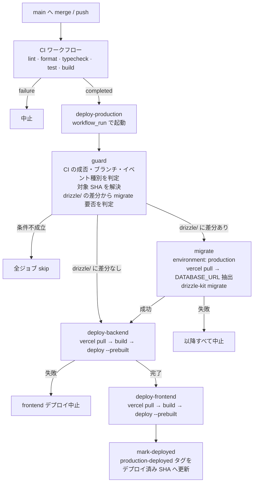

# 本番マイグレーションの CI/CD 自動化 — 設計

対象 issue: [#90](https://github.com/dot-ma801/taku-biyori/issues/90)
意思決定記録: [ADR 0008](./adr/0008-production-migration-in-github-actions.md)

このドキュメントはワークフローの**詳細設計**を扱う。方式選定の判断とその理由は ADR 0008 に、
運用手順（Secrets の登録・緊急時の手順）は [`deployment-guide.md`](./deployment-guide.md) にある。

---

## 目次

1. [背景と到達目標](#1-背景と到達目標)
2. [ワークフロー全体像](#2-ワークフロー全体像)
3. [決定事項](#3-決定事項)
4. [ワークフロー定義](#4-ワークフロー定義)
5. [vercel.json の変更](#5-verceljson-の変更)
6. [導入手順](#6-導入手順)
7. [導入前に検証する項目](#7-導入前に検証する項目)
8. [実装フェーズの検証手順](#8-実装フェーズの検証手順)

---

## 1. 背景と到達目標

現在、本番 DB マイグレーションは開発者のローカルから本番 `DATABASE_URL` を渡して手動実行している。
これにより (a) 本番資格情報がローカルに常駐する、(b) migrate とデプロイの順序が人手依存になる、
(c) 実行記録が残らない、という 3 つの問題が生じている。詳細は ADR 0008 の Context を参照。

到達目標は次の順序が仕組みとして保証された状態である。

```
main へ merge
  → CI（lint / format / typecheck / test / build）成功
      → migrate（Neon 本番。DB 変更が無ければ skip）
          → backend デプロイ
              → frontend デプロイ
                  → production-deployed タグ更新

いずれかが失敗したら、以降はすべて実行されない
```

---

## 2. ワークフロー全体像



ジョブ構成は 5 つ。

| ジョブ | environment | 役割 |
|---|---|---|
| `guard` | — | 起動条件の判定、対象 SHA の解決、migrate 要否の判定 |
| `migrate` | `production` | `drizzle-kit migrate` を本番 Neon に対して実行 |
| `deploy-backend` | `production` | backend を Vercel 本番へデプロイ |
| `deploy-frontend` | `production` | frontend を Vercel 本番へデプロイ |
| `mark-deployed` | — | `production-deployed` タグを更新（`contents: write`） |

---

## 3. 決定事項

### 3.1 トリガーは `workflow_run`（CI の成功を待つ）

`on: push: branches: [main]` 単体では採用しない。テストが落ちているコードを本番 DB へ
適用しうるためである。既存 `ci.yml`（`name: CI`）の完了イベントを受けて起動する。

`ci.yml` は `pull_request` でも走るので、`guard` の条件で 3 つすべてを絞り込む。

| 条件 | 理由 |
|---|---|
| `conclusion == 'success'` | CI が緑であること |
| `event == 'push'` | PR 実行由来の CI で起動しないこと |
| `head_branch == 'main'` | main 以外のブランチで起動しないこと |

`workflow_dispatch` を併設する。`workflow_run` はワークフロー定義が default branch に
存在しないと発火しないため PR 上で E2E 検証ができない。その補完と、Vercel 障害後の再実行に使う。

`paths` フィルタは付けない（`workflow_run` は `paths` を未サポート。migrate 自体は §3.6 でスキップ判定する）。

### 3.2 `concurrency` は `cancel-in-progress: false`

```yaml
concurrency:
  group: deploy-production
  cancel-in-progress: false
```

**migrate 実行中のジョブをキャンセルしてはいけない。** DB が中途半端な状態のまま
次のワークフローが走ると復旧が困難になる。キャンセルせずキューイングし、1 本ずつ完走させる。

### 3.3 checkout する SHA は CI が検証した SHA

`github.event.workflow_run.head_sha` を `guard` の output に載せ、全ジョブがそれを checkout する。
main へ連続 push した場合でも「CI が検証したコミット」と「デプロイするコミット」がズレない。

### 3.4 デプロイは Vercel CLI（`pull` → `build` → `deploy --prebuilt`）

Vercel の Git 連携による本番デプロイを止め（§5）、Actions から明示的にデプロイする。
Deploy Hooks を却下した理由は ADR 0008 の評価表を参照（完了ステータスが返らないため
順序保証と失敗検知が構造的に成立しない）。

`vercel build` は既存 `vercel.json` の `installCommand` / `buildCommand` をそのまま実行するため、
ADR 0007 で決めた Build Output API 方式が唯一の正として維持される。
deploy ジョブ側に個別の `pnpm install` / `shared build` ステップは書かない。

Vercel CLI のバージョンは `@latest` にせず **pin する**。CLI の破壊的変更でビルド挙動が
変わるのを防ぐため。

### 3.5 本番 `DATABASE_URL` は Vercel を単一ソースにする

**GitHub Secrets には本番 `DATABASE_URL` を置かない。**
backend の runtime 用 `DATABASE_URL` は Vercel プロジェクトの env に必ず存在する
（`packages/backend/src/system/infrastructure/config/env.ts` が読む）。
GitHub Secrets にも同じ値を置くと、Neon の資格情報ローテーション時に 2 箇所の更新が必要になり、
片方の更新漏れで migrate だけが古い資格情報で落ちる事故が起きうる。

migrate ジョブも `vercel pull` で本番 env を取得し、そこから接続文字列のみを抽出して使う。

- `.env.production.local` を丸ごと `source` しない。**必要な 1 変数のみ**を `$GITHUB_ENV` に載せる
  （`BETTER_AUTH_SECRET` 等は migrate に不要）
- `::add-mask::` でログ出力をマスクする
- `DATABASE_URL_UNPOOLED` / `POSTGRES_URL_NON_POOLING` が存在すればそれを優先する
  （Neon の pooled 接続経由の DDL を避ける。§7 参照）
- `.vercel/` は `.gitignore` 済みなので runner 上の一時ファイルとして扱える
- `drizzle.config.ts` の `dotenv/config` は既存の `process.env` を上書きしないため干渉しない

GitHub Environments `production` に置く secrets は Vercel 関連の 4 つのみになる。

| Secret 名 | 用途 |
|---|---|
| `VERCEL_TOKEN` | Vercel CLI 認証（migrate / backend / frontend 共通） |
| `VERCEL_ORG_ID` | Vercel チーム / 個人アカウント ID（共通） |
| `VERCEL_BACKEND_PROJECT_ID` | backend プロジェクト ID |
| `VERCEL_FRONTEND_PROJECT_ID` | frontend プロジェクト ID |

repository secrets ではなく **environment secrets** に置く。`ci.yml`（`pull_request` を含む）は
`environment:` を宣言していないため、構造的にこれらへアクセスできない。
将来 CI に手を入れた際に PR トリガーのジョブへ本番資格情報が渡る事故を防ぐ多層防御になる。

> `CLAUDE.md` の環境変数表は「アプリ実行時に読む env」の一覧であり、CI Secrets は別軸の関心事なので
> 混ぜない。CI Secrets 一覧は [`deployment-guide.md`](./deployment-guide.md) 側に置く。

### 3.6 DB 変更が無ければ migrate をスキップする

毎回 migrate を走らせても `drizzle-kit migrate` は冪等な no-op だが、
**変更が無いときに本番 DB へ接続しない**ほうが安全で、Actions の UI でも
「今回のリリースに DB 変更が含まれるか」が一目で分かる。

判定は **`production-deployed` タグとの差分**で行う。デプロイが全て成功したときだけ
このタグを対象 SHA へ進めるので、「前回本番に入った地点」からの差分を正確に取れる。

```
git diff --name-only <production-deployed> HEAD -- packages/backend/drizzle/
```

この方式を選んだ理由:

- **多コミット push でも正確**。`HEAD^` 比較は 1 回の push に複数コミットが含まれると
  古いコミットで追加された migration を見落とし、**誤ってスキップする**（最悪の失敗モード）
- **migrate や deploy が失敗した回はタグが進まない**ため、次回は必ず同じ差分が再検出され再実行される
- drizzle の内部テーブル名など**実装詳細に依存しない**
- 副産物として「いま本番に入っている SHA」がタグとして可視化される

**フォールバック方針**: タグが無い（初回）・`git diff` が失敗する等で判定できない場合は
**必ず migrate を実行する**。誤スキップは危険だが、余分な実行は冪等なので無害という
非対称性に従う。

migrate を skip したときも deploy は続行させたいので、`deploy-backend` にだけ明示的な `if` を書く
（詳細は §3.7）。

### 3.7 失敗したら止める / スキップは通す

`needs` で直列化する。GitHub Actions のジョブは `if` を明示しない場合デフォルトで
`success()` と等価に評価されるため、前段が失敗すれば後続は自動的に skip される。

- `continue-on-error` は**どのジョブにも付けない**
- `if: always()` は**どのデプロイジョブにも付けない**（`needs` の失敗ガードを無効化する）
- 例外は `deploy-backend` の 1 箇所のみ

```yaml
deploy-backend:
  needs: [guard, migrate]
  if: needs.migrate.result == 'success' || needs.migrate.result == 'skipped'
```

`needs` のデフォルト挙動では migrate が skip されると後続も skip されてしまうため、
「DB 変更なしでコードだけデプロイする」ケースを通すにはこの `if` が必要。
`failure` / `cancelled` は通さないので、失敗時の停止は維持される。

### 3.8 マイグレーションの安全性

- **冪等性**: `drizzle-kit migrate` は適用済みマイグレーションを DB 側の管理テーブルで追跡し、
  `packages/backend/drizzle/meta/_journal.json`（commit 済み、現在 14 件）と突き合わせて
  未適用分のみ順に適用する。同一 commit に対する再実行は実質 no-op であり、
  `workflow_dispatch` によるリトライは安全
- **shared build は不要**: `drizzle.config.ts` が参照する 3 つのスキーマファイル
  （`schema.ts` / `game-session-schema.ts` / `lobby-schema.ts`）は `@taku-biyori/shared` に
  依存していない。migrate ジョブは `pnpm install --frozen-lockfile` と Vercel CLI だけで足りる。
  `workflow_run` 間で artifact を共有できない制約は問題にならない
- **トランザクション安全性**: 既存マイグレーション `0000`〜`0013` に
  `CREATE INDEX CONCURRENTLY` 等トランザクション内で実行できない文は含まれていない。
  失敗時の部分適用リスクは現状ない
- **前進のみ**: ロールバック自動化はスコープ外。**後方互換（additive）なマイグレーションを原則とする**。
  詳細は [`deployment-guide.md`](./deployment-guide.md) の expand → contract の項を参照
- **レビュー**: 破壊的変更の検出は PR 上の `packages/backend/drizzle/*.sql` 差分レビューで行う

### 3.9 ローカル直接実行は緊急時 fallback として残す

Actions / Vercel の障害時には唯一の手段になるため削除しない。
「通常運用では使用禁止。緊急時のみ」と明記した専用セクションを
[`deployment-guide.md`](./deployment-guide.md) に設ける。

---

## 4. ワークフロー定義

`.github/workflows/deploy-production.yml`（**実装フェーズで追加する**）

```yaml
name: Deploy Production

on:
  workflow_run:
    workflows: ['CI']
    types: [completed]
  workflow_dispatch:
    inputs:
      ref:
        description: 'デプロイ対象の commit SHA（省略時はこのブランチの最新）'
        required: false

# migrate 実行中のジョブは絶対にキャンセルしない。キューイングして 1 本ずつ完走させる
concurrency:
  group: deploy-production
  cancel-in-progress: false

permissions:
  contents: read

env:
  NODE_VERSION: '22'
  PNPM_VERSION: '10.30.3'
  # CLI の破壊的変更でビルド挙動が変わるのを防ぐため pin する（導入時に安定版を確認して確定）
  VERCEL_CLI_VERSION: '48.2.0'

jobs:
  guard:
    name: Guard
    runs-on: ubuntu-24.04
    # ci.yml は pull_request でも走るので event / head_branch まで絞り込む
    if: >
      github.event_name == 'workflow_dispatch' ||
      (github.event.workflow_run.conclusion == 'success' &&
       github.event.workflow_run.head_branch == 'main' &&
       github.event.workflow_run.event == 'push')
    outputs:
      sha: ${{ steps.resolve.outputs.sha }}
      migrate: ${{ steps.detect.outputs.migrate }}
    steps:
      - name: Resolve target SHA
        id: resolve
        run: |
          if [ "${{ github.event_name }}" = 'workflow_dispatch' ]; then
            echo "sha=${{ github.event.inputs.ref || github.sha }}" >> "$GITHUB_OUTPUT"
          else
            echo "sha=${{ github.event.workflow_run.head_sha }}" >> "$GITHUB_OUTPUT"
          fi

      - uses: actions/checkout@v4
        with:
          ref: ${{ steps.resolve.outputs.sha }}
          fetch-depth: 0
          fetch-tags: true

      # production-deployed タグ（= 前回本番に入った地点）からの差分で migrate 要否を決める。
      # 判定できないときは必ず実行する（誤スキップは危険、余分な実行は冪等なので無害）
      - name: Detect pending migrations
        id: detect
        run: |
          if ! git rev-parse -q --verify refs/tags/production-deployed >/dev/null; then
            echo 'production-deployed タグが無いため migrate を実行します'
            echo 'migrate=true' >> "$GITHUB_OUTPUT"
            exit 0
          fi
          base=$(git rev-parse refs/tags/production-deployed)
          if ! changed=$(git diff --name-only "$base" HEAD -- packages/backend/drizzle/); then
            echo '差分を取得できなかったため migrate を実行します'
            echo 'migrate=true' >> "$GITHUB_OUTPUT"
            exit 0
          fi
          if [ -n "$changed" ]; then
            echo "マイグレーションの変更を検出しました:"
            echo "$changed"
            echo 'migrate=true' >> "$GITHUB_OUTPUT"
          else
            echo 'マイグレーションの変更はありません。migrate をスキップします'
            echo 'migrate=false' >> "$GITHUB_OUTPUT"
          fi

  migrate:
    name: Migrate Production DB
    needs: guard
    if: needs.guard.outputs.migrate == 'true'
    runs-on: ubuntu-24.04
    environment: production
    steps:
      - uses: actions/checkout@v4
        with:
          ref: ${{ needs.guard.outputs.sha }}
      - uses: pnpm/action-setup@v4
        with:
          version: ${{ env.PNPM_VERSION }}
      - uses: actions/setup-node@v4
        with:
          node-version: ${{ env.NODE_VERSION }}
          cache: pnpm
      - name: Install dependencies
        run: pnpm install --frozen-lockfile
      - name: Install Vercel CLI
        run: npm install -g vercel@${{ env.VERCEL_CLI_VERSION }}

      # 本番 DATABASE_URL は Vercel を単一ソースにする（GitHub Secrets には置かない）
      - name: Pull production env from Vercel
        run: vercel pull --yes --environment=production --token="$VERCEL_TOKEN" --cwd packages/backend
        env:
          VERCEL_TOKEN: ${{ secrets.VERCEL_TOKEN }}
          VERCEL_ORG_ID: ${{ secrets.VERCEL_ORG_ID }}
          VERCEL_PROJECT_ID: ${{ secrets.VERCEL_BACKEND_PROJECT_ID }}

      # 必要な 1 変数だけを取り出す（BETTER_AUTH_SECRET 等は migrate に不要なので env へ載せない）。
      # DDL は pooled 接続を避けたいので unpooled があればそちらを優先する
      - name: Resolve DATABASE_URL
        run: |
          env_file=packages/backend/.vercel/.env.production.local
          test -f "$env_file" || { echo "$env_file が見つかりません"; exit 1; }
          url=$(grep -m1 -E '^(DATABASE_URL_UNPOOLED|POSTGRES_URL_NON_POOLING)=' "$env_file" \
                | cut -d= -f2- | tr -d '"' || true)
          if [ -n "$url" ]; then
            echo 'unpooled な接続文字列を使用します'
          else
            # Actions の bash は -eo pipefail なので、grep が空振りしたときのために || true を付ける
            url=$(grep -m1 '^DATABASE_URL=' "$env_file" | cut -d= -f2- | tr -d '"' || true)
            echo 'DATABASE_URL を使用します'
          fi
          test -n "$url" || { echo '接続文字列を取得できませんでした'; exit 1; }
          echo "::add-mask::$url"
          echo "DATABASE_URL=$url" >> "$GITHUB_ENV"

      - name: Run migration
        run: pnpm --filter @taku-biyori/backend db:migrate

  deploy-backend:
    name: Deploy Backend
    needs: [guard, migrate]
    # migrate が skip された場合（DB 変更なし）もデプロイは続行する。
    # failure / cancelled は通さないので、失敗時の停止は維持される
    if: needs.migrate.result == 'success' || needs.migrate.result == 'skipped'
    runs-on: ubuntu-24.04
    environment: production
    steps:
      - uses: actions/checkout@v4
        with:
          ref: ${{ needs.guard.outputs.sha }}
      - uses: pnpm/action-setup@v4
        with:
          version: ${{ env.PNPM_VERSION }}
      - uses: actions/setup-node@v4
        with:
          node-version: ${{ env.NODE_VERSION }}
          cache: pnpm
      - name: Install Vercel CLI
        run: npm install -g vercel@${{ env.VERCEL_CLI_VERSION }}

      # install / build は vercel.json の installCommand / buildCommand が実行するので
      # ここに個別の pnpm install / shared build ステップは書かない（ADR 0007 の構成を唯一の正とする）
      - name: Pull Vercel project settings
        run: vercel pull --yes --environment=production --token="$VERCEL_TOKEN" --cwd packages/backend
        env:
          VERCEL_TOKEN: ${{ secrets.VERCEL_TOKEN }}
          VERCEL_ORG_ID: ${{ secrets.VERCEL_ORG_ID }}
          VERCEL_PROJECT_ID: ${{ secrets.VERCEL_BACKEND_PROJECT_ID }}
      - name: Build
        run: vercel build --prod --token="$VERCEL_TOKEN" --cwd packages/backend
        env:
          VERCEL_TOKEN: ${{ secrets.VERCEL_TOKEN }}
      - name: Deploy
        run: vercel deploy --prebuilt --prod --token="$VERCEL_TOKEN" --cwd packages/backend
        env:
          VERCEL_TOKEN: ${{ secrets.VERCEL_TOKEN }}

  deploy-frontend:
    name: Deploy Frontend
    # backend が Ready になってから frontend を出す（API 契約変更時の順序保証）
    needs: [guard, deploy-backend]
    runs-on: ubuntu-24.04
    environment: production
    steps:
      - uses: actions/checkout@v4
        with:
          ref: ${{ needs.guard.outputs.sha }}
      - uses: pnpm/action-setup@v4
        with:
          version: ${{ env.PNPM_VERSION }}
      - uses: actions/setup-node@v4
        with:
          node-version: ${{ env.NODE_VERSION }}
          cache: pnpm
      - name: Install Vercel CLI
        run: npm install -g vercel@${{ env.VERCEL_CLI_VERSION }}
      - name: Pull Vercel project settings
        run: vercel pull --yes --environment=production --token="$VERCEL_TOKEN" --cwd packages/frontend
        env:
          VERCEL_TOKEN: ${{ secrets.VERCEL_TOKEN }}
          VERCEL_ORG_ID: ${{ secrets.VERCEL_ORG_ID }}
          VERCEL_PROJECT_ID: ${{ secrets.VERCEL_FRONTEND_PROJECT_ID }}
      - name: Build
        run: vercel build --prod --token="$VERCEL_TOKEN" --cwd packages/frontend
        env:
          VERCEL_TOKEN: ${{ secrets.VERCEL_TOKEN }}
      - name: Deploy
        run: vercel deploy --prebuilt --prod --token="$VERCEL_TOKEN" --cwd packages/frontend
        env:
          VERCEL_TOKEN: ${{ secrets.VERCEL_TOKEN }}

  # 全て成功したときだけタグを進める。失敗した回はタグが動かないので、
  # 次回のワークフローで同じ差分が再検出され migrate が再実行される
  mark-deployed:
    name: Mark Deployed
    needs: [guard, deploy-frontend]
    runs-on: ubuntu-24.04
    permissions:
      contents: write
    steps:
      - uses: actions/checkout@v4
        with:
          ref: ${{ needs.guard.outputs.sha }}
      - name: Update production-deployed tag
        run: |
          git tag -f production-deployed "${{ needs.guard.outputs.sha }}"
          git push -f origin refs/tags/production-deployed
```

---

## 5. `vercel.json` の変更

Vercel の Git 連携による**本番デプロイのみ**を止める。PR の preview デプロイは維持する
（レビュー時の目視確認体験を変えないため）。

ダッシュボード設定ではなく `vercel.json` に宣言する方式を採る。
**コードとしてレビュー可能・再現可能**であることを優先した。

```jsonc
// packages/backend/vercel.json / packages/frontend/vercel.json の両方に追記
{
  "$schema": "https://openapi.vercel.sh/vercel.json",
  "installCommand": "...",   // 既存のまま
  "buildCommand": "...",     // 既存のまま
  "git": {
    "deploymentEnabled": { "main": false }
  }
}
```

`packages/frontend/vercel.json` の `outputDirectory` / `rewrites`、
`packages/backend/vercel.json` の「`outputDirectory` を指定しない」（ADR 0007）は**そのまま維持**する。

> この状態で CLI デプロイが通るかは未検証（§7）。通らない場合は Vercel ダッシュボードの
> Ignored Build Step（常に `exit 0`）へフォールバックする。

---

## 6. 導入手順

実装フェーズで行う作業。**リポジトリのコード変更だけでは完結しない**点に注意。

1. **Vercel のトークンと ID を取得する**
   - Account Settings → Tokens で `VERCEL_TOKEN` を発行
   - `VERCEL_ORG_ID` / 各プロジェクトの `VERCEL_PROJECT_ID` は、ローカルで
     `vercel link` 済みなら `.vercel/project.json` から、または Vercel の Project Settings から取得
2. **GitHub Environment `production` を作成する**
   - Settings → Environments → New environment → `production`
   - §3.5 の 4 つを **environment secrets** として登録する（repository secrets には置かない）
   - 本番 `DATABASE_URL` は**登録しない**
3. **Vercel の本番 env に `DATABASE_URL` が入っていることを確認する**
   - migrate はここを単一ソースとして読む
   - `DATABASE_URL_UNPOOLED` / `POSTGRES_URL_NON_POOLING` の有無も確認する（§7）
4. **`vercel.json` に `git.deploymentEnabled` を追記する**（§5）
5. **`.github/workflows/deploy-production.yml` を追加する**（§4）
6. **main へ merge する**
   - `workflow_run` はワークフロー定義が default branch に無いと発火しないため、
     ここまでは PR 上で動作確認できない
7. **`workflow_dispatch` で手動実行し、§8 の検証を行う**
8. **`deployment-guide.md` を新運用に合わせて確定させる**

---

## 7. 導入前に検証する項目

| 項目 | 確認方法 | 未確認だと何が起きるか |
|---|---|---|
| Vercel 本番 env のキー一覧。`DATABASE_URL` が pooled（`-pooler`）かどうか、`DATABASE_URL_UNPOOLED` / `POSTGRES_URL_NON_POOLING` が存在するか | `vercel pull` の結果を確認、または Vercel の Environment Variables 画面 | pooled 接続経由の DDL で PgBouncer 起因のエラーが出うる |
| `git.deploymentEnabled: { main: false }` の実挙動（反映タイミング、preview が維持されるか、その状態で CLI デプロイが通るか） | まず preview で試し、main への push で Vercel に新規 Deployment が作られないことをダッシュボードで確認 | Git 連携デプロイと Actions デプロイが二重に走る、または CLI デプロイが弾かれる |
| `vercel pull` / `build` / `deploy --prebuilt` が `--cwd` 配下（`packages/backend/.vercel/`）に生成・参照するパス | Actions 上で 1 度実行してログを確認 | `.env.production.local` の抽出パスがずれて migrate が失敗する |
| pin する Vercel CLI の安定版バージョン | `npm view vercel version` | `@latest` のまま使うと CLI の破壊的変更でビルド挙動が変わる |
| main への直接 push 時に branch protection の必須 status check が強制されるか | Settings → Branches | `workflow_run` 方式はこの設定に依存しないが、二重の防御として現状を把握しておきたい |

---

## 8. 実装フェーズの検証手順

1. `vercel pull` の出力キーを確認し、migrate が使う接続文字列（pooled / unpooled）を確定する
2. `workflow_dispatch` で手動実行し、migrate が no-op（既適用分をスキップ）で通ることを確認する
3. **DB 変更を含まないコミット**で `migrate` が skip され、`deploy-backend` / `deploy-frontend` は
   走ることを確認する（§3.7 の `if` が効いているか）
4. **DB 変更を含むコミット**で `migrate` が走ることを確認する
   （`production-deployed` タグ作成前の初回は必ず走る）
5. 意図的に壊れたマイグレーションを **preview 用の Neon ブランチ**に対して流し、
   `deploy-backend` 以降が skip されることを確認する
6. デプロイ成功後に `production-deployed` タグが対象 SHA へ進んでいることを確認する
7. Vercel ダッシュボードで **Git push 由来のデプロイが発生していない**ことを確認する
8. PR を立てて **preview デプロイは従来どおり動く**ことを確認する
