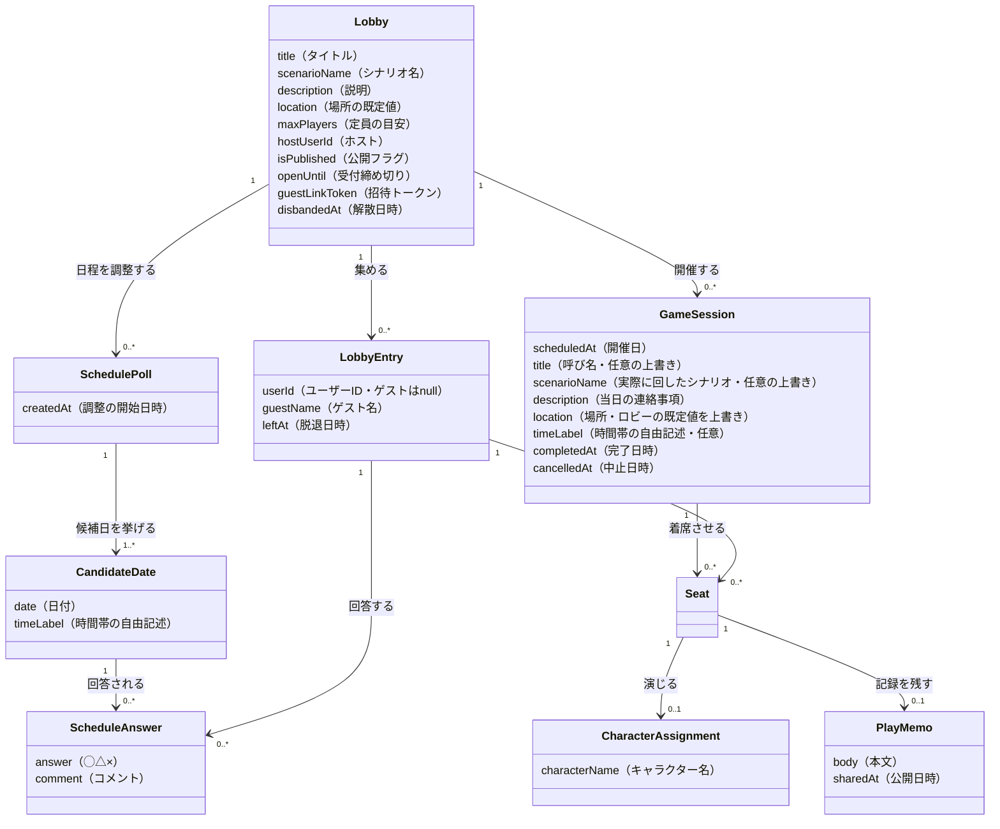

# 概念設計: ロビーとセッション — 企画と開催の分離

## 背景

v1.1 で「募集枠（lobby）」を卓（game_session）から分離したが、現行モデルは「確定は完全な終端。
再調整は新しい募集枠を立て直す」という単一方向の設計になっている。一方、現実の運用では
**リスケ（同じ顔ぶれ・同じシナリオで日程だけ引き直す）** と
**1つの声かけから複数の卓（集まりすぎて2日に分ける等）** の両方が起きる。
現実では継続している企画が、モデル上は確定の瞬間に終わり卓側へ「転生」するため、
title・シナリオ名・メンバーのコピー、`lobby_member_id` による出自突合、
確定時のトークン再発行といった帳尻合わせが生まれていた。
本ドキュメントは「本来どう概念を切るべきだったか」をゼロベースで整理したものである。

> **現行モデルの要約（前提知識）**: 募集枠（lobby）が募集・日程調整を担い、ホストの確定操作で
> `closed_at` がセットされて終端になる。確定時に title・シナリオ・選出メンバーを卓（game_session）へ
> コピーし、メンバーの出自は `game_session_members.lobby_member_id` で突合する。
> ゲスト用トークンは募集枠と卓で別々に発行される。

## 中心となる見立て

**ロビー（企画）は開催を重ねても継続する。セッション（開催）はその一回一回である。**

- 現行の「募集枠」は、確定で死ぬ使い捨ての器だった
- 新モデルの「ロビー」は、オンラインゲームのロビーと同じく
  「マッチ（セッション）のたびに戻ってきて、次を始める場所」
- **ロビーの同一性は企画単位**（「このシナリオを遊ぼう」という1企画）であり、
  グループ単位（顔ぶれの集まり）ではない。参加（LobbyEntry）は「この企画に加わる」という
  表明なので、ロビーを別シナリオに使い回すと**全員の参加表明の意味が事後に書き換わり**、
  上書きを持たない過去セッションの表示も遡って変わってしまう。同じ顔ぶれで別シナリオを遊ぶときは
  新しいロビーを立てる（再招集の手間は未決事項のグループ概念・招待機能で解決する）
- 「募集」は独立した概念ではなく、**ロビーの一状態（受付が開いているか）** に降格する
- 「日程調整」は**繰り返せる独立ユニット**に昇格する（2回目の調整を区別して語る現実があるため）

## 概念一覧

| 概念 | 一文定義 | 責務（持つもの） | 持たないもの |
|------|---------|----------------|-------------|
| Lobby（ロビー） | 「このシナリオをこの面々で遊ぼう」という、開催を重ねても継続する企画 | title, scenarioName, description, location, maxPlayers（定員の目安。超えて集めてよく、絞るのは選出の仕事）, hostUserId, isPublished, openUntil（受付の窓）, guestLinkToken, disbandedAt（企画の解散） | 日程（scheduledAt）、1回分の完了・中止、キャラクター名、`closed_at`（確定＝終端という概念そのものが消える） |
| LobbyEntry（参加） | 「この企画に加わる」という表明（プレイヤーとしても進行役としても）。セッションをまたいで続く。ホストも通常、自分の参加を持つ（現行の「作成時にホストを自動追加」と同じ） | lobbyId, userId（ゲストは null。後からアカウント登録すれば埋まりうる）, guestName, leftAt（脱退。ロビーの disbandedAt と対称。脱退しても過去の着席・メモ・回答は壊れない） | キャラクター名、選出/非選出の結果、◯△×回答そのもの |
| SchedulePoll（日程調整） | 候補日を挙げて◯△×を集める一回の調整。ロビーに 0..n 回起きる | lobbyId, createdAt（新しい調整が始まると古い調整は読み取りの履歴になる。専用の終了ファクトは持たない） | 確定結果そのもの（確定とは「セッションが生まれること」であり、調整が持つ状態ではない） |
| CandidateDate（候補日） | ある日程調整に挙げられた1つの候補日（1日1枠。同じ調整に同じ日付は重複しない） | pollId, date, timeLabel（時間帯の自由記述。「午後」「〜15時」等。任意） | 確定フラグ、構造化された開始・終了時刻、同一日の複数枠（未決事項参照） |
| ScheduleAnswer（回答） | ある参加者による、ある候補日への◯△×の表明。参加者×候補日で1つ（変更は上書き） | candidateDateId, lobbyEntryId, answer, comment | — |
| GameSession（セッション） | 「この日にこの顔ぶれで開く」一回の開催。ロビーに 0..n 個 | lobbyId, scheduledAt（「この日に開くと決めた」という決定のファクト。候補日のコピーではない）, title・scenarioName（任意の上書き。未設定ならロビーを参照して表示。「この開催は実際どうだったか」の記録であり、企画の看板はロビーのまま）, description（当日の連絡事項。VC や部屋の URL・集合情報など）, location, timeLabel（場所・時間帯）, completedAt, cancelledAt | 募集の窓、独自の guestLinkToken、title 等の既定値そのもの（既定はロビーが持ち、表示時に導出する）、構造化された「参考URL」フィールド（description の自由記述で足りる） |
| Seat（着席） | あるセッションにある参加者が着くこと。選出の結果はこれの有無で表現される | gameSessionId, lobbyEntryId | キャラクター名（CharacterAssignment に分離）、◯△×回答、ロビーへの参加そのもの |
| CharacterAssignment（キャラ割り当て） | ある着席者がそのセッションで誰を演じるかの割り当て | seatId, characterName | 選出のファクト |
| PlayMemo（プレイメモ） | 着席者がそのセッションに残す自分の記録 | seatId, body, sharedAt | メンバー情報・表示名 |

> Lobby の属性は「企画のアイデンティティ」（title・scenarioName・description。企画時に決めてほぼ変えない）と
> 「受付の運用」（isPublished・openUntil・guestLinkToken。募集のたびに触る）の2クラスタに分かれる。
> 変更主体はどちらもホストであり概念としては分離しないが、この2面性は自覚しておく
> （募集を独立概念にしない判断は「概念テストの記録」参照）。
>
> **開催ごとの属性の原則**: 開催ごとに現実に変わりうる属性（場所・時間帯・呼び名・実際に回した
> シナリオ・当日の連絡事項）はセッションが持ってよい。ただし**未設定ならロビーを参照**し、
> セッションが値を持つのは「この開催はこうだった」という上書きの記録だけ。
> 表示用の既定値（「{ロビーの title} #1」等）を保存時に書き込むと、ロビー改名に取り残された
> コピーになるため、既定は保存せず表示時に導出する。
> 「2日に分けたら土曜は店A・日曜はオンライン」はセッションごとの location で自然に語れる。

## 概念間の関係

> 図では FK（lobbyId 等）を属性に書かず、関連線で表す（概念一覧の責務欄には所有関係を示すため FK も記す）。
> Seat に属性の箱がないのはこの規約の帰結であり、**Seat が2つの FK だけでできた純粋な選出ファクト**
> であることを示している。
>
> 「卓確定（選出）」という操作は、概念としては
> **「ロビーが候補日を1つ選び、その日に来られる参加者を着席させてセッションを開く」** と言い直される。
> 選出/非選出は Seat の有無であり、専用のファクト（`lobby_member_id` 突合）を必要としない。
>
> **セッションの `scheduledAt` は候補日のコピーではない。** 候補日は「提案」、`scheduledAt` は
> 「この日に開くと決めた」という**決定の新しいファクト**であり、別の出来事である
> （直接卓立ては調整なしで決定するため、この対称性からも「決定は調整の一部ではない」ことが分かる）。
> 「どの調整のどの候補日から生まれたセッションか」の出自リンクは、現実にそれを語る場面がないため
> 持たない（YAGNI）。必要になれば GameSession → CandidateDate の 0..1 参照を後から足せる。

## ステータスの見立て（概念レベル）

状態は DB に持たずファクトから導出する既存方針を踏襲する。

- **ロビー**: `disbandedAt` があれば解散 / `isPublished` が false なら下書き /
  受付が開いているか（`openUntil`）は独立した属性。「確定済み（closed）」という終端状態は存在しない
- **セッション**: 生まれた時点で日程確定済み。`cancelled` / `completed` / `today` / `scheduled` を
  `cancelledAt` / `completedAt` / `scheduledAt` から導出する
- **日程調整**: 「終了」という状態を持たない。調整さんと同じく表は開きっぱなしで、
  最新の調整が常に回答を受け付ける（「調整中」という表示が必要なら UI の見せ方として別途決める。
  回答締切の要望が来たときの拡張は未決事項参照）
- 現行の「募集中 → 日程調整中 → 確定」という一直線のフェーズは、
  「受付が開いているか」「次のセッションがあるか」という**独立した事実**（＋開きっぱなしの調整）に分解される

## 概念テストの記録

| 要望・出来事 | 関係ロール | 概念での言い直し | 判定 |
|------|-----------|----------------|------|
| リスケしたい（同じ顔ぶれで再調整） | ホスト | セッションを1つ中止し、同じロビーで日程調整をもう一度行い、新しいセッションを開く | ✅ 自然 |
| 集まりすぎたので2日に分けたい | ホスト | 1つのロビーが2つのセッションを開く | ✅ 自然 |
| 選ばれなかった人はどうなる？ | 参加者 | ロビーの参加者のまま。そのセッションに着席していないだけ | ✅ 自然（強い言葉が構造から消える） |
| 直接卓立て（日程・メンバー決め打ち） | ホスト | 受付を開かないロビーに、最初からセッションが1つある | ✅ 自然（ゲームの「フレンドロビー」と同型） |
| 欠員が出たので追加募集したい | ホスト | ロビーが受付をもう一度開く | ✅ 自然 |
| 招待リンクを配り直したい | ホスト | ロビーがトークンを再発行する | ✅ 自然（セッション別トークンは不要になる） |
| 開催をやめたい／企画ごとやめたい | ホスト | セッションの中止／ロビーの解散。別の出来事として最初から分かれている | ✅ 自然 |
| プレイメモを書く | 参加者 | 着席者がそのセッションに記録を残す。3回遊べばメモも3つ | ✅ 自然 |
| ロビーを抜けたい（脱退） | 参加者 | 参加が終了する（leftAt）。過去の着席・メモ・回答は壊れない | ✅ 自然 |
| 2日開催で土曜は店A・日曜はオンライン | ホスト | それぞれのセッションが自分の場所を持つ（ロビーの既定値を上書き） | ✅ 自然 |
| ゲストが後からアカウント登録した | ゲスト参加者 | 参加の userId を埋める（着席・メモは参加経由なのでそのまま繋がる） | ✅ 自然 |
| GM（進行役）として立ち会い、メモを残したい | ホスト | ホストも自分の参加を持ち（作成時に自動追加）、進行役として着席してメモを残す。GM/PL の区別は将来の役割属性（未決事項参照） | ✅ 自然 |
| 「月曜午後」「水曜〜15時」の候補を出したい | ホスト | 候補日に timeLabel（時間帯の自由記述）を添える | ✅ 自然（現行 dateNote の意味を「時間帯の記述」として明確化） |
| 同じ日の昼の部・夜の部を別々に◯△×したい | 参加者 | 語れない（1日1枠。カレンダー UI の都合で意図的に落とした） | ⚠️ 未決事項参照 |
| 開催に呼び名を付けたい（「マダミスA 第2回」等） | ホスト | セッションが自分の title を持つ（未設定ならロビーの title で表示） | ✅ 自然 |
| 当日の VC・部屋の URL を伝えたい | ホスト | セッションの description に書く | ✅ 自然（専用の「参考URL」フィールドは自由記述で足りるため切らない） |
| 同じ顔ぶれで別シナリオを遊びたい | ホスト | 新しいロビーを立てる。シナリオはロビーの同一性の一部であり、書き換えると過去セッションの記録まで変わるため使い回さない | ⚠️ 概念としては自然だが再招集が手間（未決事項のグループ概念参照） |
| 続き物の連作シナリオで同じキャラを続投したい | 参加者 | キャラ割り当てを Seat から LobbyEntry 側へ引き上げるかという問いになる | ⚠️ 未決事項参照 |

### 募集を独立概念にするかの検討（棄却）

| 出来事 | 属性案（採用） | 独立概念案（棄却） |
|---|---|---|
| 追加募集 | ロビーが受付をもう一度開く | ロビーが2つ目の募集を出す |
| どの募集で来た人か知りたい | 語れない | 語れる — が、**この出来事を現実に語る場面がない** |
| 1回目の受付はいつ閉じたか知りたい | 語れない（openUntil は上書きで、受付の履歴は残らない） | 語れる — が、同上 |
| 初心者枠・経験者枠を同時募集 | 表現できない | 表現できる — が、**現実に存在しない**（YAGNI） |

日程調整が独立ユニットなのは「2回目の調整」を区別して語る現実（誰がいつ◯だったかは調整ごとに別）が
あるため。募集にはそれに相当する現実がないため、属性に留める。

## 命名の検討ログ

| 採用名 | 棄却案 | 理由 |
|--------|--------|------|
| Lobby / ロビー | 企画（plan / project）、recruitment | オンラインゲームの「マッチ間に戻ってくる場所」のメタファーが継続する企画と一致。既存コード資産も活きる。ただし **UI の日本語ラベルは「募集枠」→「ロビー」に変える**（募集は状態名に降格するため、募集していないロビーを「募集枠」と呼ぶと嘘になる） |
| GameSession / セッション | 開催（occurrence）、公演（performance） | TRPG の現場語「セッション」と一致。Better Auth との衝突は既存の `game` プレフィックス規約で解決済み。「卓」という現場語はどちらかといえば企画（ロビー側）を指すため、1回の開催の名前には使わない |
| Seat / 着席 | gameSessionMember, Seating, SeatedEntry | 「メンバー」は企画（ロビー）側の語彙。1回の開催に着くという事実は「着席」。注意: 英語の seat は「空席になりうる枠」を第一に含意するが、本モデルの Seat は必ず参加者が着いている「着席ファクト」であり、空席（欠員）は Seat では表現しない（欠員＝受付を開く、で語る）。Seating / SeatedEntry も検討したが、日本語「着席」に一語で対応する Seat を維持し、含意のズレはこの注記で対処する |
| SchedulePoll / 日程調整 | Scheduling, ScheduleRound, ロビー直下に candidates を置く（現行） | 「2回目の調整」を区別して語る現実があるため独立ユニットにする。調整さん（候補日×参加者の◯△×表を1枚作る日程調整サービス）の1枚に相当。注意: 一般語の poll は締切と集計結果を含意するが、本モデルでは意図的にどちらも持たない（表は開きっぱなし。ステータスの見立て参照） |
| ScheduleAnswer / 回答 | Answer | 裸の Answer は広すぎる。名前空間（lobby 配下）で絞れるとはいえ、shared の型名や grep では単体で現れるため、SchedulePoll と接頭辞を揃える |
| CandidateDate / 候補日 | Candidate, CandidateSlot | 裸の Candidate は選出（人を選ぶ）と紛らわしいため Date を残す。一度は同一日複数枠（昼の部・夜の部）を許す CandidateSlot（候補枠）を採ったが、カレンダー UI で扱えないため1日1枠に戻した。実態が「1日1つの候補日＋時間帯メモ」である以上、名前も CandidateDate が正直（複数枠の要望が観測されたら名前ごと再検討。未決事項参照） |
| LobbyEntry / 参加 | Participation, lobbyMember, Entry | 「ロビーへの参加表明」であることが名前だけで分かる。Participation は単体では何への参加か読めず、Entry 単体では対応する概念を忘れる。member は状態寄りで、Seat との対比（参加＝ロビーへ / 着席＝セッションへ）が薄れる |
| disbandedAt（Lobby） / 解散 | cancelledAt | 「企画の解散」と「開催の中止」は最初から別の出来事、と主張するモデルが両者に同じ属性名を与えると grep・会話で混線する。別の出来事には別の名前を付ける |

## 現行モデルからの主な差分（帳尻合わせが消える箇所）

| 現行の帳尻合わせ | 新モデルでの消え方 |
|---|---|
| 確定時に title・シナリオ・メンバーを卓へコピー | セッションはロビーを参照し、値を持つのは開催ごとの上書き（実際どうだったかの記録）だけ。既定値の複製が存在しない（`scheduledAt` は候補日の複製ではなく「決定」という新しいファクト） |
| `game_session_members.lobby_member_id` による出自突合 | 選出＝Seat の有無。突合カラム不要 |
| 確定時に `guest_link_token` を新規生成 | トークンはロビーに1つ。セッションは独自の資格情報を持たない |
| 中止が募集枠側と卓側の2概念に割れる | 「企画の解散」と「開催の中止」は最初から別の出来事 |
| `closed_at`（確定＝終端） | 概念ごと消える。ロビーは開催後も生きている |
| 再調整＝新しい募集枠を立て直す | 同じロビーで日程調整をもう一度行うだけ |

## 未決事項

> Ph2 = design-v1 で定義された将来フェーズ（シナリオ管理・キャラクター選択・GM 指定などの拡張計画）。

- **調整の終了ファクト（closedAt）**: 現時点では持たない（調整は開きっぱなし。ステータスの見立て参照）が、
  「回答を締め切りたい」要望は現実味が高いと作者も認識している。必要になったら SchedulePoll に
  closedAt を足す additive な拡張で応えられる。「調整中／締切済み」の表示もそのとき導出に加える
- **同一日の複数枠（昼の部・夜の部）**: カレンダー UI で選択できないため、当面は1日1枠に留める。
  同じ日の昼・夜を別々に◯△×したいという現実の要望が観測されたら、候補日を「候補枠（CandidateSlot）」に
  拡張する（date の unique を外し、timeLabel で枠を区別する変更。命名の検討ログ参照）
- **セッションごとの役割（GM 交代・GM 枠と PL 枠の区別）**: 現モデルの Seat は「着いているか否か」しか
  語れない。「今回だけ GM を交代」は Seat への役割属性の追加で吸収できる見込み。Ph2 の GM 指定と同枠で決める
  （前提: ホストも LobbyEntry を持つため、GM としての着席自体は現モデルで語れる。概念テスト参照）
- **見学者・補欠（キャンセル待ち）**: どちらも「着席か否か」の二値では語れない同型の問題。
  着席させると「選出＝Seat の有無」が濁り、着席させないと「当日いる」「控えている」事実が語れない。
  必要になった時点で Seat の種別として検討する
- **CharacterAssignment のぶら下がり先**: マダミス（毎回役が変わる）では Seat ごとが自然だが、
  続き物の連作シナリオ（同キャラ続投）では LobbyEntry 側が自然。当面は Seat にぶら下げ、
  Ph2 のシナリオ・キャラクター管理の設計時に引き上げの要否を決める
  （Seat 本体は純粋な選出ファクトなので、この判断がどちらに転んでも Seat は影響を受けない）。
  判断材料: 開催前に配役済みの卓をリスケすると、Seat ぶら下げでは新セッションへの配役コピーが
  再登場する。LobbyEntry 側にあれば同一ロビー内のリスケで自動的に引き継がれる
- **仮押さえ（仮確定）**: セッションは生まれた時点で確定であり、仮押さえは「開いて、流れたら中止」で
  しか語れない（cancelledAt が「仮押さえ流れ」と「本当の中止」の二義になる）。要望が現実に来たら検討する
- **グループ（固定メンバーの集まり）**: 「同じ顔ぶれで別シナリオを遊ぶ」再招集を楽にする概念。
  ロビーの上位に置く将来候補だが、メンバー管理を巡る現実の出来事がまだ観測されていないため
  いまは切らない（YAGNI）。まずは「前回の参加者を招待」のような機能で足りるかを見る
- **シナリオの独立概念化**: Ph2 のシナリオ管理機能が来たら Scenario を独立概念にし、
  Lobby が `scenarioName` の代わりに参照する。今回の切り方はこの置き換えを妨げない
- **直接卓立ての参加フロー**: 日程確定済みロビーへの参加は「参加＋着席」を一体の操作として
  提供する必要がある（概念は分かれていても、UI 上は1ボタンでよい）。API 設計時に決める。
  なお「メンバー決め打ち」といってもホストが決めているのは頭の中であり、システム上は本人が
  招待リンクから参加＋着席する（ホストによる代理登録は現行方針どおり持たない）
- **ロビー一覧の表示状態**: `closed` が消えた後、一覧で「次の開催があるロビー／遊び終えた（全セッション
  完了・中止済み）ロビー」をどう見せるか。企画単位である以上、完了した企画のロビーは積み重なっていくが、
  これは現行の完了卓と同じ構造であり、一覧の畳み方という UI 設計の関心事として別途決める
- **移行パス**: 本ドキュメントはゼロベースの概念整理であり、現行実装からの移行計画は含まない。
  移行するかどうか自体を含めて別途判断する
