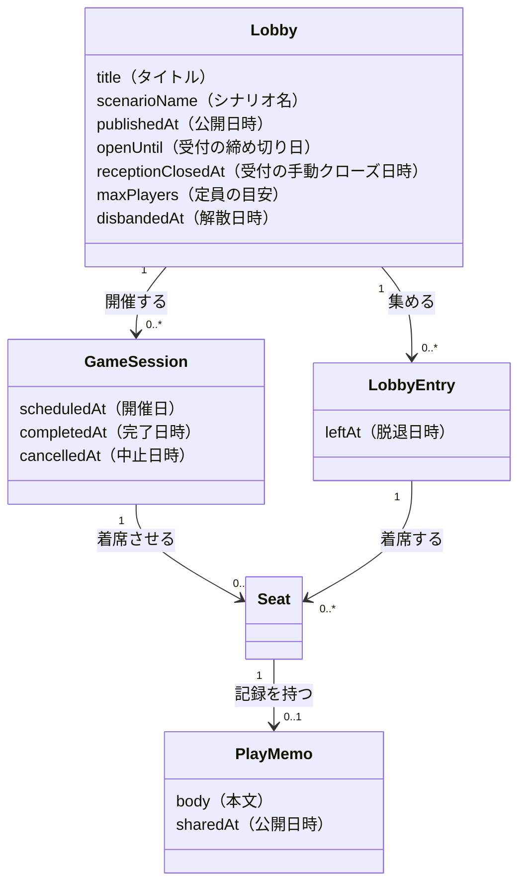

# 概念設計: 卓と開催 — UI が企画と開催を畳む線

> **この文書の位置づけ**: 提案であり、現行仕様ではない。実装の根拠は
> `docs/design/README.md` の「現行版」が指す設計書のまま。
> 本文書は表示層の概念を整理し、**何を観測したら何が決まるか**を残すためのもの。
> バックエンドの概念（Lobby / GameSession / Seat）は変更しない。

## 背景

「卓と募集の概念を分けるべきか」という迷いから始めた整理。結論は **分ける線が1本ずれていた**。

募集は独立概念にしない。[`lobby-game-session.md`](./lobby-game-session.md) の棄却理由は
「追加募集の履歴・どの募集で来た人かを**現実に語る場面がない**」であり、これは今も有効
（この要約を本文に持たないと、半年後に棄却の根拠が辿れなくなる）。

無理が出ていたのは、**バックエンドが 1:N（Lobby 1 : GameSession N）なのに、UI が 1:1 に畳んでいる**ため。
畳むために「代表の開催を1つ選ぶ」処理が要り、それが痛みの共通の出どころだった。

---

## 中心となる見立て

**「卓の状態」という単一の概念は存在しない。** `getLobbyStatus` / `getGameSessionStatus`
（どちらも `packages/shared/src/*/status.ts`。DB カラムではなく**ファクトからの導出**）を読むと、
3つの独立した事実が2つの enum に潰されていると分かる。

```
getLobbyStatus（先頭一致）                     何の事実か
  1. disbandedAt あり          → disbanded    企画の生死・不可逆・1回きり
  2. publishedAt なし          → draft        公開したか・受付以前
  3. receptionClosedAt あり    → closed       受付・ホストの意思
  4. openUntil なし or 今日<=openUntil → open  受付・時間の経過
  5. それ以外                  → closed       受付・時間の経過

getGameSessionStatus（先頭一致）
  1. cancelledAt あり          → cancelled    ホストの意思・取り消しうる決定
  2. completedAt あり          → completed    遊んだという事実
  3. scheduledAt == 今日       → today        時間の経過
  4. それ以外                  → scheduled    時間の経過（未来・**または過ぎたが未完了**）
```

| 事実 | 誰が変えるか | いつ | 可逆か |
|---|---|---|---|
| 企画を畳んだか（解散(disbanded)） | ホスト | 企画の終わり・1回きり | ❌ 不可逆 |
| 受付が開いているか（募集中(recruiting) / 調整中(adjusting)） | ホスト **＋ 時間の経過**（`openUntil`） | 募集のたび・何度でも | ✅ 可逆 |
| 遊んだか・やめたか（開催予定(scheduled) / 完了(completed) / 中止(cancelled)） | ホスト ＋ 時間の経過 | 開催のたび・毎回 | 開催ごと |

別主体・別頻度・別可逆性。分離パターンの Job / Execution（＝仕事の定義と、その一度の実行。
リトライがあると Job 単体の成否が答えられなくなる）と同型で、
「1回目完了・2回目開催予定の卓は 完了(completed) か 開催予定(scheduled) か」に答えられない。
バックエンドは既に Lobby / GameSession に分離済みであり、**割れきっていないのは UI と、状態の enum**。

---

## 概念一覧

表示層の概念。バックエンドの概念との対応は1:1で、**新しいエンティティは足さない**
（「1:1」はこの対応のこと。卓と開催の多重度は 1:N で、別の話）。

| 概念 | 一文定義 | 責務（持つもの） | 持たないもの |
|------|---------|----------------|-------------|
| 卓（Lobby の UI 表現） | 利用者が「この企画」と数える単位。俯瞰するときの単位 | タイトル、シナリオ名、参加者、受付の状態、企画の生死 | 開催日、**開催の状態**、着席、「代表の開催」 |
| 開催（GameSession の UI 表現） | 利用者が「今週の卓」と名指しする単位。共有・振り返りの単位。卓に 0..n | 開催日、場所、時間帯、当日の連絡事項、**開催の状態**、着席、キャラクター名、プレイメモ、タイトル・シナリオ名の**上書き** | 受付の状態、参加者の母集団、独自の招待トークン |

> **数える単位は場面で変わる。** 俯瞰（一覧・探す）は卓、名指し（共有・振り返り・当日）は開催。
> どちらか一方に統一すると必ずもう一方が潰れる。単位が1つに決まらないのが正しい。
>
> 名詞は「開催」（`CONTEXT.md` の UI 表記）。数えるときだけ「第3回」「3回遊んだ」と**回**を使う。

---

## 概念間の関係



`Lobby` に `status` カラムは無い。上の4ファクトから `getLobbyStatus` が毎回導出する。
本文書はこの構造を**変えない**。変えるのは、UI がこれをどう読むかだけ。

---

## 状態名の対応表

3系統の名前が使われている。読み替えが暗黙のままだと追えなくなるため明示する。

| ファクト | `LobbyStatus`（DB 由来の導出値） | `GameSessionCardStatus`（UI の型） | 表示ラベル |
|---|---|---|---|
| `publishedAt` なし | `draft` | `draft` | 下書き |
| 受付が開いている | `open` | `recruiting` | 募集中 |
| 受付が閉じた（enum コメントは「**受付終了**」） | `closed` | `adjusting` | **調整中** |
| `disbandedAt` あり | `disbanded` | `cancelled` | **中止** |

| ファクト | `GameSessionStatus` | `GameSessionCardStatus` | 表示ラベル |
|---|---|---|---|
| 未来、または**過ぎたが未完了** | `scheduled` | `scheduled` | 開催予定 |
| 開催日が今日 | `today` | `scheduled` | 開催予定 |
| `completedAt` あり | `completed` | `completed` | 完了 |
| `cancelledAt` あり | `cancelled` | （本線では出ない） | — |

---

## コードから確定している不具合

実運用の観測を要さず、コードだけから導ける。

| 症状 | 根拠 |
|---|---|
| 1回目完了・2回目開催予定の卓は、1回目が一覧から消える | `resolveGameSessionCardStatus` が代表の開催を1つだけ選ぶ（`pickNewest`） |
| 第一話 完了(completed) ＋ 第二話の日程を調整中の卓が、**調整中のタブに出ず完了に入る** | 同関数の優先順位で「完了した開催あり」が「ロビーの受付状態」より先に評価される |
| 開催を中止しても 中止(cancelled) と表示されず、募集中(recruiting)／調整中(adjusting) に戻る | 中止(cancelled) は `LobbyStatus.disbanded` にしか割り当てられていない |
| バッジ「中止」が二役 | 本線では**解散**、`toGameSessionCards` の `ORPHAN_STATUS` では**開催の中止** |
| 「開催予定だけど追加募集中」が表現できない | 状態を1つに潰す以上、片方しか出せない |
| **調整中(adjusting) が日程調整と無関係** | `SchedulePoll` は `getLobbyStatus` に一度も現れない。**締め切りが過ぎただけの卓**も「調整中」と表示される |
| **完了操作を忘れた過去の開催が、永久に 開催予定(scheduled) のまま** | `GameSessionStatus.scheduled` の定義が「未来・または過ぎたが未完了」 |

`CONTEXT.md` は「解散と中止は別の出来事」と明記しているが、UI のバッジは同じ1枚である。

---

## 提案: 受付の状態をもう一度割る（**未決**）

上の「中心となる見立て」で卓の状態を割ったが、**割った片方が同じ病気を抱えたまま残っている。**
`getLobbyStatus` の5段は3つの別の事実で、「受付の状態」という器に受付でないものが2つ入っている。

- 段1（解散）＝ 企画の生死。不可逆・1回きり
- 段2（下書き）＝ 公開したか。受付以前
- 段3〜5（受付中／受付終了）＝ 受付。可逆・何度でも繰り返す

命名の側から見ても同じ結論になる。4値のうち受付の開閉を素直に表すのは 募集中(recruiting) だけで、
**調整中(adjusting) は「受付が終了した」を、受付と無関係な作業（日程調整）の名前で呼んでいる。**

**割るか、ラベルを直すかは未決。** どちらも固定語彙の変更を伴うため、
[to-issues] に渡す前に決める（「未決事項」参照）。

---

## あるべき導出

### 卓カード

**代表の開催を1つ選ぶのをやめる。** 卓は卓の事実だけから、開催は開催の事実だけから導出する。

| 出すもの | 導出 | 現行との違い |
|---|---|---|
| 受付の状態 | `getLobbyStatus` をそのまま | 開催の状態に上書きされなくなる |
| 次の開催 | 開催予定(scheduled) のうち開催日が最も近い1件 | 「代表」ではなく**次の予定**。無ければ出さない |
| 遊んだ回数 | 完了(completed) の件数 | 現行は出していない |

1枚の卓が「開催予定 かつ 募集中」を**同時に**見せてよい。開催が0件の卓は受付の状態だけを出す。

### 参加者から見た「自分の出番」

`CONTEXT.md` のロール表は参加者の関心事に「自分は選ばれたのか」を挙げているが、
現行モデルは Seat の**不在**に複数の意味を同居させているため答えられない。

| 参加者に見せる | 導出 |
|---|---|
| あなたが出ます | 自分の Seat がある |
| 今回は見送り | 自分の Seat が無い ＋ その開催に Seat が1つ以上ある |
| まだ決まっていません | その開催に Seat が1つも無い |

**穴が2つある。**

1. ホストが1人ずつ着席させていく途中は「見送り」に見える（一括選出の運用なら起きない）
2. `unseat` は**本人にも許可されている**（`permissions.ts`）ため、
   **自分から降りた場合も「見送り」と同じ表示になる**

どちらも起きると分かった時点で、GameSession に「選出を確定した」ファクトを足す／
Seat に降板の理由を持たせる、で解ける。いまは足さない（「未決事項」参照）。

---

## 概念テストの記録

| 要望・出来事 | 関係ロール | 概念での言い直し | 判定 |
|------|-----------|----------------|------|
| リスケ（流れて引き直し） | ホスト | 開催を1つ中止し、日程調整をもう一度行い、新しい開催を開く | ✅ 自然 |
| 連作・キャンペーン（同じシナリオの続き） | ホスト | 卓はそのまま、開催が2つ目になる | ✅ 自然 |
| 同上 | 参加者 | 一覧では卓1枚（次の開催が添う）、履歴では開催が1回ずつ並ぶ | ✅ 自然（単位が場面で変わる） |
| 分割開催（同じシナリオを2日） | ホスト | 1つの卓が2つの開催を持つ。どちらも 開催予定(scheduled) | ✅ 自然 |
| 同上 | 参加者 | 自分が着席した側の開催だけが「自分の出番」になる | ✅ 自然 |
| **定例A**（同じシナリオを毎月続ける） | ホスト | 連作と同型。一覧は卓1枚のまま、開催だけが積み上がる | ✅ 自然 |
| **定例B**（毎月**別シナリオ**を同じメンバーで） | ホスト | 語れない。シナリオは卓の同一性の一部なので、毎月**新しい卓**を立てることになる | ⚠️ 未決事項（グループ概念） |
| **溢れ分割**（別日・別メンバー・別シナリオ） | ホスト | 新しい卓を立てる。日・人・シナリオのどれも共通しないので、同じ企画ではない | ✅ 自然（失われるのは「元は同じ声かけだった」出自だけ） |
| 開催予定だが追加募集したい | ホスト | 卓の受付を開く。開催の状態は動かない | ✅ 自然（状態を潰さないので両立する） |
| 開催をやめた | ホスト | その開催が 中止(cancelled)。卓は生きている | ✅ 自然（現行は表示できない） |
| 企画ごとやめた | ホスト | 卓が 解散(disbanded)。開催の中止とは別の出来事 | ✅ 自然 |
| 「この土曜の卓に来ない？」と誘う | ホスト | その開催の URL を渡す | ⚠️ 名前と概念が食い違う（命名の検討ログ） |
| 当日の集合情報を確かめる | 参加者 | その開催を開く。日時・場所・連絡事項は開催が持つ | ✅ 自然 |
| 過去の卓を振り返る | 参加者 | 開催を1回ずつ辿る。プレイメモは開催（着席）にぶら下がる | ✅ 自然 |
| 自分がその開催に出るか知りたい | 参加者 | Seat の有無 ＋ その開催に Seat があるか、から導出 | ⚠️ 上記の穴2つ |
| **開催日を1週間ずらしたい**（中止ではなく延期） | ホスト | **決まっていない。** 開催を中止して新規に開くのか、`scheduledAt` を書き換えるのか | ❌ 未決事項 |
| **2回目の日程調整を始めた** | ホスト | 受付の状態は動かない（`SchedulePoll` は導出に現れない）。なのにラベルは「調整中」 | ❌ ラベルが嘘 |
| 知らない人に見つけてもらう | — | 語れるが、**現実に使われていない** | ⚠️ 未決事項 |
| 当日ドタキャンした | 参加者 | 語れない。席を外す＝最初から居なかったことになる | ⚠️ 未決事項（観測待ち） |
| 見学する / 補欠で待つ / GM を交代する | ホスト・参加者 | 語れない | ⚠️ 未決事項（観測待ち） |

---

## 命名の検討ログ

| 採用名 | 棄却案 | 理由 |
|--------|--------|------|
| 開催（名詞）／「第N回」（数える語） | 「回」を名詞に昇格 | `CONTEXT.md` の UI 表記が「開催」なので名詞はそちらに従う。名詞ごと「回」にするかは未決 |
| 受付の状態 / 開催の状態 | 「卓の状態」1系列 | 1系列は1企画1開催のときだけ成立する見かけだった。**ただし「受付の状態」も割りきれていない**（上記の提案） |
| 募集（状態のまま） | 募集を独立概念にする | 追加募集の履歴を語る場面が現実に無い（[`lobby-game-session.md`](./lobby-game-session.md) の棄却）。公開募集の相手も現実に存在しない |
| 解散(disbanded) / 中止(cancelled) を別ラベルに | 両方を「中止」と表示（現行） | `CONTEXT.md` が「別の出来事」と定義しているのに、UI のバッジが同じ1枚になっている |
| 卓（`CONTEXT.md` の固定語彙どおり） | — | **含意チェックは不合格。** 日常語の「今週の卓」「土曜の卓」は開催を指すのに、モデルの卓は開催日を持たない。固定語彙なので変えないが、UI 側で「◯◯卓 第3回」のように開催を名指しできる表記が要る |
| 着席（`CONTEXT.md` どおり） | — | **含意チェックは不合格。** 「当日その場にいる」を強く含意するのに、実体はホストの選出結果であり、さらにプレイメモの所有者でもある（三役。下記） |

---

## 未決事項

### 観測待ち（実運用を1回まわすと決まるもの）

- **一覧タブの再構成**: 「これから / 募集中 / 履歴」に組み替え、**卓が複数のタブに重複して出てよい**とし、
  履歴だけ単位を開催にする案がある。モックで見た感触どまり。採ると次の3つを崩す。
  - 固定語彙 `募集中(recruiting) → 調整中(adjusting) → 開催予定(scheduled) → 完了(completed) / 中止(cancelled)` の1系列
    （タブがこの系列そのもの）
  - 同じ固定語彙の**一方向性**。追加募集は 調整中(adjusting) → 募集中(recruiting) の**逆行**であり、タブ案と無関係にこれ自体が矢印を崩す
  - 一覧のカードに日時を出さない決まり（#151）。履歴を開催ごとに並べるなら日付なしでは見分けられない
- **`maxPlayers` の去就**: バックエンドのどこでも強制されていない（`create-lobby` が保存するだけ）。
  呼び方も割れている — バリデーションは「募集人数」（参加の上限）、
  [`lobby-game-session.md`](./lobby-game-session.md) は「定員の目安」（着席の枠）。
  カードの「残り N 枠」は `maxPlayers − 参加者数` で、どちらの定義でも正しくない。
  **数の去就は、実際に何の数として入力したくなるかを観測してから決める。**
  「残り N 枠」の表示だけは、どの定義でも嘘になるため先に落としてよい（未着手）
- **グループ（固定メンバーの集まり）**: 卓の上位概念。
  [`lobby-game-session.md`](./lobby-game-session.md) が「メンバー管理を巡る現実の出来事がまだ観測されていない」として保留した概念。
  今回、その実例が2つ増えた — **定例B**（毎月別シナリオ）と**溢れ分割**（別日・別メンバー・別シナリオ）。
  どちらも「ありそう」の段階であり、観測ではない。
  **いまは「卓を増やす」で対応する。** コストは再招集の手間だけなので、それが痛くなってから切る
- **着席まわりの分離**: Seat は**三役**。①ホストにとっての選出の結果 ②参加者にとっての出席の事実
  ③プレイメモとキャラクター名の帰属先（`play_memos.seat_id` は `onDelete: cascade`）。
  変更主体もタイミングも違う（ホストが選出時／参加者が当日／参加者が事後）うえ、
  **最も寿命が長いはずの記録が、最も撤回されやすい選出に従属している**。
  Order / Fulfillment 型（＝約束と、その履行を別概念にする）の分離が要るかは、
  ドタキャン・GM 交代・見学・補欠・選出漏れのどれかが**実際に起きてから**決める。現時点で観測はゼロ
- **選出の確定ファクト / 降板の理由**: 「自分の出番」の導出にある穴2つ（段階的な選出、自分から降りた）。
  起きてから GameSession / Seat に足す
- **公開募集**: 「いずれ入れたいが今は使われていない」。`List/index.vue` の
  「ほかの人が募集している卓」（`publicCards`）は実装済みだが、現実の利用者がいない。
  **いまの概念設計の根拠には使わない。** 入れるときは「カードだけで参加を判断される」前提で情報量を設計し直す

### 観測を待たずに決めるもの

- **受付の状態を割るか、ラベルを直すか**（上記「提案」）。固定語彙の変更を伴う
- **開催の同一性**: 「開催日を1週間ずらす」が、中止して新規なのか `scheduledAt` の書き換えなのかが決まっていない。
  前者なら着席・キャラクター名・プレイメモがやり直しになり、後者なら「中止の記録が残らない延期」が生まれる。
  `update-game-session` と Edit 画面は後者を実装しており、本文書のリスケの言い直しは前者。**矛盾している**
- **完了操作を忘れた開催**: 開催日が過ぎても 開催予定(scheduled) のまま残る。
  時間で 完了(completed) に倒すのか、催促を出すのか、放置してよいのか

### この整理では扱わなかったもの

- 移行計画。バックエンドを変更しないため影響は表示層に限られる
- 脱退（`leftAt`）した参加者の過去の着席・メモ。論理削除で保持する既存方針のままでよい
