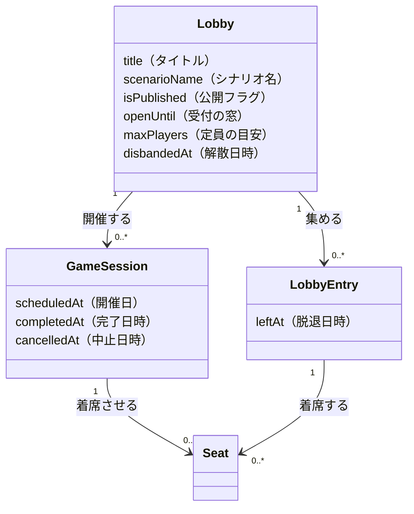

# 概念設計: 卓と開催 — UI が企画と開催を畳む線

## 背景

「卓と募集の概念を分けるべきか」という迷いから始めた整理。結論は **分ける線が1本ずれていた**。
募集は独立概念にしない（[`lobby-game-session.md`](./lobby-game-session.md) の棄却判断は有効）。
無理が出ていたのは、**バックエンドが 1:N（Lobby 1 : GameSession N）なのに、UI が 1:1 に畳んでいる**ため。
畳むために「代表の開催を1つ選ぶ」が必要になり、それが痛みの共通の出どころだった。

本ドキュメントは UI 表示層の概念モデルを扱う。**バックエンドの概念（Lobby / GameSession / Seat）は変えない。**

---

## 中心となる見立て

**「卓の状態」という単一の概念は存在しない。** それは独立した2つの事実である。

| 見せている事実 | 誰が変えるか | いつ | なぜ |
|---|---|---|---|
| 受付が開いているか・企画を畳んだか | ホスト | 企画の始めと終わり、数回だけ | 人を集めるため |
| 開催予定か・遊び終えたか・やめたか | ホスト ＋ 時間の経過 | **開催のたび、毎回** | 実際に遊んだから |

別主体・別頻度・別理由。分離パターンの Job / Execution と同型で、
「1回目完了・2回目開催予定の卓は 完了(completed) か 開催予定(scheduled) か」に答えられない。
バックエンドは既に分離済み（Lobby / GameSession）であり、**割れているのは UI だけ**である。

---

## 概念一覧

UI 表示層の概念。バックエンドの概念との対応は1:1で、新しいエンティティは足さない。

| 概念 | 一文定義 | 責務（持つもの） | 持たないもの |
|------|---------|----------------|-------------|
| 卓（Lobby の UI 表現） | 利用者が「この企画」と数える単位。俯瞰するときの単位 | タイトル、シナリオ名、参加者、**受付の状態**（下書き(draft) / 募集中(recruiting) / 調整中(adjusting) / 解散(disbanded)） | 開催日、**開催の状態**、着席、「代表の開催」 |
| 開催（GameSession の UI 表現） | 利用者が「今週の卓」と名指しする単位。共有・振り返りの単位。卓に 0..n | 開催日、場所、**開催の状態**（開催予定(scheduled) / 完了(completed) / 中止(cancelled)）、着席、キャラクター名、プレイメモ | 受付の状態、参加者の母集団 |

> **数える単位は場面で変わる。** 俯瞰（一覧・探す）は卓、名指し（共有・振り返り・当日）は開催。
> どちらか一方に統一しようとすると、必ずもう一方が潰れる。単位が1つに決まらないのが正しい。
>
> 名詞は「開催」（`CONTEXT.md` の UI 表記）。数えるときだけ「第3回」「3回遊んだ」と**回**を使う。

---

## 概念間の関係



図はバックエンドの概念そのままで、本ドキュメントはこれを**変えない**。
変えるのは、この構造を UI がどう読むか（下記「状態の見立て」）だけである。

---

## 状態の見立て

### いまの導出が壊れている箇所

`resolveGameSessionCardStatus.ts` は5段の優先順位で、卓の状態を1つに決めている。
導出元を並べると、1系列に見えていたものが実は2系列だと分かる。

| 表示 | 導出元 | どちらの概念か |
|---|---|---|
| 下書き(draft) | `lobby.status = draft` | 卓 |
| 募集中(recruiting) | `lobby.status = open` | 卓 |
| 調整中(adjusting) | `lobby.status = closed` | 卓 |
| 開催予定(scheduled) | 進行中の GameSession あり | **開催** |
| 完了(completed) | 完了した GameSession あり | **開催** |
| 中止(cancelled) | `lobby.status = disbanded`（＝**解散**） | 卓 |

`募集中(recruiting) → 調整中(adjusting) → 開催予定(scheduled) → 完了(completed)` が一直線に見えていたのは、
**1企画1開催のときだけ**。2回目の開催が生まれた瞬間、前半（卓の受付）と後半（開催の進行）は独立に動き出す。

### コードから確定している不具合

実運用の観測を要さず、コードだけから導ける。

| 症状 | 根拠 |
|---|---|
| 1回目完了・2回目開催予定の卓は、1回目が一覧から消える | 代表の開催を1つだけ選ぶ（`pickNewest`） |
| 第一話 完了(completed) ＋ 第二話 調整中(adjusting) の卓が、**調整中のタブに出ず完了に入る** | 優先順位で「完了した開催あり」が「ロビーの受付状態」より先に評価される |
| 開催を中止しても中止(cancelled) と表示されず、募集中(recruiting)／調整中(adjusting) に戻る | 中止(cancelled) は `LobbyStatus.disbanded` にしか割り当てられていない |
| バッジ「中止」が二役している | 本線では**解散**(disbanded)、`toGameSessionCards` の `ORPHAN_STATUS` では**開催の中止**(cancelled) |
| 「開催予定だけど追加募集中」が表現できない | 状態を1つに潰す以上、片方しか出せない |

`CONTEXT.md` は「解散と中止は別の出来事」と明記しているが、UI のバッジは同じ1枚である。

### あるべき導出

**状態を1つに潰すのをやめる。** 卓は受付の状態を、開催は開催の状態を、それぞれ独立に持つ。
1つの卓が「開催予定 かつ 募集中」を同時に見せてよい。

### 参加者から見た「自分の出番」

`CONTEXT.md` のロール表は参加者の関心事に「自分は選ばれたのか」を挙げているが、
現行モデルは Seat の**不在**に3つの意味を同居させているため、これに答えられない。

```
Seat が無い ─┬─ まだホストが選出作業をしていない
             ├─ 選出された結果、自分は外れた
             └─ そもそもこの回の対象ではない（分割開催の別日）
```

ただし参加者にとって区別が要るのは「**まだ決まっていないのか、決まった結果なのか**」の1本だけで、
これは**既存データからの導出で足りる**。新しいテーブル・カラムを必要としない。

| 参加者に見せる | 導出 |
|---|---|
| あなたが出ます | 自分の Seat がある |
| 今回は見送り | 自分の Seat が無い ＋ その開催に Seat が1つ以上ある |
| まだ決まっていません | その開催に Seat が1つも無い |

**穴**: ホストが1人ずつ着席させていく途中は「見送り」に見える。一括で選出する運用なら起きない。
起きると分かった時点で GameSession に「選出を確定した」ファクトを1つ足せば解ける（未決事項参照）。

---

## 概念テストの記録

| 要望・出来事 | 関係ロール | 概念での言い直し | 判定 |
|------|-----------|----------------|------|
| 1回目を終えて2回目を開く（連作・定例） | ホスト | 卓はそのまま、開催が2つ目になる。卓の受付状態は動かない | ✅ 自然 |
| 同上 | 参加者 | 一覧では卓1枚（次の開催が添う）、履歴では開催が1回ずつ並ぶ | ✅ 自然（単位が場面で変わる） |
| リスケ（流れて引き直し） | ホスト | 開催を1つ中止し、日程調整をもう一度行い、新しい開催を開く | ✅ 自然 |
| 集まりすぎて2日に分ける | ホスト | 1つの卓が2つの開催を持つ。どちらも開催予定(scheduled) | ✅ 自然 |
| 同上 | 参加者 | 自分が着席した側の開催だけが「自分の出番」になる | ✅ 自然 |
| 定例で毎月続ける | ホスト | 一覧は卓1枚のまま。開催だけが積み上がる | ✅ 自然（卓単位なので溢れない） |
| 開催予定だが追加募集したい | ホスト | 卓の受付を開く。開催の状態は動かない | ✅ 自然（状態を潰さないので両立する） |
| 開催をやめた | ホスト | その開催が中止(cancelled)。卓は生きている | ✅ 自然（現行は表示できない） |
| 企画ごとやめた | ホスト | 卓が解散(disbanded)。開催の中止とは別の出来事 | ✅ 自然 |
| 「この土曜の卓に来ない？」と誘う | ホスト | その開催の URL を渡す | ✅ 自然 |
| 当日の集合情報を確かめる | 参加者 | その開催を開く。日時・場所・連絡事項は開催が持つ | ✅ 自然 |
| 過去の卓を振り返る | 参加者 | 開催を1回ずつ辿る。プレイメモは開催（着席）にぶら下がる | ✅ 自然 |
| 自分がその開催に出るか知りたい | 参加者 | Seat の有無 ＋ その開催に Seat があるか、から導出する | ⚠️ 段階的な選出では誤判定（上記「穴」） |
| 知らない人に見つけてもらう | — | 語れるが、**現実に使われていない**（作者が明言）。根拠にしない | ⚠️ 未決事項参照 |
| 当日ドタキャンした | 参加者 | 語れない。席を外す＝最初から居なかったことになる | ⚠️ 未決事項参照（観測待ち） |
| 見学する / 補欠で待つ / GM を交代する | ホスト・参加者 | 語れない | ⚠️ 未決事項参照（観測待ち） |

---

## 命名の検討ログ

| 採用名 | 棄却案 | 理由 |
|--------|--------|------|
| 開催（名詞）／「第N回」（数える語） | 「回」を名詞に昇格する | `CONTEXT.md` の UI 表記が「開催」なので名詞はそちらに従う。ただし「卓には回がある」という言い方が現場語として自然なため、**数えるときだけ**「回」を使う。名詞ごと「回」にするかは未決 |
| 受付の状態 / 開催の状態 | 「卓の状態」1系列 | 1系列は1企画1開催のときだけ成立する見かけであり、変更主体・頻度・理由が違う2つを同居させていた |
| 募集（状態のまま） | 募集を独立概念にする | 公開募集の相手が現実に存在しない（作者が明言）。[`lobby-game-session.md`](./lobby-game-session.md) の棄却理由は UI 側でも有効 |
| 解散(disbanded) / 中止(cancelled) を別ラベルに | 両方を「中止」と表示する（現行） | `CONTEXT.md` が「別の出来事」と定義しているのに、UI のバッジが同じ1枚になっている。表示ラベルも分ける |

---

## 未決事項

**観測待ち（実運用を1回まわすと決まるもの）**

- **一覧タブの再構成**: 「これから / 募集中 / 履歴」に組み替え、**卓が複数のタブに重複して出てよい**とする案がある。
  履歴だけ単位を開催にする。モックで見た感触どまりで、実際に使ってからでないと自然さを判断できない。
  この案を採ると次の2つの既存決定を崩す。
  - `CLAUDE.md` / `CONTEXT.md` の固定語彙 `募集中(recruiting) → 調整中(adjusting) → 開催予定(scheduled) → 完了(completed) / 中止(cancelled)` の1系列
    （タブがこの系列そのものであるため）
  - 一覧のカードに日時を出さない決まり（#151）。履歴を開催ごとに並べるなら、日付なしでは開催を見分けられない
- **`maxPlayers` の去就**: バックエンドのどこでも強制されていない（`create-lobby` が保存するだけ）。
  呼び方も割れている — バリデーションのメッセージは「募集人数」（参加の上限）、
  [`lobby-game-session.md`](./lobby-game-session.md) は「定員の目安」（着席の枠）。
  カードの「残り N 枠」は `maxPlayers − 参加者数` で、着席の枠を参加者数と比べており、どちらの定義でも正しくない。
  **数の去就（残す / 定義し直す / 消す）は、実際に何の数として入力したくなるかを観測してから決める。**
  「残り N 枠」の表示だけは、どの定義でも嘘になるため先に落としてよい
- **着席まわりの分離**: Seat は「ホストにとっての選出の結果」と「参加者にとっての出席の事実」を兼ねている。
  Order / Fulfillment 型の分離が要るかは、**ドタキャン・GM 交代・見学・補欠・選出漏れのどれかが実際に起きてから**決める。
  現時点で観測はゼロであり、いま概念を足すのは YAGNI 違反になる
  （[`lobby-game-session.md`](./lobby-game-session.md) の同名の未決事項と同じ判断）
- **選出の確定ファクト**: 上記「自分の出番」の導出が、段階的な選出で誤判定する。
  一括選出の運用なら起きないため、起きてから GameSession に追加する
- **公開募集**: 「いずれ入れたいが今は使われていない」（作者）。`List/index.vue` の
  「ほかの人が募集している卓」（`publicCards`）は実装済みだが、現実の利用者がいない。
  **いまの概念設計の根拠には使わない。** 入れるときは「カードだけで参加を判断される」前提で情報量を設計し直す

**この整理では扱わなかったもの**

- `play_memos.seat_id` の `onDelete: cascade` により、**席を外すとその開催のプレイメモも消える**。
  `unseat` は終了前しか許可されていない（`permissions.ts`）ため実害は限定的だが、
  「席を外す」と「最初から居なかったことにする」が同じ操作である設計の帰結であり、
  ドタキャンが観測された時点で効いてくる
- 移行計画は含まない。バックエンドは変更しないため、影響は表示層に限られる
