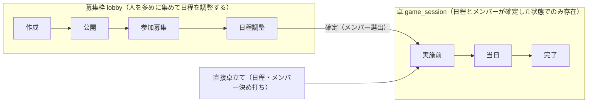
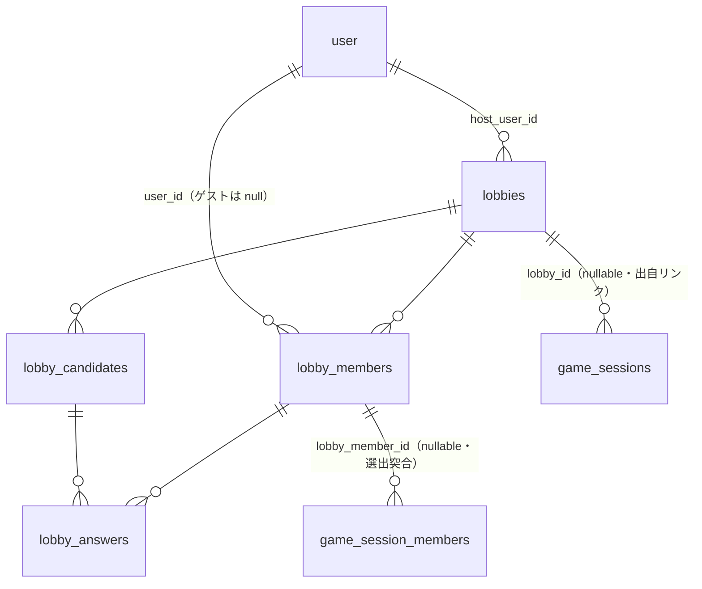
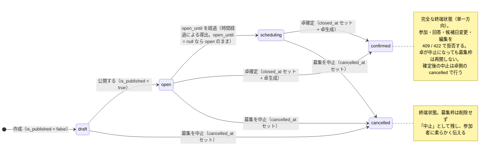
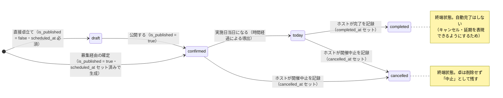

# RollHub（たく日和）— 設計ドキュメント v1.1: 募集と卓の分離

> **最終更新**: 2026-07-11
> **元要求**: [docs/requirements/recruitment-separation.md](./requirements/recruitment-separation.md)
> **位置づけ**: [design-v1.md](./design-v1.md) に対する**差分設計書**。本書に記載のない事項（技術スタック、認証、ゲストトークンの扱い、命名規則の基本方針など）は design-v1 を踏襲する。

---

## 目次

1. [概要とコンセプト](#1-概要とコンセプト)
2. [命名](#2-命名)
3. [DBスキーマ](#3-dbスキーマ)
4. [ステータス設計](#4-ステータス設計)
5. [卓確定（選出）の設計](#5-卓確定選出の設計)
6. [API設計](#6-api設計)
7. [画面構成](#7-画面構成)
8. [既存（卓）側の変更](#8-既存卓側の変更)
9. [実装ステップ](#9-実装ステップ)
10. [意思決定ログ](#10-意思決定ログ)

---

## 1. 概要とコンセプト

「卓（game_session）」が担っていた**募集・日程調整**の責務を、新概念**「募集枠（lobby）」**に分離する。



- 募集枠では定員を超えて人を集めてよい。**卓確定時に「その日に来られる人」を選ぶ**ことで、「キック」操作を不要にする
- 選ばれなかった人は募集枠の参加者のまま。強い言葉（キック・削除・落選）は UI に出さない
- 卓は募集枠を経由せず直接作ることもできる（既存グループ向け最短導線）。作成後の扱いは募集経由と同一

---

## 2. 命名

| 対象 | 名前 |
|---|---|
| 概念の英語名 | **lobby** |
| PostgreSQL スキーマ | `lobby` |
| URL | `/lobbies` |
| 変数名 / 型名 | `lobby` / `Lobby` |
| バックエンドの機能ディレクトリ | `packages/backend/src/lobby/` |

> 要求ドキュメントでの仮称は recruitment。PR #57 レビューで **lobby** に決定した（[意思決定ログ](#10-意思決定ログ)参照）。
> lobby は Better Auth の予約概念（`session` / `user` / `account` / `verification`）と衝突しないため、
> `game` プレフィックスは付けない。`game` プレフィックスは引き続き卓（gameSession）系の識別子にのみ使う。

---

## 3. DBスキーマ

### 方針

- design-v1 と同じく、ステータスは DB に持たずファクトデータから導出する
- ADR 0005 に従い、新テーブル・enum は `pgSchema('lobby')` 配下に定義する
- 構造は既存の `game_session` スキーマ4テーブルのミラー。既存テーブルへの変更は `game_session_members.lobby_member_id` の追加のみ（後述）

### `lobby.lobbies` — 募集枠

| カラム | 型 | 説明 |
|---|---|---|
| `id` | `uuid` | PK |
| `host_user_id` | `text` | FK → `auth.user.id` |
| `title` | `text` | 募集タイトル |
| `scenario_name` | `text?` | シナリオ名 |
| `description` | `text?` | 備考・説明文 |
| `location` | `text?` | 開催場所（オンライン等の自由入力） |
| `max_players` | `integer?` | 定員。`null` なら定員の目安なし（選出画面で定員不一致の確認ダイアログを出さない） |
| `guest_link_token` | `text` | ゲストリンク用トークン（design-v1 と同じ仕組み） |
| `is_published` | `boolean` | 公開フラグ |
| `open_until` | `date?` | 募集締め切り日 |
| `closed_at` | `timestamp?` | クローズ（卓確定）日時。`null` なら受付中。卓確定時にセットする |
| `cancelled_at` | `timestamp?` | 募集中止日時。ホストの「募集を中止する」アクションで記録。`null` なら中止されていない |
| `created_at` | `timestamp` | |
| `updated_at` | `timestamp` | |

> `closed_at` が「確定してクローズした」というファクト。ステータス導出はこの1行で完結する（JOIN 不要）。
> 卓との紐付けは卓側の `lobby_id` で持つ（下記）。
> 1募集枠から生まれる卓は Ph1 では1つだが、DB 制約では縛らない（複数卓への将来拡張に耐えるため）。

### `lobby.lobby_members` — 募集枠の参加者

| カラム | 型 | 説明 |
|---|---|---|
| `id` | `uuid` | PK |
| `lobby_id` | `uuid` | FK → `lobbies.id`（cascade delete） |
| `user_id` | `text?` | FK → `auth.user.id`。ゲストは `null` |
| `guest_name` | `text?` | ゲストの表示名 |
| `created_at` | `timestamp` | |
| `updated_at` | `timestamp` | |

> partial unique index: `(lobby_id, user_id) WHERE user_id IS NOT NULL`（ログインユーザーの重複参加防止。既存と同じ）。
> 募集枠の作成時に**ホストのメンバーレコードを自動追加**する（既存卓と同じ）。ホストも参加者として日程回答に加わる（要求 §3-2）。
> **`character_name` は持たない**。キャラクター名は「卓に着席してから」の関心事とし、卓側（`game_session_members.character_name`）でのみ管理する（[意思決定ログ](#10-意思決定ログ)参照）。

### `lobby.lobby_candidates` — 候補日

| カラム | 型 | 説明 |
|---|---|---|
| `id` | `uuid` | PK |
| `lobby_id` | `uuid` | FK → `lobbies.id`（cascade delete） |
| `date` | `date` | 候補日（時刻は持たない） |
| `created_at` | `timestamp` | |
| `updated_at` | `timestamp` | |

### `lobby.lobby_answers` — 日程回答（◯△×）

| カラム | 型 | 説明 |
|---|---|---|
| `id` | `uuid` | PK |
| `candidate_id` | `uuid` | FK → `lobby_candidates.id`（cascade delete） |
| `member_id` | `uuid` | FK → `lobby_members.id`（cascade delete） |
| `answer` | `lobby.lobby_answer` | enum `'ok' \| 'maybe' \| 'ng'` |
| `comment` | `text?` | 回答コメント |
| `created_at` | `timestamp` | |
| `updated_at` | `timestamp` | |

> unique 制約: `(candidate_id, member_id)`。
> enum は `lobby` スキーマに新規定義する（`game_session.availability_date_answer` を跨いで参照しない。スキーマ独立性を優先）。

### 既存テーブルへの変更: `game_session.game_session_members`

| カラム | 型 | 説明 |
|---|---|---|
| `lobby_member_id` | `uuid?` | FK → `lobby.lobby_members.id`（`onDelete: set null`）。卓確定でコピーされたメンバーの出自。直接参加は `null` |

### 既存テーブルへの変更: `game_session.game_sessions`

| カラム | 型 | 説明 |
|---|---|---|
| `lobby_id` | `uuid?` | FK → `lobby.lobbies.id`（`onDelete: set null`）。出自の募集枠。直接卓立ては `null` |
| `cancelled_at` | `timestamp?` | 中止日時。ホストの「開催を中止する」アクションで記録。`null` なら中止されていない |

> 選出/非選出の突合のために持つ。ログインユーザーは `user_id` で突合できるが、ゲストは `user_id = null` かつ同名重複参加を許容するため、`guest_name` では突合が曖昧になる。募集枠詳細画面の「選出者に卓リンク・非選出者に柔らかい文言」の描画にこの FK を使う。

### リレーション概要



> `game_sessions` / `game_session_members` は `game_session` スキーマ、`user` は `auth` スキーマ。それ以外は `lobby` スキーマ。

---

## 4. ステータス設計

### 募集枠のステータス

ファクトカラム: `is_published` / `open_until` / `closed_at` / `cancelled_at`

| ステータス | 表示名 | 条件 |
|---|---|---|
| `cancelled` | 中止 | `cancelled_at != null`（最優先） |
| `confirmed` | 卓確定済み | `closed_at != null` |
| `draft` | 非公開 | `is_published = false` |
| `open` | 募集中 | 公開済み・`open_until` が `null` または未来 |
| `scheduling` | 日程調整中 | 公開済み・`open_until` 経過 |

```ts
// src/lobby/domain/lobby-status.ts
// （既存 getGameSessionStatus = src/game-session/domain/game-session-status.ts と同パターン）

export type LobbyStatus =
  | 'draft'
  | 'open'
  | 'scheduling'
  | 'confirmed'
  | 'cancelled';

export function getLobbyStatus(
  lobby: Pick<
    Lobby,
    'isPublished' | 'openUntil' | 'closedAt' | 'cancelledAt'
  >,
  now: Date = new Date(),
): LobbyStatus {
  if (lobby.cancelledAt) return 'cancelled';
  if (lobby.closedAt) return 'confirmed';
  if (!lobby.isPublished) return 'draft';
  if (!lobby.openUntil || now < lobby.openUntil) return 'open';
  return 'scheduling';
}
```

> `confirmed` を公開フラグ・締め切りより優先する理由: 確定は終端状態であり、公開フラグや締め切りに関係なく以降の参加・回答を締め切るため（最優先は `cancelled`。確定と中止は排他ガードにより共存しない）。
> `open` / `scheduling` の判定は既存 `getGameSessionStatus` の修正済みロジック（`docs/game-session-status.md`）と同一。
> **卓確定は `open` / `scheduling` のどちらからでも可能**（締め切り前でも回答が揃えばホストは確定できる）。

### ステータスごとの操作可否

| 操作 | draft | open | scheduling | confirmed | cancelled |
|---|---|---|---|---|---|
| 募集枠の編集（PATCH） | ✅ | ✅ | ✅ | ❌ 409 | ❌ 409 |
| 募集枠の削除（DELETE） | ✅* | ✅* | ✅* | ❌ 409 | ✅* |
| 公開（PATCH `/status`） | ✅ | — | — | ❌ 409 | ❌ 409 |
| 募集中止（PATCH `/status`） | ✅ | ✅ | ✅ | ❌ 409** | ❌ 409 |
| 参加（ログイン / ゲスト） | ❌ 422 | ✅ | ❌ 422 | ❌ 422 | ❌ 422 |
| 退出（本人 / ホスト） | — | ✅ | ✅ | ❌ 409 | ❌ 409 |
| 候補日の追加・削除 | ✅ | ✅ | ✅ | ❌ 409 | ❌ 409 |
| 日程回答（◯△×） | ❌ 422 | ✅ | ✅ | ❌ 409 | ❌ 409 |
| 卓確定 | ❌ 422 | ✅ | ✅ | ❌ 409 | ❌ 422 |

> \* **ホスト以外の**メンバーが1人でもいる場合は `409`（既存卓の削除と同方針。ホスト自身しか参加していない募集枠は削除できる）。確定済みの削除を禁止するのは、卓の出自リンク（卓側 `lobby_id`）を保持するため。
> \*\* 確定後の中止は募集枠側ではなく**卓側の中止**（`game_sessions.cancelled_at`）で行う（[意思決定ログ](#10-意思決定ログ)参照）。
> 退出はログインユーザー本人またはホストが行える。ゲストメンバーの取り消しはホストのみ（ゲストは本人確認手段がないため）。退出時、そのメンバーの日程回答は cascade delete で消える（日程調整中の退出も許容。確定処理はトランザクション内で再検証するため不整合は起きない）。
> 日程回答が draft で不可なのは、既存の `inputScheduleResponse` と同じく公開後（`open`/`scheduling`）に限るため（ホストは自動参加済みだが、回答は公開後に行う）。
> 参加可否を `open` のみに限定するのは design-v1 の既存方針と同じ。
> 操作可否は既存の shared `ACTION_POLICIES` / `canPerform` パターンを踏襲し、`LobbyAction` として shared に定義する。

### 卓のステータス（最終形）

卓は「下書き → 実施前 → 当日 → 完了」に加え、終端状態として「中止」（`cancelled_at` から導出）を持つ（詳細は [8. 既存（卓）側の変更](#8-既存卓側の変更)）。

### ステータス遷移図

遷移のラベルは「操作（変更されるファクト）」。`draft`/`open`/`scheduling` 等は DB に保存されず、ファクトから導出される（[導出ロジック](#4-ステータス設計)参照）。時間経過による遷移は操作なしで導出結果が変わるもの。

募集枠:



卓（最終形）:



> 確定候補日が当日の場合、導出は直ちに `today` になる。
> 中止は**卓のステータス**として表現する（`cancelled_at` ファクトから導出。`completed_at` と対称）。
> 中止しても募集枠は `confirmed`（クローズ）のまま戻らない（**単一方向**）。募集枠の再開
> （`closed_at` クリアによる `scheduling` への復帰・再調整）は Ph1 では提供しない
> （[意思決定ログ](#10-意思決定ログ)参照）。再調整したい場合は新しい募集枠を立てる。

---

## 5. 卓確定（選出）の設計

本要求のコア機能。**候補日を1つ選び、その日に来られるメンバーで卓を作る**。

### 選出ルール

1. 選出は**常にホストが選出 UI で確認・確定する**（自動選出はない）
2. **◯△回答者をデフォルト候補として選択済みで提示する**。×・未回答のメンバーも選出可能（UI 上で注意表示）
3. 定員（`max_players`）は**目安**。選出数が定員と一致しない場合はフロントで確認ダイアログを挟む（API はブロックしない）
4. **ホスト自身も通常メンバーとして扱う**。参加・回答していれば選出候補になり、非選出も可（「卓のホスト」と「卓のメンバー」は独立。ホストがメンバーでない卓は既存モデルでも存在しうる）。なお卓のホスト（`host_user_id`）は募集枠のホストを常に引き継ぐため、ホストを選出しなくても卓の管理操作（完了・編集・削除）は可能であり、「管理者不在」は発生しない

### 確定処理（1トランザクション）

`POST /api/lobbies/:id/confirm` — body: `{ candidateId, memberIds: string[] }`（`memberIds` は必須・1件以上）

```text
0. 募集枠・確定候補日・選出メンバーをトランザクション内で SELECT ... FOR UPDATE により
   再読込し、バリデーション（候補日がこの募集枠の候補日であること・`memberIds` が
   この募集枠のメンバーであること）を再実行する
   （候補日の削除・メンバー退出が並行しても、古い選出結果のまま確定しない。
   ◯△回答内容・定員によるサーバ側ブロックはしない）
1. 卓 game_sessions を INSERT
   - title / scenario_name / description / location / max_players を募集枠からコピー
     （`max_players` は卓側 API では `maxMembers` として現れる。DB カラム名は両方 `max_players`）
   - host_user_id = 募集枠のホスト
   - lobby_id = 募集枠の ID
   - scheduled_at = 確定候補日の date
   - is_published = true、guest_link_token は新規生成（募集枠のトークンは使い回さない）
   - open_until = 確定実行日（今日）※移行期間中の措置。既存の卓ステータス導出は
     open_until が null だと scheduled_at 済みでも 'open'（募集中）に落ちるため、
     確定卓を confirmed/today へ正しく到達させるためにセットする。段階6c でカラムごと廃止
2. 選出メンバーを game_session_members に INSERT
   - user_id / guest_name をコピーし、lobby_member_id に元メンバーの ID をセット
   - character_name は null（卓側で後から設定）
3. UPDATE lobbies
     SET closed_at = now()
     WHERE id = :id AND closed_at IS NULL AND cancelled_at IS NULL
   - 更新行数が 0（並行する確定に先を越された・並行して中止された）なら全体をロールバックして 409
```

> 手順3の条件付き UPDATE が二重確定の排他を担う。`WHERE closed_at IS NULL` により、
> 同一募集枠への並行 confirm は片方だけが `closed_at` をセットでき、敗者は更新0行で `409` になる。

### バリデーション・エラー

| 条件 | レスポンス |
|---|---|
| ホスト以外の実行 | `403` |
| 確定済み（`closed_at != null`）・並行確定に敗北 | `409` |
| ステータスが `draft` または `cancelled` | `422` |
| `candidateId` がこの募集枠の候補日でない | `404` |
| `memberIds` 未指定・空配列（選出は必須） | `422` |
| `memberIds` にこの募集枠のメンバーでない ID を含む | `422` |

> 定員・回答内容（◯△×・未回答）によるサーバ側ブロックはしない（定員は目安、選出は常にホストが確定するため）。
> レスポンスは作成された卓（`GameSession`）を返し、フロントは卓詳細へ遷移する。

### 確定後の募集枠

- 参加・日程回答・候補日変更・募集枠編集をすべて受け付けない（read-only）
- 詳細画面は閲覧可能のまま。選出メンバーには卓詳細へのリンクを表示する
- **非選出者への表現**: 「今回は日程が合いませんでした。またの機会にぜひ遊びましょう」等の柔らかい文言。「キック」「削除」「落選」は使わない

---

## 6. API設計

### 方針

- 既存の game-sessions 系 API と同じ構造・権限モデル・ゲストトークン方式（`Guest-Token` ヘッダー）をミラーする
- 一覧は全件返却・絞り込みはフロント（design-v1 と同じ）
- API 表の「公開済みは不要」の「公開済み」は `is_published = true` を指す（ステータスでは判定しない。draft のまま中止した募集枠は `cancelled` でも非公開）
- shared パッケージに契約型を先に定義する。主な型:

| 型 | フィールド |
|---|---|
| `CreateLobbyInput` | `title`, `scenarioName?`, `description?`, `location?`, `maxPlayers?`, `openUntil?`, `candidateDates: string[]`（**1件以上必須**。日程調整が募集枠の存在意義であるため。卓側の「作成時スケジュール任意」= ADR 0006 とは意図的に方針を分ける） |
| `UpdateLobbyInput` | 上記のうち候補日を除く各フィールドの partial（候補日は availability-dates API で操作） |
| `ConfirmLobbyInput` | `candidateId`, `memberIds: string[]`（**必須・1件以上**） |
| `Lobby` / `LobbyListItem` | 既存 `GameSession` / `GameSessionListItem` に準じる。詳細は `closedAt?` を含む |

### Lobbies

| メソッド | パス | 認証 | 概要 |
|---|---|---|---|
| `GET` | `/api/lobbies` | 必要 | 募集枠一覧（全件） |
| `POST` | `/api/lobbies` | 必要 | 募集枠新規作成 |
| `GET` | `/api/lobbies/:id` | 公開済みは不要 | 募集枠詳細（メンバー含む）。確定済みなら `closedAt` を含む |
| `PATCH` | `/api/lobbies/:id` | ホスト | 募集枠更新（確定済みは `409`） |
| `DELETE` | `/api/lobbies/:id` | ホスト | 募集枠削除（メンバーあり・確定済みは `409`。[4章の操作可否表](#4-ステータス設計)参照） |
| `PATCH` | `/api/lobbies/:id/status` | ホスト | `{ status: "open" }` — `draft → open`（公開）／`{ status: "cancelled" }` — `draft`/`open`/`scheduling` → `cancelled`（募集中止。`cancelled_at` セット。確定済みは `409`） |
| `POST` | `/api/lobbies/:id/confirm` | ホスト | **卓確定（選出）**。[5章](#5-卓確定選出の設計)参照 |

### Lobby Members

| メソッド | パス | 認証 | 概要 |
|---|---|---|---|
| `GET` | `/api/lobbies/:id/members` | 公開済みは不要 | 参加者一覧 |
| `POST` | `/api/lobbies/:id/members` | 必要 | 参加（`open` のみ。それ以外 `422`） |
| `POST` | `/api/lobbies/:id/guest-members` | 不要・`Guest-Token` 必須 | ゲスト参加（`open` のみ） |
| `DELETE` | `/api/lobbies/:id/members/:memberId` | **本人またはホスト** | 退出・参加取り消し（確定済み・中止済みは `409`）。ログインユーザーは自分の参加を取り消せる。ゲストメンバーの取り消しはホストのみ |

> `PATCH .../members/:memberId` は提供しない（募集枠メンバーは `character_name` を持たず、編集対象がないため）。

### Lobby Schedules（日程調整）

既存の availability-dates 系と同一のインターフェース。ロジックは既存実装から移植する。

| メソッド | パス | 認証 | 概要 |
|---|---|---|---|
| `GET` | `/api/lobbies/:id/availability-dates` | 公開済みは不要 | 候補日一覧（回答含む） |
| `POST` | `/api/lobbies/:id/availability-dates` | ホスト | 候補日追加（確定済みは `409`） |
| `PUT` | `/api/lobbies/:id/availability-dates` | ホスト | 候補日一括更新（1件以上。候補日0件にはできない。確定済みは `409`） |
| `DELETE` | `/api/lobbies/:id/availability-dates/:dateId` | ホスト | 候補日削除（確定済みは `409`） |
| `PUT` | `/api/lobbies/:id/availability-dates/:dateId/responses` | 必要 | 自分の回答登録・更新（確定済みは `409`） |
| `PUT` | `/api/lobbies/:id/availability-dates/:dateId/guest-responses` | 不要・`Guest-Token` 必須 | ゲスト回答（全ゲスト分編集可。確定済みは `409`） |

> 既存にあった `POST .../availability-dates/:dateId/confirm`（日程だけ確定）は募集枠には**存在しない**。
> 募集枠における「確定」は日程＋メンバー選出＋卓生成を不可分に行う `POST /:id/confirm` のみ。

### Lobby Guest Links

| メソッド | パス | 認証 | 概要 |
|---|---|---|---|
| `GET` | `/api/lobbies/:id/guest-link` | ホスト | ゲストリンクトークン取得。`/lobbies/:id?token=...` を配る |

### 既存 API の変更

| API | 変更 |
|---|---|
| `GET /api/game-sessions/:id` | レスポンスに `lobbyId?`（`lobby_id` カラムをそのまま返す）を追加 |
| `GET .../members`（卓詳細のメンバー） | レスポンスの各メンバーに `lobbyMemberId?` を追加（選出突合用） |
| `PATCH /api/game-sessions/:id/status` | `{ status: "cancelled" }` を追加（`confirmed`/`today` → `cancelled`。`cancelled_at` セット。段階3で追加） |
| `DELETE /api/game-sessions/:id` | 変更なし（既存ポリシーどおり確定以降の卓は削除不可。「確定後にやめたい」の受け皿は中止が担う） |
| `POST /api/game-sessions` | 【最終形】`scheduledAt` 必須化（直接卓立て = 日程決め打ち）。移行期間中は現状のまま |
| 卓の availability-dates 系 | 【段階6で廃止】[9章](#9-実装ステップ)参照（公開遷移 `PATCH /:id/status` の `draft → open` は残す） |
| 卓への参加系 | 【最終形】参加条件を「公開済み・未完了・実施日当日まで」に変更（トークン仕様は現行のまま。[8章](#8-既存卓側の変更)参照） |

---

## 7. 画面構成

### 画面一覧

| URL | 概要 | 新規/変更 |
|---|---|---|
| `/` | ダッシュボード。**募集枠と卓を分けて表示**（「募集・調整中」「開催予定の卓」） | 変更 |
| `/lobbies` | 募集枠一覧 | **新規** |
| `/lobbies/new` | 募集枠新規作成（タイトル・シナリオ名・説明・場所・定員・締め切り・候補日） | **新規** |
| `/lobbies/:lobbyId` | 募集枠詳細。参加・日程調整・卓確定はすべてこの画面。ゲストは `?token=` 付きリンクで同画面を使う | **新規** |
| `/lobbies/edit/:lobbyId` | 募集枠編集（既存 `/game-sessions/edit/:id` と同パターン） | **新規** |
| `/game-sessions` | 卓一覧（確定済みの卓のみが並ぶ世界になる） | 位置づけ変更 |
| `/game-sessions/new` | **直接卓立て**（日程決め打ち。募集系フィールドは最終的に撤去） | 位置づけ変更 |
| `/game-sessions/:gameSessionId` | 卓詳細（実施前→当日→完了・中止の管理、メンバー表示、キャラ名編集） | 位置づけ変更 |
| `/game-sessions/edit/:gameSessionId` | 卓編集 | 位置づけ変更 |

### 募集枠詳細画面（`/lobbies/:lobbyId`）の構成

- **基本情報**: タイトル・シナリオ名・説明・場所・定員・締め切り・ステータスバッジ
- **参加者一覧**: 募集枠メンバー（定員超えて表示してよい。「5 / 定員3」のような表示可）
- **日程調整表**: 既存 `ScheduleDisplay` 系の実装詳細を流用・移植（◯△×マトリクス、ゲスト全列編集）
- **卓確定フロー（ホストのみ・`open`/`scheduling` 時）**: 画面内ダイアログのステップ形式
  1. 候補日を選ぶ（各候補日の ◯/△ 人数を表示）
  2. メンバー選出（**常に表示**。◯△回答者がデフォルト選択済み、×・未回答は注意表示付きで選択可、選出数が定員と不一致なら確認ダイアログ）
  3. 確認 → 確定 → 作成された卓詳細へ遷移
- **確定後**: 全操作を閉じ、「卓が確定しました」の案内を表示
  - 選出メンバー: 卓詳細へのリンク
  - 非選出メンバー: 「今回は日程が合いませんでした。またの機会にぜひ遊びましょう」（柔らかい文言。強い言葉を使わない）

### フロントエンドのディレクトリ方針

`features/Lobby/` を新設し、`features/GameSession/` と同じ構成（List / New / Detail / Edit、Detail 配下に `Schedule/` サブディレクトリ）を取る。日程調整 UI・composable は既存 GameSession 実装から移植する。

---

## 8. 既存（卓）側の変更

### 最終形（旧経路廃止後）

廃止するのは**募集系のみ**（`open_until` カラム、`game_session_candidates` / `game_session_answers` テーブル、availability-dates API、status の `open` 遷移）。**`is_published` は維持**し、意味を「下書き/公開（閲覧制御）」に限定する（直接卓立ての下書き保存に使う）。

- 卓は**日程とメンバーが確定した状態でのみ存在**する。ライフサイクルは「下書き → 実施前 → 当日 → 完了」
- ステータス導出は簡素化する:

```ts
export type GameSessionStatus =
  | 'draft'
  | 'confirmed'
  | 'today'
  | 'completed'
  | 'cancelled';
// cancelled_at があれば cancelled（最優先）/ is_published が false なら draft /
// completed_at があれば completed / scheduled_at が今日なら today / それ以外 confirmed
```

- 完了は引き続きホストの明示アクション（`PATCH /:id/status` で `completed_at` セット）。自動完了しない
- **中止**もホストの明示アクション（`PATCH /:id/status` で `cancelled_at` セット）。卓は削除せず「中止」として残し、参加者に柔らかく伝わる表示にする
- `game_sessions` から `open_until` を、テーブルごと `game_session_candidates` / `game_session_answers` を削除（`is_published` は残す）
- `game_sessions.scheduled_at` は NOT NULL 化する（「卓は日程確定状態でのみ存在」を DB レベルで保証）
- `POST /api/game-sessions` は `scheduledAt` 必須

### 最終形の閲覧・参加の認可モデル

`is_published` を維持するため、閲覧・参加の認可モデルは現行を踏襲する。

| 操作 | 認可 |
|---|---|
| 閲覧（`GET /:id`） | 公開済みなら誰でも・非公開はホストのみ（現行踏襲） |
| 参加（ログイン `POST /:id/members`） | 公開済み・未完了・実施日当日までならトークン不要で参加可（現行踏襲） |
| 参加（ゲスト `POST /:id/guest-members`） | 現行どおり `Guest-Token` 必須 |
| メンバー編集・退出・完了・削除 | 現行どおり（ホスト権限） |

> 満員（`maxPlayers`）チェックは既存方針どおり入れない（入れる場合はログイン・ゲスト両方に。Ph2）。
> **直接卓立てのメンバー集めもこの参加モデルで行う**: ホストが卓を作成・公開し、URL（ログインユーザー向け）またはゲストリンク（ゲスト向け）を共有して、**相手に参加ボタンを押してもらう**。フレンド機能・ホストによる代理登録は持たない（ゲスト分はゲストリンクから本人が名前を入力する）。
> なお「参加を受け付けている」ことは卓のステータスとしては表現しない（`confirmed` と重なる二重状態になるため）。参加可否は上表の条件から導出する `canJoin` として扱い、UI では「参加できます」の表示で伝える。人を集める行為そのものは募集枠の責務。
> `canJoin` は既存 shared の `ACTION_POLICIES` / `canPerform`（`joinSession` アクション）パターンで定義する。フロントは参加ボタンの表示制御、バックエンドは参加 API のバリデーションで**同じ関数**を使う。API レスポンスには含めない（ステータスと同様、ファクトから両側で計算する）。

### 移行期間中（旧経路廃止まで）

- 既存の卓の募集・日程調整機能（候補日 CRUD・◯△×回答・日程確定・`draft/open/scheduling` ステータス）は**そのまま動かし続ける**
- 本番データは存在しないため、データ移行は不要。廃止時はカラム・テーブルを drop するマイグレーションのみ

---

## 9. 実装ステップ

各段階を独立した PR として提出する（要求 §5）。GitHub issue はこの段階単位で切る。

| # | 内容 | 主な成果物 |
|---|---|---|
| 1 | **募集枠の基盤**: DB スキーマ（`lobby` スキーマ4テーブル）+ shared 型 + 募集枠 CRUD API（一覧/作成/詳細/更新/削除/公開・募集中止） | backend `src/lobby/`、マイグレーション |
| 2 | **募集枠への参加と日程調整 API**: members / guest-members / guest-link / availability-dates / responses / guest-responses（既存ロジック移植） | backend |
| 3 | **卓確定 API**: `POST /:id/confirm`（選出バリデーション + トランザクション卓生成 + 二重確定排他）+ `game_session_members.lobby_member_id` 追加 + `GET /game-sessions/:id` への `lobbyId` 追加 + 卓の中止（`cancelled_at` カラム + `PATCH /:id/status` の `cancelled` 遷移） | backend |
| 4 | **募集枠のフロントエンド**: 一覧・作成・詳細（参加・日程調整）・編集画面（既存 GameSession 実装の移植） | frontend `features/Lobby/` |
| 5 | **卓確定フローのフロントエンド**: 確定ダイアログ（候補日選択 → 条件付き選出 → 確認）、確定後表示（非選出者文言含む）、ダッシュボード再構成 | frontend |
| 6 | **旧経路の廃止**: 卓の候補日・回答・募集ステータスの削除（API・UI・テーブル）、`POST /api/game-sessions` の `scheduledAt` 必須化、卓ステータス簡素化（6a フロント導線撤去 → 6b API 廃止 → 6c DB 整理 の分割・詳細は[移行計画](./migration-plan-recruitment-separation.md)参照） | backend + frontend + マイグレーション |

> 段階 1〜5 の間、既存機能は無変更で動き続ける（要求 §5「既存実装を壊さず段階的に」）。
> 段階 6 は新経路の動作確認（受け入れ基準の一連フロー）完了後に着手する。

---

## 10. 意思決定ログ

### 確定リンクは卓側（`lobby_id`）に持ち、確定ファクトは `closed_at` で持つ

当初は募集枠側に unique FK（`confirmed_game_session_id`）を持たせる設計だったが、PR レビューで
「1募集1卓の制約に意味がなく、複数卓への拡張に耐えられない」との指摘を受けて反転した。
確定リンクは卓側の nullable FK `lobby_id` で持ち、出自参照は `GET /api/game-sessions/:id` が
`lobbyId` を返す。ステータス導出の自行完結（募集枠のステータスが**自テーブルの行だけで**計算できること）は、
確定ファクトを `closed_at` カラムで持つことで維持する（JOIN 不要）。

### 募集枠メンバーは character_name を持たない

キャラクター名は「卓に着席してから」決まる関心事（シナリオのネタバレ配慮・HO割り当て等も卓確定後）。
募集段階で持たせると、非選出者のキャラ名という無意味なデータが残る。卓確定時は `character_name = null` でコピーし、卓詳細画面で従来どおり編集する。

### 確定はステータス遷移 API ではなく専用エンドポイント

design-v1 で「日程確定は `PATCH /status` に統合せず独立エンドポイント」とした判断を踏襲・発展させた。
卓確定は「日程確定 + メンバー選出 + 卓生成」の不可分な複合操作であり、`{ status: ... }` の形に収まらないため `POST /:id/confirm` とする。

### 確定時に guest_link_token を新規生成する

募集枠のトークンを卓に使い回すと、非選出者（募集枠のトークンを知っている）が卓側のゲスト操作をできてしまう。
卓は独立した資格情報を持つ。

### enum は lobby スキーマに再定義する

`game_session.availability_date_answer` をスキーマ跨ぎで参照すると、段階6（旧経路廃止）で `game_session` 側の候補日・回答テーブルを drop する際に依存が残る。値は同一（`ok | maybe | ng`）だが独立して定義する。

### 選出対象0人での確定は許可しない

「メンバー0人の卓」は概念上存在意義がなく、誤操作の可能性が高い。`422` で別の候補日を選ぶよう促す。
ホスト自身も参加者として回答に加わる方針（要求 §3-2）のため、ホストが開催したい日には自分で ◯ を付ければよい。

### 締め切り前（open）でも卓確定できる

回答が早く揃った場合に締め切りを待たせる理由がない。`open` / `scheduling` の両方から確定可能とする。
確定がすべての受付を閉じる終端状態であることは、ステータス導出の優先順位（`cancelled` に次いで `confirmed` を優先）で保証する。

### ホストは作成時にメンバーへ自動追加する

既存卓の挙動を踏襲。要求 §3-2「ホスト自身も参加者として日程回答に加われる」を自然に満たし、ホストの回答し忘れ導線を減らす。

### 確定後ロックのエラーコードは 409 に統一（既存卓の 423 から変更）

既存卓側は確定後の変更拒否に `423 Locked` を使っていたが、WebDAV 由来でクライアント・フレームワークの扱いが安定しないため、lobby 系では慣用的な `409 Conflict` に統一する。既存実装から移植する際に 423 を持ち込まないこと。

### ホスト（`host_user_id`）は「管理者ロール」であり、参加メンバーとは独立

「ホスト」は管理権限（編集・公開・確定・完了・削除）を持つ1人を指す**ロール**であり、
プレイヤーとして参加している（= members にいる）ことを要求しない。既存実装もこの構造
（`host_user_id` と `game_session_members` は独立）である。

- 募集経由の卓は募集枠の `host_user_id` を**自動で引き継ぐ**。「選出」はプレイヤーとしての
  参加メンバーを選ぶ操作であり、管理権限の付与とは無関係。募集枠を立てた人が自分を選出
  しなくても（自分は遊ばない回でも）、その人が卓の管理者であり続けるため、管理者不在は発生しない
- UI では「ホスト」を「主催者（管理者）」の意味で一貫して使い、プレイヤー参加とは区別して表示する
- ホストの譲渡・複数管理者・GM 指定は Ph2（design-v1 の GM 指定の検討と同枠）

### 二重確定は条件付き UPDATE で排他する

同一募集枠への並行 confirm（互いに別の新規卓を作る）を素通りさせないため、
確定ファクトのセットを `WHERE closed_at IS NULL` 付き UPDATE（`SET closed_at = now()`）で行い、
更新行数 0 ならトランザクション全体をロールバックして `409` を返す。
片方の確定だけが `closed_at` をセットでき、敗者は必ず 0 行更新になる。

### 中止は卓のステータス（`cancelled_at`）で表現し、募集枠の再開は Ph1 では提供しない

「やっぱり中止」を表現する方式として、当初は操作方式（卓を削除し募集枠の `closed_at` をクリアして
`scheduling` に復帰させる）を提案したが、**ステータス方式**に確定した。理由:

- 要求 §3-6 の「完了を明示アクションにするのはキャンセル・延期を表現できるようにするため」と整合する
  （中止はもともと要求レベルで「表現したい状態」だった）
- 卓を削除すると参加者視点で「何が起きたか」が分からない。`cancelled` 表示なら柔らかく伝えられる
- `cancelled_at` は `completed_at` と対称なファクトで、導出方針とも整合する
- FK を卓側 `lobby_id`（unique なし）に反転済みのため、中止卓を残したまま将来の再確定
  （1募集枠に cancelled + confirmed の複数卓）にも DB はそのまま耐える

**募集枠の再開（`closed_at` クリア → `scheduling` 復帰）は Ph1 では提供しない（単一方向）。**
募集枠の `confirmed` は完全な終端であり、卓が中止になっても戻らない。再調整したい場合は
新しい募集枠を立てる。再開導線が必要になったら、`closed_at` クリアの1操作を追加するだけで
実現できる（DB 変更不要の additive な拡張）ため、必要性が実証されてから議論する。

なお、募集由来の卓の削除を暫定的に `409` でガードする案は不要になった。既存の削除ポリシーが
もともと確定（`confirmed`）以降の卓の削除を許しておらず、「確定後にやめたい」の受け皿は中止が担う。

### 募集枠にも `cancelled`（募集中止）を持つ — 確定前と確定後で中止の主体を分ける

「中止」は確定の前後で意味が異なるため、主体を分けて表現する。

- **確定前の中止（募集自体の取りやめ）**: 募集枠の `cancelled_at`。メンバーが付いた募集枠は削除できない
  （ホスト以外のメンバーがいると `409`）ため、削除以外に募集をやめる手段が必要。参加者には
  「この募集は中止されました」を柔らかく表示する
- **確定後の中止（開催の取りやめ）**: 卓側の `cancelled_at`。募集枠は `confirmed` のまま動かない（単一方向）

確定済み募集枠への中止は `409`（確定後の中止は卓側で行う）。逆に中止済み募集枠の確定も `422`。
排他は確定処理の条件付き UPDATE に `AND cancelled_at IS NULL` を加えて担保する。

### ログインユーザー本人の退出を許可する

募集枠のメンバー取り消しは「本人またはホスト」が行える（ゲストメンバーはホストのみ。本人確認手段がないため）。
日程調整中の退出も許容する — 退出時に回答は cascade delete で消え、確定処理はトランザクション内で
メンバーを再検証するため、退出と確定が並行しても不整合は起きない。確定後・中止後は `409`。

### 「参加を受け付けている」を卓のステータスにしない

卓への参加可否（公開済み・未完了・実施日当日まで）は `confirmed` 期間と重なるため、独立したステータスに
すると排他的なステータスモデルが崩れる（「実施前かつ募集中」の二重状態）。参加可否は `canJoin` として
導出し、UI 表示で伝える。「人を集める」行為はあくまで募集枠の責務であり、卓に `open`（募集中）は復活させない。

### 選出の突合は `lobby_member_id` FK で行う

当初は YAGNI として持たない判断をしたが、ゲストが `user_id = null` かつ同名重複参加を許容する仕様のため、
`guest_name` では選出/非選出の突合が曖昧になる。非選出者への表示（要求 §4 の柔らかい文言）を
正確に描画するために、`game_session_members.lobby_member_id`（nullable FK）を追加する。

### 非公開へ戻す遷移は提供しない

要求 §3-1 の「公開/非公開にできる」に対し、`PATCH /:id/status` は `draft → open` の一方向のみとする。
参加者が付いた後の非公開化は「参加したはずの募集枠が見えなくなる」混乱を招くため。既存卓と同方針。

### 確定時に `open_until` をセットする（移行期間中の措置）

既存の卓ステータス導出は `open_until = null` の卓を `scheduled_at` の有無にかかわらず `open` と判定する。
確定で生まれた卓が「募集中」と表示され、第三者参加が可能になり、`today` に到達せず完了操作が不能になる
ことを防ぐため、確定処理で `open_until = 確定実行日` をセットする。段階6c のカラム廃止で不要になる。

### `is_published` は廃止せず維持する

当初は `is_published` を廃止し、卓への参加をトークン必須に一本化する設計だったが、作者判断で維持に変更した。
維持することで直接卓立ての「下書き保存」（非公開のまま準備する）が使え、閲覧・参加の認可モデルも
現行踏襲（公開済みなら誰でも閲覧・参加可、非公開はホストのみ）で済む。廃止するのは募集系ファクト（`open_until`）のみ。
卓の最終形ステータスは `draft`（非公開下書き）→ `confirmed`（実施前）→ `today` → `completed`。

### 英語名は lobby に決定（仮称 recruitment から変更）

要求ドキュメントの仮称 recruitment は「企業の採用」を連想させ堅い。lobby は「ゲーム開始前に人が
集まる場所」のメタファーがこの概念（卓が立つ前の待機・調整の場）と一致し、短く、URL（`/lobbies`）も
自然で、Better Auth とも衝突しない。PR #57 のレビューで作者が決定した。
なお日本語の概念名は引き続き「募集枠」を使う（lobby はコード・URL・DB 上の識別子）。
