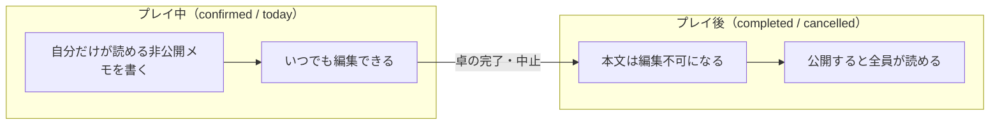
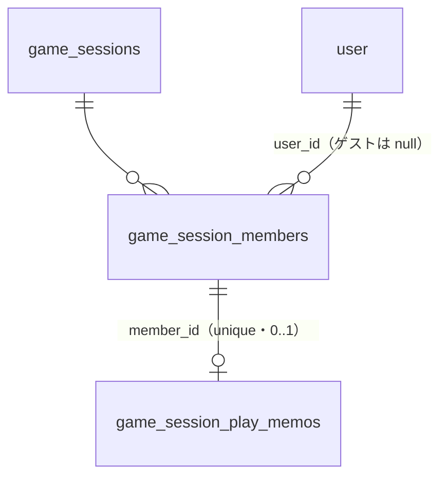

# RollHub（たく日和）— 設計ドキュメント v1.2: プレイメモ

> **最終更新**: 2026-08-03
> **元要求**: [docs/requirements/play-memo.md](./requirements/play-memo.md)
> **位置づけ**: [design-v1.md](./design-v1.md) / [design-v1.1.md](./design-v1.1.md) に対する**差分設計書**。本書に記載のない事項（技術スタック、認証、ゲストトークンの扱い、命名規則の基本方針、卓のステータス導出など）は design-v1 / design-v1.1 を踏襲する。
> **マージ先**: `develop/0.2`

---

## 目次

1. [概要とコンセプト](#1-概要とコンセプト)
2. [命名](#2-命名)
3. [DBスキーマ](#3-dbスキーマ)
4. [権限・可視性設計](#4-権限可視性設計)
5. [API設計](#5-api設計)
6. [画面構成](#6-画面構成)
7. [実装ステップ](#7-実装ステップ)
8. [意思決定ログ](#8-意思決定ログ)

---

## 1. 概要とコンセプト

卓（`game_session`）の参加者が、**プレイ中に自分用の記録を残し、プレイ後にみんなで共有できる**機能。
日程調整ツールには無い体験を卓側に持たせ、卓に独自の存在意義を与える（要求 §1）。



- メモは**デフォルト非公開**。作成者本人だけが読める
- 公開は**本人の明示的な操作**。いつでも非公開に戻せる
- 他人のメモが読めるのは「**卓が完了または中止**」かつ「**そのメモが公開されている**」場合のみ
- 本文の編集ができるのは卓が完了・中止する前まで。**公開・非公開の切り替えは完了・中止後も可能**
- メモを**書ける**のはログインユーザーのメンバーのみ。ゲストメンバーは対象外
- メモを**読む**（公開メモの閲覧）のは未ログイン・ゲストを含む誰でも可

---

## 2. 命名

概念名は**英語・日本語ともに「プレイメモ」で統一**する。UI で見た言葉でそのままコードを検索できる状態を保つ。

| 対象 | 名前 |
|---|---|
| 概念名（英語 / 日本語） | **play memo** / **プレイメモ** |
| DB テーブル | `game_session.game_session_play_memos` |
| 型名 | `GameSessionPlayMemo` |
| ファイル名 | `play-memo.ts`（kebab-case） |
| URL パス | `/api/game-sessions/:id/play-memos` |
| バックエンドの機能ディレクトリ | `packages/backend/src/game-session/`（既存に同居） |
| フロントエンドのディレクトリ | `packages/frontend/src/features/GameSession/PlayMemo/` |
| UI 表記 | 「プレイメモ」（見出し・導線ともにこの語を使う。「マイメモ」等の別名を作らない） |

> **`memo` 単独では使わない。** 既存の `GameSession/Detail/MemoDisplay.vue` と `Lobby/Detail/MemoDisplay.vue` が
> 卓・募集枠の `description`（備考）の表示に「メモ」を使っており、衝突する。
> `play` 接頭辞を必ず付けることで `PlayMemoDisplay.vue` / `playMemos` のように区別する
> （[意思決定ログ](#8-意思決定ログ)参照）。
>
> ADR 0005 に従い新テーブルは機能ごとのスキーマに置くが、メモは卓メンバーに従属する概念であり
> 独立した機能ではないため、**新しいスキーマは切らず既存の `game_session` スキーマ配下**に置く。
> バックエンドのディレクトリも `src/game-session/` に同居させる。

---

## 3. DBスキーマ

### 方針

- design-v1 / v1.1 と同じく、状態は DB に持たずファクトから導出する（`shared_at` の有無が公開のファクト）
- `game_session_members` へのカラム追加ではなく**別テーブル**とする（要求 §7）
- 既存テーブルへの変更は**なし**

### `game_session.game_session_play_memos` — プレイメモ

| カラム | 型 | 説明 |
|---|---|---|
| `id` | `uuid` | PK |
| `member_id` | `uuid` | FK → `game_session_members.id`（cascade delete）。**unique**（1メンバー1メモ） |
| `body` | `text` | 本文。`not null default ''` |
| `shared_at` | `timestamp?` | 公開日時。`null` なら非公開。**「最後に公開した時刻」**であり、再公開のたびに更新される（[§8](#8-意思決定ログ)） |
| `created_at` | `timestamp` | |
| `updated_at` | `timestamp` | |

```ts
// src/system/infrastructure/database/game-session-schema.ts に追記

export const gameSessionPlayMemos = gameSessionSchema.table(
  'game_session_play_memos',
  {
    id: uuid('id').primaryKey().defaultRandom(),
    memberId: uuid('member_id')
      .notNull()
      .unique()
      .references(() => gameSessionMembers.id, { onDelete: 'cascade' }),
    body: text('body').notNull().default(''),
    // 公開日時。null なら非公開（design-v1.2 §4）
    sharedAt: timestamp('shared_at'),
    createdAt: timestamp('created_at').notNull().defaultNow(),
    updatedAt: timestamp('updated_at')
      .notNull()
      .defaultNow()
      .$onUpdate(() => new Date()),
  },
);
```

> `member_id` の unique 制約が「1メンバー1メモ」を DB レベルで保証し、upsert の衝突キーにもなる。
> unique index がそのまま検索インデックスとして働くため、追加のインデックスは不要。
> **`game_session_id` は持たない**（[意思決定ログ](#8-意思決定ログ)参照）。卓単位の取得は
> `game_session_members` との JOIN 1段で行う。
> メンバーが退出・削除されるとメモも cascade delete で消える。卓の削除も同様に伝播する。

### リレーション概要



---

## 4. 権限・可視性設計

本機能の中核。**ファクトは3つだけ**で、すべての可否がここから導出される。

| ファクト | 由来 |
|---|---|
| 卓のステータス | 既存 `getGameSessionStatus`（`cancelled` / `draft` / `completed` / `today` / `confirmed`） |
| メモの公開状態 | `shared_at` の有無 |
| 閲覧者とメモ所有者の一致 | `game_session_members.user_id` と認証ユーザー ID の一致 |

### メモを「書ける人」の判定

**その卓に `user_id` が一致するメンバー行が存在するログインユーザー**、のみ。

ゲストメンバーは `user_id = null` で登録されるため、認証ユーザー ID での引き当てには**構造上ヒットしない**。
つまりゲスト除外のための専用ロジックは不要で、「認証ユーザー ID で自分のメンバー行を引く」という
1つの検索で「ログイン済み」「その卓のメンバー」「ゲストでない」の3条件が同時に満たされる
（[意思決定ログ](#8-意思決定ログ)参照）。

### 操作可否表

| 操作 | 主体 | draft | confirmed | today | completed | cancelled |
|---|---|---|---|---|---|---|
| 自分のメモの閲覧 | 本人 | ✅ | ✅ | ✅ | ✅ | ✅ |
| 本文の作成・編集 | 本人 | ✅ | ✅ | ✅ | ❌ 409 | ❌ 409 |
| 公開・非公開の切替 | 本人 | ✅ | ✅ | ✅ | ✅ | ✅ |
| 公開メモの閲覧 | **誰でも**（未ログイン・ゲスト含む） | ❌ | ❌ | ❌ | ✅ | ✅ |

> 本文編集を完了・中止で閉じるのは要求 §3-1。公開切替を閉じないのは要求 §3-2
> （「遊んだ後に公開する」が本機能の主目的であるため、むしろ完了後こそ使われる）。
> 拒否のステータスコードは **409**（design-v1.1 の「確定後ロックは 409 に統一」に従う。**423 は使わない**）。
> `draft` の卓では他人のメモ欄がそもそも現れない（公開メモの閲覧が `completed` / `cancelled` 限定のため）。

### 公開メモ閲覧の認可

公開メモの一覧は「卓が完了または中止 かつ `shared_at != null`」だけで決まり、**閲覧者に依存しない**。
ただし**卓そのものの閲覧制御は既存 `getGameSession` と同一**にする。

```text
1. 卓が存在しない                          → 404
2. 卓が非公開（is_published = false）かつ
   閲覧者がホストでない                    → 403
3. 卓のステータスが completed / cancelled  → shared_at != null のメモを全件返す
   それ以外                                → 空配列
```

> 手順2 が必要なのは、非公開のまま中止された卓が `cancelled`（`cancelled_at` が `draft` より優先）に
> 導出されるため。ここを揃えないと、非公開卓のメモが第三者に読めてしまう。
> 返却対象には**閲覧者自身の公開メモも含める**（閲覧者による分岐を作らない。[意思決定ログ](#8-意思決定ログ)参照）。

### shared への追加

```ts
// packages/shared/src/game-session/permissions.ts
export enum GameSessionAction {
  // ...既存
  /** プレイメモの本文編集 */
  editPlayMemo = 'editPlayMemo',
}

export const ACTION_POLICIES: Record<GameSessionAction, ActionPolicy> = {
  // ...既存
  // ホストもプレイヤーとして自分のメモを持つため両ロールを許可する。
  // 「本人のメモであること」はロールでは表現できないため別途検証する
  [GameSessionAction.editPlayMemo]: {
    roles: ['host', 'member'],
    statuses: [
      GameSessionStatus.draft,
      GameSessionStatus.confirmed,
      GameSessionStatus.today,
    ],
  },
};
```

```ts
// packages/shared/src/game-session/play-memo.ts（新規）

/**
 * 他メンバーの公開メモを閲覧できるステータスかどうか。
 *
 * 閲覧者のロールに依存しない（未ログイン・ゲストも含めて誰でも読める）ため、
 * roles を持つ ACTION_POLICIES ではなくステータス単独の関数として定義する。
 */
export const canViewSharedPlayMemos = (status: GameSessionStatus): boolean =>
  status === GameSessionStatus.completed ||
  status === GameSessionStatus.cancelled;
```

> 公開・非公開の切替は**全ステータスで許可**するため、ポリシー表にもこの関数にも載せない
> （ステータス非依存であることを、表に載せないことで表現する）。
> フロントの表示制御とバックエンドのバリデーションで**同じ関数**を使う点は既存方針どおり。
> なお `ACTION_POLICIES` と `EDITABLE_STATUSES` の乖離（#85）・`permissions.ts` の活用不足（#45）は
> 既知の課題であり、本機能では既存の `canPerform` パターンに素直に乗せるに留める。

---

## 5. API設計

### 方針

- 既存の game-sessions 系と同じ構造・権限モデルをミラーする
- **自分のメモ**（`/play-memos/me`）と**公開メモ一覧**（`/play-memos`）でエンドポイントを分ける。
  メンバー一覧（`GET /:id/members`）にメモを混ぜない（[意思決定ログ](#8-意思決定ログ)参照）
- **本文の編集**と**公開切替**もエンドポイントを分ける。ライフサイクルが異なる
  （完了後：本文 ✗ ・切替 ◯）ため、1つの PATCH にすると片方だけ 409 という歪な API になる

### shared に定義する契約型

```ts
// packages/shared/src/game-session/play-memo.ts

export const GameSessionPlayMemoSchema = z.object({
  memberId: z.string().uuid(),
  body: z.string(),
  /** 公開日時。null なら非公開 */
  sharedAt: z.string().nullable(),
  updatedAt: z.string(),
});
export type GameSessionPlayMemo = z.infer<typeof GameSessionPlayMemoSchema>;

/**
 * 自分のメモのレスポンス。
 *
 * メモを一度も書いていないメンバーにも 404 ではなく空メモを返すため（§8）、
 * まだ行が存在しないケースを表す `updatedAt: null` を許容する。
 */
export const MyGameSessionPlayMemoSchema = GameSessionPlayMemoSchema.extend({
  updatedAt: z.string().nullable(),
});
export type MyGameSessionPlayMemo = z.infer<typeof MyGameSessionPlayMemoSchema>;

/** 公開メモ一覧の要素。公開済みのみを返すため sharedAt は non-null */
export const SharedGameSessionPlayMemoSchema =
  GameSessionPlayMemoSchema.extend({
    sharedAt: z.string(),
  });
export type SharedGameSessionPlayMemo = z.infer<
  typeof SharedGameSessionPlayMemoSchema
>;

export const UpsertGameSessionPlayMemoInputSchema = z.object({
  body: z.string().max(5000),
});
export type UpsertGameSessionPlayMemoInput = z.infer<
  typeof UpsertGameSessionPlayMemoInputSchema
>;

export const UpdateGameSessionPlayMemoVisibilityInputSchema = z.object({
  shared: z.boolean(),
});
export type UpdateGameSessionPlayMemoVisibilityInput = z.infer<
  typeof UpdateGameSessionPlayMemoVisibilityInputSchema
>;
```

> 本文の上限は **5000 文字**（既存の `description` は 1000 文字だが、プレイ中の記録は長文になるため広げる）。
> 空文字の保存を許可する（`body` は `min(1)` にしない）。[意思決定ログ](#8-意思決定ログ)参照。
> 公開メモ一覧のレスポンスには誰のメモかを示す `memberId` を含める。表示名は既存の
> `GET /:id/members` のレスポンスとフロントで突合する（メンバー情報をメモ側に重複させない）。

### エンドポイント

| メソッド | パス | 認証 | 概要 |
|---|---|---|---|
| `GET` | `/api/game-sessions/:id/play-memos/me` | 必要 | 自分のメモ取得。**未作成でも 404 にせず** `{ memberId, body: '', sharedAt: null, updatedAt: null }` を返す（`MyGameSessionPlayMemoSchema`） |
| `PUT` | `/api/game-sessions/:id/play-memos/me` | 必要 | 本文の作成・更新（upsert）。完了・中止は `409` |
| `PATCH` | `/api/game-sessions/:id/play-memos/me/visibility` | 必要 | 公開・非公開の切替（`{ shared: boolean }`）。全ステータスで可。`true` は `shared_at` を**常に現在時刻で上書き**、`false` は `null` にする |
| `GET` | `/api/game-sessions/:id/play-memos` | **公開済みは不要** | 公開メモ一覧。完了・中止 かつ 公開 のもののみ |

### バリデーション・エラー

| 条件 | レスポンス |
|---|---|
| 未ログイン（`/play-memos/me` 系） | `401` |
| 卓が存在しない | `404` |
| ログイン済みだがその卓のメンバーでない（ゲスト参加のみの場合を含む） | `403` |
| 卓が `completed` / `cancelled` で本文を編集しようとした | `409` |
| メモ未作成のまま公開切替しようとした | `404` |
| 本文が 5000 文字超（`GAME_SESSION_PLAY_MEMO_MAX_LENGTH`） | `400` |
| 非公開の卓の `GET /play-memos` をホスト以外が呼んだ | `403` |

> `PATCH .../visibility` が未作成メモで `404` になるのは、本文を一度も保存していないメモを
> 公開する意味がないため。フロントは保存後にトグルを活性化する。
> なお本文が**空文字で保存済み**のメモは存在しうる（公開も可能）。これは許容する。

### 既存 API の変更

なし。`GET /api/game-sessions/:id` と `GET /api/game-sessions/:id/members` のレスポンスは変更しない。

---

## 6. 画面構成

卓詳細（`/game-sessions/:gameSessionId`）にセクションを1つ追加し、**読み書き専用の画面を1枚新設する**。
メモは長文（数千字）が書かれる前提のため、卓詳細に編集面を置くと詳細画面が本文の長さだけ縦に伸び、
他のセクションが遠くなる。卓詳細は入口に徹し、書く・読むは専用画面に分ける
（[意思決定ログ](#8-意思決定ログ)参照）。

### ルート

| パス | ルート名 | 認証 | 役割 |
|---|---|---|---|
| `/game-sessions/:gameSessionId` | `game-sessions-detail` | 不要 | プレイメモのカード（入口） |
| `/game-sessions/:gameSessionId/play-memo` | `game-sessions-play-memo` | 不要 | 本文の読み書き・公開切替・他メンバーのメモの閲覧 |

> メモ画面に `requiresAuth` を付けない。完了・中止した卓の公開メモは
> **未ログイン・ゲストにも開く**のが要求 §3-4（受け入れ基準）であり、読む場所をこの画面に
> 集約する以上、ルートガードで弾いてはならない。書く操作の可否はメンバー判定と
> `canPerform` が決める。
>
> ただし**段階3 の時点では書く専用のため `requiresAuth: true` を付けている**。
> 公開メモの閲覧を載せる段階4 で外す。

### 卓詳細の「プレイメモ」カード

入口に徹する。全文と他メンバーのメモはメモ画面で読む。

| 表示要素 | 表示条件 | 内容 |
|---|---|---|
| プレイメモのカード | ログインユーザー かつ その卓のメンバー | 公開状態バッジ・本文3行のプレビュー・文字数と最終保存時刻・メモ画面への導線 |
| 編集不可の案内 | 上記 かつ `completed` / `cancelled` | 「卓が完了したため本文は編集できません。公開・非公開の切り替えは引き続き行えます」 |
| ログイン導線 | 未ログイン または ゲスト | 「メモ機能はログインユーザー限定です」+ ログインリンク（要求 §4） |
| （何も出さない） | ログイン済みだが その卓のメンバーでない | セクションごと非表示。`GET .../play-memos/me` も呼ばない |

- **公開状態がひと目で分かる**表示にする（要求 §4）。バッジは `shared_at` の有無から導く
- 完了・中止で本文が編集できなくなることを、**完了前から**分かるように示す（要求 §4）
- **完了・中止後も導線を残す。** 本文は編集できないが、読み返し・公開切替・他メンバーの
  メモの閲覧のためにメモ画面を開く必要がある
- カードは**折りたたみを持たない**。全文はメモ画面で読むため、固定行数で切るだけでよい

### プレイメモ画面

卓のライフサイクルで役割が変わる。出し分けは `canViewSharedPlayMemos(status)` ひとつで決まる。

| ステータス | レイアウト |
|---|---|
| `draft` / `confirmed` / `today` | 全幅の編集面。サイドバーは出さない（他メンバーのメモが1件も返らない時期に、開けない項目だけが並ぶため） |
| `completed` / `cancelled` | メンバー切り替えサイドバー + 本文。本文は読み取り、公開トグルはここ |

#### メンバー切り替えサイドバー

**参加メンバー全員**を並べ、読めない相手はタグで理由を示して選択不可にする。

| 対象 | タグ | 選択 | 本文 |
|---|---|---|---|
| 自分（公開中） | 公開 | 可 | 読める。公開トグルもここ |
| 自分（非公開） | 非公開 | 可 | 読める（本人はいつでも読める） |
| 他メンバー（公開） | 公開 | 可 | 読み取りのみ |
| 他メンバー（非公開） | 非公開 | 不可 | — |
| ゲストメンバー | ゲスト | 不可 | — （`user_id = null` でメモを持てない） |

- タグの語彙は **公開 / 非公開 / ゲスト** の3つ。「作成不可」のような禁止の言い方はしない
  （ゲストがメモを持てないのは制裁ではなく本人確認の手段がないという仕様上の帰結）
- 主ラベルは**キャラ名**、副ラベルにユーザー名。`character_name` が null ならユーザー名を主ラベルに繰り上げる。
  ゲスト行の副ラベルは `memberDisplayName` の「（ゲスト）」とタグが重複するため `memberBaseName` を使う
- 選択中のメンバーは `?member=<memberId>` で URL に載せる。指定が無ければ、メンバーは自分、
  それ以外は先頭の公開メモ。読めないメンバーを直接指定された場合は既定の選択へ `replace` で落とす
- 公開しているメンバーが1人も居なければサイドバーを出さず全幅に倒す
- モバイルではサイドバーを畳み、横スクロールのチップ列として本文の上に置く

#### 保存

- 本文は**デバウンス3秒の自動保存**。保存ボタンは「今すぐ保存」の意味に降りる
- 離脱時は確認より **flush を優先**し、保存に失敗したときだけ確認する
- サイドバーの切り替えはクエリ変更なので `onBeforeRouteLeave` が発火しない。
  `onBeforeRouteUpdate` でも同じ flush を通す
- `409` を受けたら読み取りへ落とす。先回りしてステータスを監視しない

### ディレクトリ構成

CLAUDE.md の「フィーチャー内のディレクトリ構成」に従い、外部に公開するエントリポイントを1ファイルに限定する。
**`Detail/` の下ではなくフィーチャー直下に置く**。卓詳細とメモ画面の両方から使うため、
`Detail/` の実装詳細として隔離すると外から参照することになり、隔離の意味が壊れる。

```plaintext
features/GameSession/PlayMemo/
  PlayMemoDisplay.vue            ← 卓詳細から import するのはここだけ
  MyPlayMemoCard.vue             ← 卓詳細のカード（読み取り + 導線）
  PlayMemoEditor.vue             ← メモ画面の本体
  PlayMemoSidebar.vue            ← 段階4
  useMyPlayMemo.ts               ← サーバ値の所有者。取得・メンバー判定・編集可否
  usePlayMemoEdit.ts             ← ドラフトの所有者。自動保存・離脱制御
  useSharedPlayMemos.ts          ← 段階4。公開メモ一覧の取得とメンバー名の突合
views/GameSession/
  PlayMemoView.vue               ← メモ画面。単独で開ける（ブックマーク直行）
features/GameSession/Detail/
  MemoDisplay.vue                ← 既存（卓の「備考」。本機能とは無関係）
  index.vue                      ← PlayMemo/PlayMemoDisplay.vue だけを import する
```

- サーバ値（真実）と編集ドラフトは**別の状態**として持つ。`useMemberEdit.ts` の
  `baseline` / `draft` / `isDirty` パターンを踏襲する（CLAUDE.md）
- composable の引数に `Ref` を要求しない。読みは `MaybeRefOrGetter` + `toValue()`、
  書きは `onXxx` コールバックで所有者に委譲する（CLAUDE.md）
- 表示用フォールバック（「まだメモがありません」等）は composable ではなくコンポーネント側の `computed` に置く
- 卓詳細は `requiresAuth` ではなくルートガードがセッション復元を待たないため、
  メンバー判定の前に `ensureSessionReady()` を待つ（待たないとマウント直後は常に非メンバー扱いになる）

---

## 7. 実装ステップ

各段階を独立した PR として提出する。GitHub issue はこの段階単位で切る。

| # | 内容 | 主な成果物 |
|---|---|---|
| 1 | **メモの基盤と自分のメモ**: DB テーブル + マイグレーション、shared 型・`editPlayMemo` ポリシー・`canViewSharedPlayMemos`、`GET`・`PUT /:id/play-memos/me` | backend、shared、マイグレーション |
| 2 | **公開切替と公開メモ閲覧**: `PATCH /:id/play-memos/me/visibility`、`GET /:id/play-memos`（認可 + フィルタ） | backend |
| 3 | **自分のメモの UI**: 卓詳細への `PlayMemo/` セクション追加、`/play-memo` ルートとメモ画面、`useMyPlayMemo`・`usePlayMemoEdit`（自動保存）、編集不可の案内、未ログイン・ゲストのログイン導線 | frontend |
| 4 | **公開切替と公開メモ閲覧の UI**: メンバー切り替えサイドバー、公開トグルと状態表示、確認ダイアログ、`useSharedPlayMemos`、`/play-memo` から `requiresAuth` を外す | frontend |

```text
段階1 ─┬─▶ 段階2 ─┐
       │           ├─▶ 受け入れ確認
       └─▶ 段階3 ─┴─▶ 段階4
```

> 段階3 は段階1の直後から段階2 と並行着手できる。段階4 は段階2・3 の両方を必要とする。
> Backend は TDD（Red → Green → Refactor）で進める（CLAUDE.md）。とくに段階2 の
> 「非公開メモが漏れないこと」「完了前は他人のメモが返らないこと」はテストが本体。

### 受け入れ基準（要求 §8 + 本設計での確認項目）

- [ ] ログインユーザーは自分が参加する卓で、自分のメモを作成・編集できる
- [ ] 他人のメモは、卓が完了または中止していない限り閲覧できない
- [ ] 卓が完了または中止した後、他人が公開しているメモのみ閲覧できる
- [ ] 卓が完了または中止した後、自分のメモの本文編集はできない（公開・非公開の切り替えは可能）
- [ ] ゲストメンバーにはメモの作成・編集・公開操作が提供されない（UI にも出ない）
- [ ] 公開したメモを、作成者が非公開に戻せる
- [ ] **未ログイン・ゲストでも、完了・中止した卓の公開メモを閲覧できる**
- [ ] **非公開のまま中止された卓の公開メモが、ホスト以外に見えない**
- [ ] **メンバーが退出すると、そのメンバーのメモも消える**

---

## 8. 意思決定ログ

### 概念名は英語・日本語ともに「プレイメモ」で統一する

当初は英語名を `note`、UI 文言を「プレイメモ」と分ける案だったが、**両方を play memo に揃えた**。
概念名が言語をまたいでずれると、UI で「プレイメモ」を見た人が `memo` で grep しても見つからず、
ドキュメント・UI・コードの間に翻訳表が必要になる。この翻訳表に見合う利益がない。

`memo` を避けようとした理由は、既存の `GameSession/Detail/MemoDisplay.vue` /
`Lobby/Detail/MemoDisplay.vue` が卓・募集枠の `description`（備考）の表示に「メモ」を
使っており衝突することだった。これは **`play` 接頭辞を必ず付ける**ことで解決する
（`PlayMemoDisplay.vue` / `playMemos` / `game_session_play_memos`）。
裸の `memo` / `Memo` は本機能では使わない。

既存の備考側（`MemoDisplay.vue` が `description` を表示している状態）は本機能では触らない。
UI 文言が「備考」なのにコンポーネント名が `Memo` である点はもともとずれているが、
本機能のスコープ外とする。

### 新しいスキーマ・機能ディレクトリを切らない

ADR 0005 は「新しいテーブル・enum は機能ごとの PostgreSQL スキーマに置く」と定めるが、
メモは卓メンバーに従属する概念であり、卓と独立したライフサイクルを持たない
（メンバーが消えればメモも消える）。`lobby` のように独立した機能ではないため、
既存の `game_session` スキーマ・`src/game-session/` ディレクトリに同居させる。

### `game_session_id` を非正規化して持たない

卓単位でメモを引くには `game_session_members` との JOIN が1段必要になるが、
非正規化カラムを持つと「メモの卓」と「メンバーの卓」が二重管理になり、
不整合が起きたときに権限判定が壊れる（他の卓のメモが見える）。
権限に直結するデータを二重に持たない方を優先した。JOIN 1段のコストは無視できる。

### ゲスト除外のための専用ロジックを書かない

ゲストメンバーは `user_id = null` で登録されるため、認証ユーザー ID でメンバー行を引く検索には
構造上ヒットしない。「ログイン済み」「その卓のメンバー」「ゲストでない」の3条件が
1つの検索で同時に満たされる。`isGuestMember()` による明示的な除外分岐を書くと、
検索条件と除外条件の二重管理になり、片方の修正漏れが権限バグになる。

### 公開メモ一覧は閲覧者に依存させない

`GET /:id/play-memos` は「卓が完了・中止 かつ `shared_at != null`」だけでフィルタし、
**閲覧者自身の公開メモも含めて**返す。「自分のメモを除く」ようにすると閲覧者による分岐が生まれ、
分岐を持つ権限フィルタは漏洩バグの温床になる。同じ卓なら誰が呼んでも同じレスポンスになる形にして、
「非公開メモが返らないこと」のテストを1本に収束させる。
フロントは `/play-memos/me` と重複した場合に `memberId` で突合して表示を整える。

### 未作成のメモは 404 ではなく空メモを返す

`GET /:id/play-memos/me` は、メモを一度も書いていないメンバーに対して
`{ memberId, body: '', sharedAt: null, updatedAt: null }`（`MyGameSessionPlayMemoSchema`）を
200 で返す。404 にするとフロントが「エラー」と「まだ書いていない」を区別する分岐を持つことになり、
編集ドラフトの初期化も 404 ハンドラ側に散る。メンバーであればメモ欄は常に存在する、と考える。

### 本文の編集と公開切替でエンドポイントを分ける

要求 §3-2 により、卓の完了・中止後は「本文は編集不可・公開切替は可能」となる。
1つの `PATCH .../play-memos/me` に両方を載せると、同じエンドポイントがフィールドによって
409 になったりならなかったりする。ライフサイクルが違うものは別リソースとして扱い、
`PUT .../play-memos/me`（本文）と `PATCH .../play-memos/me/visibility`（切替）に分ける。

### メンバー一覧にメモを混ぜない

`GET /:id/members` は未ログインでも呼べる公開エンドポイントであり、
ここにメモを含めると非公開メモの漏洩経路が1本増える。
メモは専用エンドポイントに閉じ込め、権限フィルタを1か所に集約する。

### 公開状態は真偽値ではなく nullable timestamp（`shared_at`）

要求 §7 の判断を踏襲。「公開したかどうか」だけでなく「いつ公開したか」を表現でき、
卓の `completed_at` / `cancelled_at` と対称になる。
「過去に一度でも公開したか」の履歴は使う予定がないため YAGNI として持たない（要求 §6）。

### `shared_at` は「最後に公開した時刻」とし、再公開で上書きする

`PATCH .../visibility` に `shared: true` を送ると、すでに公開済みのメモでも `shared_at` を
現在時刻で上書きする。「初回公開時刻を保持する」案（すでに非 `null` なら更新しない）は採らない。

- `shared_at` は**公開状態を表すファクト**であって、公開の履歴ではない。
  「一度でも公開したか」の履歴を持たない方針（前項・要求 §6）と揃える
- 「非公開に戻して書き直し、また公開した」ときに、最後に公開した時刻が出る方が読み手にとって自然。
  初回時刻を保持すると、非公開だった期間を挟んでも古い日時が表示され続ける
- 実装が「`shared` の値から `shared_at` を決める」だけの純粋な写像で済む。
  現在値を読んでから分岐する実装にすると、公開切替に閲覧・判断のステップが増える

副作用として、公開メモ一覧の並び順（`shared_at` 昇順）も再公開のたびに変わる。これは許容する。
また `updated_at` は Drizzle の `$onUpdate` により、本文を変えない公開切替でも進む。
「本文の最終更新時刻」が必要になった時点で別カラムを検討する（現時点では YAGNI）。

### 空文字のメモを許可する

`body` は `min(1)` にせず、空文字での保存を許す。本文を空にしたときに行ごと削除すると
`shared_at`（公開状態）も一緒に失われ、「本文を消して書き直したら非公開に戻っていた」という
挙動になる。行は残し、本文だけ空にする。

### 本文編集不可のエラーコードは 409

design-v1.1 の「確定後ロックのエラーコードは 409 に統一（既存卓の 423 から変更）」に従う。
`423 Locked` は WebDAV 由来でクライアントの扱いが安定しないため使わない。

### 公開切替はステータス非依存であることを、ポリシー表に載せないことで表現する

`editPlayMemo` は `ACTION_POLICIES` に追加するが、公開切替のアクションは追加しない。
全ステータスで許可されるアクションを表に載せると「全ステータス列挙」の行ができ、
表を読む側が「制約がある」と誤読する。制約がないものは表に載せない。

### 他人の公開メモの閲覧は `ACTION_POLICIES` ではなく専用関数にする

`ACTION_POLICIES` は `roles: ('host' | 'member')[]` を持つが、公開メモの閲覧は
未ログイン・ゲストを含む**誰でも**可能であり、このロール体系で表現できない。
無理に載せるとロールの意味が壊れるため、ステータス単独の
`canViewSharedPlayMemos(status)` として `shared/game-session/play-memo.ts` に置く。

### 未ログイン・ゲストにも公開メモの閲覧を提供する

要求 §3-4 はゲストの「作成・編集・公開操作」のみ除外を定めており、閲覧には触れていなかった。
作者判断で**閲覧は提供する**と確定した。公開メモの可視条件（完了・中止 かつ 公開）は
閲覧者に依存しないため、閲覧を開いても権限判定は複雑にならず、むしろ分岐が消えて単純になる。
卓詳細そのものが「公開済みなら誰でも閲覧可」である既存モデルとも整合する。

### ホストに他人の非公開メモを読む特権を与えない

要求に例外の記載がなく、非公開メモは「本人だけが読める」という約束が本機能の前提であるため、
ホストにも例外を作らない。ホストが読めるのは他のメンバーと同じく公開メモのみ。

### 「新規画面はない」を撤回し、専用ルートを切る（2026-08-03 追記）

当初は卓詳細にセクションを1つ足すだけの想定だった。しかし**メモは長文（数千字）が書かれる**
前提であることが UI 検討の過程で確定し、その寸法では次の3つが同時に壊れることが分かった。

- 卓詳細に編集面を置くと、本文の長さだけ詳細画面が縦に伸びて他のセクションが遠くなる
- 段階4 の公開メモ一覧が、自分の長文の下敷きになる。長く書いた人ほど他人のメモに辿り着けない
- プレイ中に何度も開き直すのに、毎回ステータス・詳細・メンバーを通り過ぎる必要がある

モーダル・タブ・専用ルートを比較し、**専用ルート**を採った。決め手は URL に状態が乗ることで、
ブックマークからの直行・戻る・リロード復帰が追加の設計なしに手に入る。モーダルとタブは同じ利便を
得るために別途クエリ設計を要し、タブは Ph2（シナリオ管理・ハンドアウト）で枚数の奪い合いになる。

代償として、将来メモの紐付け先を見直す（§2 の複数キャラクター対応）際に URL のリネームが起きれば
リダイレクトを1本負う。パスに必要なパラメータをすべて含めておけば
`redirect: (to) => ...` で任意の行き先に飛ばせるため、いま備えることはしない。

### 卓詳細のカードは入口に徹し、「マイメモ」と名乗り分けない（2026-08-03 追記）

読む場所をメモ画面に集約した結果、卓詳細のカードと公開メモ一覧が**どちらも同じ画面への入口**に
なった。同じ行き先のボタンを2つ並べる意味がないため、カードは1枚に統合する。

これに伴い次の3つが連鎖して決まった。

- **公開トグルはメモ画面へ置く。** 振り返りの場がメモ画面になったので、操作もそこにある方が近い。
  カードは状態バッジだけ持てば要求 §4「公開状態がひと目で分かる」を満たせる
- **カードの折りたたみを廃止する。** 全文はメモ画面で読むので、固定行数で切れば足りる
- **UI 表記を「プレイメモ」に統一する。** 自分のメモと他人のメモの区別はサイドバーが担うため、
  カード側で「マイメモ」と名乗り分ける必要がなくなった（§2 の命名と一致させる）

### サイドバーには参加メンバー全員を並べる（2026-08-03 追記）

「公開している人だけ並べないと、書いたが非公開の人の存在が漏れるのではないか」を検討したが、
**漏れない**と結論した。クライアントが持つのは `GET /play-memos` の返り値だけで、そこには
公開済みのメモしか入らない。つまり「書いたが非公開」と「書いていない」は、フロントからは
どちらも同じ「一覧に居ない」にしか見えず、区別する情報を持たない。

漏洩を防いでいるのはサーバのフィルタであって、UI で隠すことではない。全員を並べた方が
卓の顔ぶれが分かり、「公開されれば増える」ことも伝わる。

### 本文の保存は自動保存を主とする（2026-08-03 追記）

3〜4時間書き続ける前提では、保存ボタン1つだとリロードやタブ落ちで全部失われる。
デバウンス3秒の自動保存を主役にし、ボタンは「今すぐ保存」に降ろす。

離脱時に毎回確認ダイアログを出すのは、自動保存がある画面としては筋が悪いため、
**まず保存を試み、失敗したときだけ確認する**。`409`（書いている最中に卓が完了・中止した）は
仕様どおりのエラーなのでリトライせず読み取りへ落とす。先回りしてステータスを監視すると
状態が二重になるため、返ってきてから落とす。
