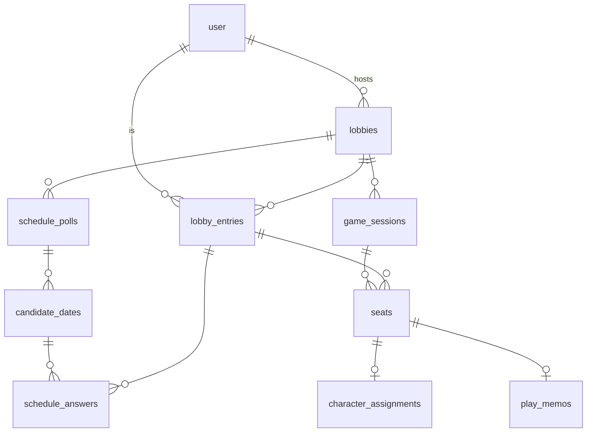
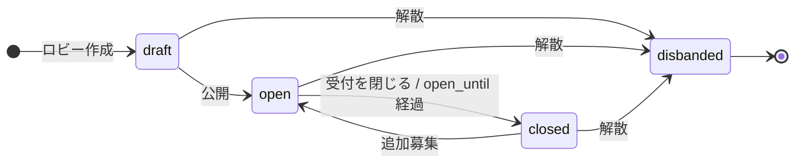
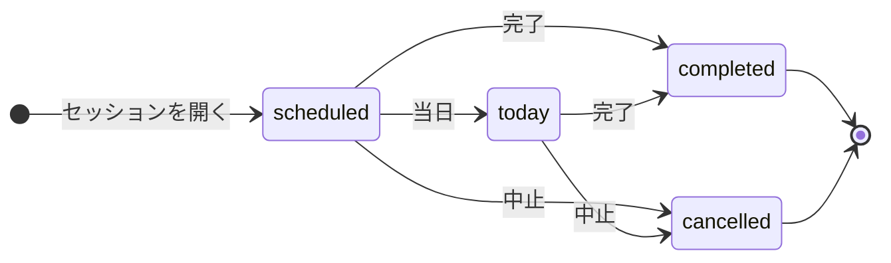

# 設計 v2: ロビー（企画）とセッション（開催）

> 最終更新: 2026-08-22
> 元概念設計: [docs/concept/lobby-game-session.md](./concept/lobby-game-session.md)
> ロール定義: [docs/concept/roles.md](./concept/roles.md)
> 前版: [docs/design-v1.1.md](./design-v1.1.md)（募集と卓の分離）、[docs/design-v1.2.md](./design-v1.2.md)（プレイメモ）

本書は概念設計 `docs/concept/lobby-game-session.md` を実装可能な設計（DBスキーマ・ステータス導出・API・画面）に落とし込んだものである。
移行の手順・段階分けは [docs/migration-plan-concept-model.md](./migration-plan-concept-model.md) が担当する。

**design-v1.1 / design-v1.2 は本書によって置き換えられる。** 両者は履歴として残すが、実装の参照先は本書とする。

---

## 1. 概要とコンセプト

### 1-1. 何が変わるのか

現行モデル（v1.1）は「募集枠は確定した瞬間に死に、卓へ転生する」という単一方向の設計である。
新モデルは **ロビー（企画）は開催を重ねても継続し、セッション（開催）はその一回一回である** と捉え直す。

```
[現行 v1.1]
  募集枠 --確定(closed_at)--> 卓            ← 1:1・一方向・使い捨て
    ↑ title/シナリオ/メンバーをコピー、トークン再発行、lobby_member_id で出自突合

[新 v2]
  ロビー ──┬── 日程調整 #1（候補日・◯△×）
           ├── 日程調整 #2（リスケ時にもう一度）
           ├── セッション #1（開催日・着席者）
           └── セッション #2（2日に分けたときの2つ目）
    ↑ ロビーは解散(disbanded_at)するまで生き続ける。コピーも突合も存在しない
```

### 1-2. 概念と実装の対応

| 概念 | PG スキーマ | テーブル | 現行からの由来 |
|---|---|---|---|
| Lobby | `lobby` | `lobbies` | `lobby.lobbies`（`closed_at` 削除・`cancelled_at`→`disbanded_at`） |
| LobbyEntry | `lobby` | `lobby_entries` | `lobby.lobby_members` の改名 + `left_at` 追加 |
| SchedulePoll | `lobby` | `schedule_polls` | **新規**（現行はロビー直下に候補日がぶら下がっていた） |
| CandidateDate | `lobby` | `candidate_dates` | `lobby.lobby_candidates` の改名（`lobby_id`→`poll_id`、`date_note`→`time_label`） |
| ScheduleAnswer | `lobby` | `schedule_answers` | `lobby.lobby_answers` の改名 |
| GameSession | `game_session` | `game_sessions` | `game_session.game_sessions`（募集系カラムを剥がし `lobby_id` を必須化） |
| Seat | `game_session` | `seats` | `game_session.game_session_members` を2 FK まで削ぎ落とす |
| CharacterAssignment | `game_session` | `character_assignments` | **新規**（`game_session_members.character_name` の分離） |
| PlayMemo | `game_session` | `play_memos` | `game_session.game_session_play_memos` の改名（`member_id`→`seat_id`） |

ADR 0005（機能ごとの PostgreSQL スキーマ）は継続する。スキーマは `lobby` と `game_session` の2つのまま。

### 1-3. 消える帳尻合わせ

| 現行 | 新モデルでの消え方 |
|---|---|
| 確定時に title・シナリオ・メンバーを卓へコピー | セッションは未設定ならロビーを参照して表示。コピーが存在しない |
| `game_session_members.lobby_member_id` による出自突合 | 選出＝Seat の有無。突合カラム不要 |
| 確定時に `guest_link_token` を新規生成 | トークンはロビーに1つだけ |
| 中止が募集枠側と卓側の2概念に割れる | 「企画の解散（`disbanded_at`）」と「開催の中止（`cancelled_at`）」は別テーブルの別カラム |
| `lobbies.closed_at`（確定＝終端） | カラムごと消滅 |
| 再調整＝新しい募集枠を立て直す | 同じロビーに `schedule_polls` をもう1行作るだけ |
| `game_sessions.is_published` / `max_players` / `host_user_id` | すべてロビー側の関心事。セッションからは消える |

---

## 2. 命名

### 2-1. 規則

- テーブル名は **概念名の snake_case 複数形**（`LobbyEntry` → `lobby_entries`、`PlayMemo` → `play_memos`）
- ADR 0005 に従い `pgSchema('lobby')` / `pgSchema('game_session')` 経由で定義する。`pgTable` / `pgEnum` は使わない
- 卓（セッション）に関する識別子は引き続き `game` プレフィックスを付ける（`gameSession` / `GameSession`）。Better Auth の `session` との衝突回避
- ファイル名は kebab-case、DB カラム名は snake_case（CLAUDE.md の既存規則を継続）

### 2-2. 日本語ラベル

| 概念 | UI 表記 | 旧 UI 表記 |
|---|---|---|
| Lobby | ロビー | 募集枠 / ロビー（混在していた） |
| LobbyEntry | 参加 / 参加者 | メンバー |
| SchedulePoll | 日程調整 | （名前が無かった） |
| CandidateDate | 候補日 | 候補日 |
| ScheduleAnswer | 回答 | 回答 |
| GameSession | 開催 / セッション | 卓 |
| Seat | 着席 / 着席者 | 参加メンバー |
| `disbanded_at` | 解散 | 募集中止 |
| `cancelled_at`（session） | 中止 | 中止 |

「卓」は現場語としてロビー（企画）側を指すため、1回の開催の呼称には使わない。ランディングページなど
サービス全体を語る文脈での「卓」はそのまま残してよい。

### 2-3. 棄却した名前

概念設計の「命名の検討ログ」を参照。実装側で追加した判断のみここに記す。

| 採用 | 棄却 | 理由 |
|---|---|---|
| `lobby.schedule_polls` | `lobby.polls` | `poll` 単体では何の poll か読めない。概念名 `SchedulePoll` に揃える |
| `candidate_dates.time_label` | `date_note`（現行） | 現行の `date_note`（ひとこと）は実態が時間帯の記述だった。概念設計の `timeLabel` に合わせて意味を明確化する |
| `LobbyStatus.closed` | `scheduling`（現行） | 「受付が閉じている」という意味に純化する。現行の `scheduling`（＝締切を過ぎた）は日程調整の有無と無関係だったため誤読を招いていた |
| `GameSessionStatus.scheduled` | `confirmed`（現行） | 「確定」という概念そのものが消えるため。セッションは生まれた時点で日程が決まっている |

---

## 3. DBスキーマ

### 3-1. 方針

- ステータスは **持たない**。ファクトカラムから導出する（v1 からの継続方針）
- 「未設定ならロビーを参照」する上書きカラム（`game_sessions.title` など）は **既定値を書き込まない**。NULL のまま保存し、表示時にロビーから導出する
- 脱退・解散・中止・完了はすべて **nullable timestamp のファクト**。boolean にしない
- 破壊的な作り直しを行う。本番はテストデータのみのため、データ移行スクリプトは書かない

### 3-2. `lobby.lobbies`

| カラム | 型 | 制約 | 説明 |
|---|---|---|---|
| `id` | uuid | PK, default random | |
| `host_user_id` | text | NOT NULL, FK → `auth.user.id` | ホスト（管理権限。LobbyEntry の有無に依存しない） |
| `title` | text | NOT NULL | 企画のタイトル |
| `scenario_name` | text | | シナリオ名（自由記述。Ph2 で Scenario 概念に置き換わる想定） |
| `description` | text | | 企画の説明 |
| `location` | text | | 場所の既定値 |
| `max_players` | integer | | 定員の目安。超えて集めてよい |
| `guest_link_token` | text | NOT NULL | ゲスト招待トークン。**ロビーに1つだけ**。再発行で上書き |
| `is_published` | boolean | NOT NULL, default false | 公開フラグ |
| `open_until` | date | | 受付締め切り。NULL は無期限受付 |
| `disbanded_at` | timestamp | | 企画の解散 |
| `created_at` / `updated_at` | timestamp | NOT NULL | |

**現行からの差分**: `closed_at` を削除、`cancelled_at` を `disbanded_at` に改名。他は据え置き。

### 3-3. `lobby.lobby_entries`

| カラム | 型 | 制約 | 説明 |
|---|---|---|---|
| `id` | uuid | PK | |
| `lobby_id` | uuid | NOT NULL, FK → `lobbies.id` ON DELETE CASCADE | |
| `user_id` | text | FK → `auth.user.id` | ゲストは NULL。後からアカウント登録すれば埋まりうる |
| `guest_name` | text | | ゲストの表示名 |
| `left_at` | timestamp | | 脱退。**行は削除しない** |
| `created_at` / `updated_at` | timestamp | NOT NULL | |

- partial unique index `(lobby_id, user_id) WHERE user_id IS NOT NULL` — 現行の `lobby_members` から継続
- **`left_at` は unique の条件に含めない。** 再参加は新しい行を作らず `left_at = NULL` に戻す（同じ人の参加は常に1行）。
  これにより過去の着席・回答・メモが自然に繋がったまま復帰できる
- **脱退はハード削除しない。** Seat・ScheduleAnswer・PlayMemo が参照しているため、削除すると過去の開催記録が壊れる

### 3-4. `lobby.schedule_polls`

| カラム | 型 | 制約 | 説明 |
|---|---|---|---|
| `id` | uuid | PK | |
| `lobby_id` | uuid | NOT NULL, FK → `lobbies.id` ON DELETE CASCADE | |
| `created_at` / `updated_at` | timestamp | NOT NULL | |

- index `(lobby_id, created_at DESC)`
- 「最新の調整」は `ORDER BY created_at DESC, id DESC LIMIT 1` で取る（同一 timestamp のタイブレークに `id` を使う）
- 終了ファクト（`closed_at`）は**持たない**。概念設計の未決事項どおり、必要になったら additive に追加する

### 3-5. `lobby.candidate_dates`

| カラム | 型 | 制約 | 説明 |
|---|---|---|---|
| `id` | uuid | PK | |
| `poll_id` | uuid | NOT NULL, FK → `schedule_polls.id` ON DELETE CASCADE | |
| `date` | date | NOT NULL | 候補日（1日1枠） |
| `time_label` | text | | 時間帯の自由記述（「午後」「〜15時」等）。最大20文字 |
| `created_at` / `updated_at` | timestamp | NOT NULL | |

- unique `(poll_id, date)` — 同じ調整に同じ日付は重複しない
- index `(poll_id)`

### 3-6. `lobby.schedule_answers`

| カラム | 型 | 制約 | 説明 |
|---|---|---|---|
| `id` | uuid | PK | |
| `candidate_date_id` | uuid | NOT NULL, FK → `candidate_dates.id` ON DELETE CASCADE | |
| `lobby_entry_id` | uuid | NOT NULL, FK → `lobby_entries.id` ON DELETE CASCADE | |
| `answer` | `lobby.schedule_answer` enum | NOT NULL | `ok` / `maybe` / `ng` |
| `comment` | text | | |
| `created_at` / `updated_at` | timestamp | NOT NULL | |

- unique `(candidate_date_id, lobby_entry_id)` — upsert の衝突キー
- index `(candidate_date_id)`, `(lobby_entry_id)`
- enum 名は `lobby.lobby_answer` → `lobby.schedule_answer` に改名

### 3-7. `game_session.game_sessions`

| カラム | 型 | 制約 | 説明 |
|---|---|---|---|
| `id` | uuid | PK | |
| `lobby_id` | uuid | **NOT NULL**, FK → `lobby.lobbies.id` ON DELETE CASCADE | セッションは必ずロビーに属する |
| `scheduled_at` | date | NOT NULL | 「この日に開くと決めた」という決定のファクト。候補日のコピーではない |
| `title` | text | | **任意の上書き**。NULL ならロビーの title を表示 |
| `scenario_name` | text | | 任意の上書き。NULL ならロビーの scenario_name |
| `description` | text | | 当日の連絡事項（VC・部屋の URL・集合情報など） |
| `location` | text | | 任意の上書き。NULL ならロビーの location |
| `time_label` | text | | 時間帯の自由記述 |
| `completed_at` | timestamp | | 開催の完了 |
| `cancelled_at` | timestamp | | 開催の中止 |
| `created_at` / `updated_at` | timestamp | NOT NULL | |

- index `(lobby_id, scheduled_at)`
- **削除されるカラム**: `host_user_id`（→ ロビー）、`guest_link_token`（→ ロビー）、`is_published`（→ ロビー）、`max_players`（→ ロビー）
- 「直接卓立て」も **必ずロビーを1つ作る**。`lobby_id` を nullable にしない理由は §9-3

### 3-8. `game_session.seats`

| カラム | 型 | 制約 | 説明 |
|---|---|---|---|
| `id` | uuid | PK | |
| `game_session_id` | uuid | NOT NULL, FK → `game_sessions.id` ON DELETE CASCADE | |
| `lobby_entry_id` | uuid | NOT NULL, FK → `lobby.lobby_entries.id` ON DELETE CASCADE | |
| `created_at` / `updated_at` | timestamp | NOT NULL | |

- unique `(game_session_id, lobby_entry_id)` — **partial ではない完全な unique**。ゲストも自分の LobbyEntry を持つため、
  現行の `WHERE user_id IS NOT NULL` という条件付き unique が不要になる
- index `(lobby_entry_id)`
- **削除されるカラム**: `user_id` / `guest_name`（→ LobbyEntry 経由で解決）、`character_name`（→ `character_assignments`）、`lobby_member_id`（概念ごと消滅）
- アプリケーション層の不変条件: `seats.lobby_entry_id` が指す LobbyEntry の `lobby_id` は、
  `seats.game_session_id` が指す GameSession の `lobby_id` と一致しなければならない（DB 制約では表現しないため §5-2 で検証する）

### 3-9. `game_session.character_assignments`

| カラム | 型 | 制約 | 説明 |
|---|---|---|---|
| `id` | uuid | PK | |
| `seat_id` | uuid | NOT NULL, **UNIQUE**, FK → `seats.id` ON DELETE CASCADE | 1着席1割り当て |
| `character_name` | text | NOT NULL | |
| `created_at` / `updated_at` | timestamp | NOT NULL | |

`seats.character_name` という nullable カラムではなく別テーブルにする理由は §9-4。

### 3-10. `game_session.play_memos`

| カラム | 型 | 制約 | 説明 |
|---|---|---|---|
| `id` | uuid | PK | |
| `seat_id` | uuid | NOT NULL, **UNIQUE**, FK → `seats.id` ON DELETE CASCADE | 1着席1メモ。upsert の衝突キー |
| `body` | text | NOT NULL, default `''` | 最大5000文字 |
| `shared_at` | timestamp | | NULL なら非公開 |
| `created_at` / `updated_at` | timestamp | NOT NULL | |

design-v1.2 の設計をそのまま引き継ぎ、ぶら下がり先を `member_id` → `seat_id` に付け替えるだけ。

### 3-11. リレーション概要



`lobby` スキーマ → `game_session` スキーマへの参照は無く、`game_session` 側から `lobby` を参照する
（`game_sessions.lobby_id`、`seats.lobby_entry_id`）。依存の向きは **セッション → ロビー** の一方向。

---

## 4. ステータス設計

### 4-1. ロビーのステータス

ファクト `{ isPublished, openUntil, disbandedAt }` から導出する。**先頭一致**。

| # | 条件 | ステータス | 意味 |
|---|---|---|---|
| 1 | `disbandedAt != null` | `disbanded` | 企画が解散した |
| 2 | `!isPublished` | `draft` | 下書き（ホストのみ閲覧可） |
| 3 | `openUntil == null` または `today <= openUntil` | `open` | 受付中 |
| 4 | それ以外 | `closed` | 受付終了 |

- **`confirmed` は存在しない。** 確定という終端概念が消えるため
- `closed` は「受付が閉じている」だけを意味する。開催があるかどうかとは**独立**
- `open ⇄ closed` は往復する（追加募集＝もう一度開く）

ロビーの「今どうなっているか」は、ステータス1つでは語れない。UI は次の**独立したファクト**を併せて表示する。

| 導出値 | 定義 |
|---|---|
| `nextGameSession` | `cancelled` でも `completed` でもないセッションのうち `scheduled_at` が最も近いもの |
| `gameSessionCount` | 中止を除くセッション数 |
| `hasOpenPoll` | `schedule_polls` が1件以上ある（＝最新の調整が回答を受け付けている） |

### 4-2. セッションのステータス

ファクト `{ scheduledAt, completedAt, cancelledAt }` から導出する。**先頭一致**。

| # | 条件 | ステータス |
|---|---|---|
| 1 | `cancelledAt != null` | `cancelled` |
| 2 | `completedAt != null` | `completed` |
| 3 | `scheduledAt` が今日と同じ日付 | `today` |
| 4 | それ以外 | `scheduled` |

- **`draft` は存在しない。** 公開はロビーの関心事に移ったため
- **`open` / `scheduling` も存在しない。** v1.1 で既に導出されなくなっていた残骸を完全に削除する
- 現行実装は `draft` が `completed` より優先されるという非対称があったが、v2 では解消される
- `scheduled_at` と「今日」の比較は現行同様サーバのローカル時刻の Y/M/D 比較。タイムゾーン依存は既知の課題として据え置く（§10）

### 4-3. 操作可否

| 操作 | ロール | 条件 |
|---|---|---|
| ロビーの編集 | ホスト | `disbanded` 以外 |
| ロビーの公開（`draft`→`open`） | ホスト | `draft` |
| 受付を閉じる / 開く（`open`⇄`closed`） | ホスト | `open` または `closed` |
| ロビーの解散 | ホスト | `disbanded` 以外 |
| ロビーの削除 | ホスト | `draft` かつ 他の参加者なし かつ セッション0件 |
| ロビーへの参加 | 参加者 / ゲスト | `open` |
| ロビーからの脱退 | 本人 / ホスト | `disbanded` 以外。ホスト自身の参加は脱退不可 |
| 日程調整を始める | ホスト | `disbanded` 以外 |
| 候補日の編集 | ホスト | 最新の調整のみ。`disbanded` 以外 |
| ◯△×の回答 | 参加者 / ゲスト | 最新の調整のみ。ロビーが `disbanded` 以外かつ `isPublished` |
| セッションを開く | ホスト | ロビーが `disbanded` 以外 |
| セッションの編集 | ホスト | `cancelled` 以外 |
| セッションの完了 | ホスト | `today` または `scheduled` |
| セッションの中止 | ホスト | `today` または `scheduled` |
| セッションの削除 | ホスト | `cancelled`、または着席者がホスト本人のみ |
| 着席させる / 解除 | ホスト | セッションが `cancelled` / `completed` 以外 |
| 自分で着席 / 離席 | 本人 | 同上 |
| キャラ割り当て | ホスト / 本人 | セッションが `cancelled` 以外 |
| プレイメモの編集 | 本人（着席者） | セッションが `cancelled` / `completed` 以外 |
| プレイメモの公開切替 | 本人 | 常時 |
| 公開メモの閲覧 | 着席者 | セッションが `completed` または `cancelled` |

`shared` の `ACTION_POLICIES` / `LOBBY_ACTION_POLICIES` はこの表に合わせて全面的に書き直す。

### 4-4. 遷移図





ロビーの状態とセッションの状態は**互いに独立**である。解散したロビーの過去セッションは `completed` のまま残る。

---

## 5. 主要ユースケースの設計

### 5-1. 日程調整を始める / やり直す（リスケ）

「リスケ」に専用の操作は無い。既存の操作の組み合わせで語れる。

1. ホストが対象セッションを中止する（`PATCH /api/game-sessions/:id/status` → `cancelled`）
2. ホストが新しい日程調整を始める（`POST /api/lobbies/:id/schedule-polls`、候補日を同送）
3. 参加者が◯△×で答える
4. ホストが新しいセッションを開く（`POST /api/lobbies/:id/game-sessions`）

古い `schedule_polls` の行は消さない。読み取り専用の履歴になる。
**候補日の編集・回答の受付は「最新の調整」に限る**（`poll_id` が最新でないリクエストは 409）。

### 5-2. セッションを開く（旧「卓確定」）

`POST /api/lobbies/:lobbyId/game-sessions` — 1トランザクション。

入力: `{ scheduledAt, entryIds[], title?, scenarioName?, description?, location?, timeLabel? }`

手順（ロビー行を `SELECT ... FOR UPDATE` した中で実行）:

1. ホストか検証 → 違えば `403`
2. ロビーが `disbanded` でないか → `422 invalidStatus`
3. `entryIds` が空でないか → `422`（zod で弾く）
4. `entryIds` がすべて当該ロビーの LobbyEntry か、かつ `left_at IS NULL` か検証（`FOR KEY SHARE`）→ 違えば `422 invalidEntries`
5. `game_sessions` を1行 INSERT（`scheduled_at` は入力値。候補日 ID は渡さない）
6. `seats` を `entryIds` 分バルク INSERT
7. 作成された `GameSession` を `201` で返す

**現行 `confirm-lobby.ts` との差分**:

| 現行 | v2 |
|---|---|
| `candidateId` を受け取り `candidate.date` をコピー | `scheduledAt` を直接受け取る（決定は新しいファクト） |
| title・シナリオ・場所を卓へコピー | コピーしない。上書きしたいときだけ任意入力 |
| `guest_link_token` を新規生成 | しない |
| `closeLobby()` で `closed_at` をセット | しない。ロビーは開いたまま |
| 二重確定を条件付き UPDATE で排除 | 不要。同じロビーに複数セッションがあってよい |
| `game_session_members.lobby_member_id` を埋める | `seats.lobby_entry_id` が唯一の紐付け |

「候補日を選ぶ」のは UI の仕事であり、フロントエンドが選ばれた候補日の `date` を `scheduledAt` として送る。
`GameSession → CandidateDate` の出自リンクは持たない（概念設計の YAGNI 判断）。

### 5-3. 直接卓立て

受付を開かないロビーを作り、そこにセッションを1つ作る。API 上は
`POST /api/lobbies`（`isPublished: false`・候補日なし）→ `POST /api/lobbies/:id/game-sessions` の2ステップ。
**フロントエンドはこれを1画面1ボタンで提供する**（BFF 的な合成はせず、フロントの composable が2回叩く）。

### 5-4. 参加 + 着席（1操作）

日程確定済みのロビー（＝直接卓立て）に招待リンクから来た人は、参加と着席を同時に行いたい。
概念は分かれているが操作は1つにする。

- ログインユーザー: `POST /api/game-sessions/:id/seats`（body なし）
  → LobbyEntry が無ければ作成し、Seat を作る。同一トランザクション
- ゲスト: `POST /api/game-sessions/:id/guest-seats`（`Guest-Token` ヘッダ + `{ guestName }`）
  → ゲスト LobbyEntry を作成し、Seat を作る

ホストが他人を着席させる場合は `POST /api/game-sessions/:id/seats` に `{ entryId }` を渡す。
**ホストによる代理の新規参加登録は持たない**（現行方針を継続）。

### 5-5. 表示値の導出（未設定ならロビーを参照）

セッションの表示は保存値ではなく導出値を返す。バックエンドの presentation 直前（application 層）で解決し、
フロントエンドには解決済みの値と「上書きされているか」の両方を返す。

```ts
// GameSessionDetail のレスポンス例
{
  id, lobbyId, scheduledAt,
  title:        '<解決済み>',   // session.title ?? lobby.title
  titleOverride: null,          // session.title の生値（編集フォームの初期値に使う）
  scenarioName: '<解決済み>',
  scenarioNameOverride: null,
  location:     '<解決済み>',
  locationOverride: null,
  // ...
}
```

**既定値を DB に書き込まない**ため、ロビーを改名すると上書きしていないセッションの表示も追随する。
「{ロビーの title} #1」のような連番表示が必要なら、`lobby_id` 内の `scheduled_at` 順で表示時に採番する。

---

## 6. API設計

### 6-1. 方針

- 認証は Better Auth のセッション Cookie。ゲストは `Guest-Token` ヘッダ（現行を継続）
- ステータスは返すが受け取らない（`PATCH /status` の target 値は遷移の意図を表す）
- エラーコード: `400` バリデーション、`401` 未認証、`403` 権限なし / トークン不正、`404` 不在、
  `409` 競合・状態ロック、`422` 状態が操作を許さない（現行の使い分けを継続）
- `shared` に契約型を先に定義してから実装する（CLAUDE.md）

### 6-2. Lobbies

| Method | Path | 認証 | 説明 |
|---|---|---|---|
| GET | `/api/lobbies` | S | 一覧（ホスト / 参加者 / 公開かつ受付中） |
| POST | `/api/lobbies` | S | 作成。**候補日は任意**（渡すと同時に調整#1を作る） |
| GET | `/api/lobbies/:id` | S? | 詳細（参加者・最新の調整の要約・セッション一覧を含む） |
| PATCH | `/api/lobbies/:id` | S | title / scenarioName / description / location / maxPlayers / openUntil |
| DELETE | `/api/lobbies/:id` | S | `draft` かつ他参加者なしかつセッション0件のときのみ |
| PATCH | `/api/lobbies/:id/status` | S | target: `open` / `closed` / `disbanded` |
| GET | `/api/lobbies/:id/guest-link` | S(host) | `{ token }` |
| POST | `/api/lobbies/:id/guest-link` | S(host) | **トークン再発行**（新規） |
| GET | `/api/join/:token` | P | 招待リンクのプレビュー。**ロビーを返す**（現行はセッションを返していた） |

### 6-3. Lobby Entries

| Method | Path | 認証 | 説明 |
|---|---|---|---|
| GET | `/api/lobbies/:id/entries` | S? | 参加者一覧（`leftAt` を含む） |
| POST | `/api/lobbies/:id/entries` | S | 参加。既存 entry が `leftAt != null` なら復帰（`left_at = NULL`） |
| POST | `/api/lobbies/:id/guest-entries` | G | ゲスト参加 |
| DELETE | `/api/lobbies/:id/entries/:entryId` | S | **脱退（`left_at` セット）**。行は消えない。`204` |

### 6-4. Schedule Polls

| Method | Path | 認証 | 説明 |
|---|---|---|---|
| GET | `/api/lobbies/:id/schedule-polls` | S? | 調整の履歴一覧（要約のみ） |
| GET | `/api/lobbies/:id/schedule-polls/latest` | S? | 最新の調整（候補日 + 全回答） |
| GET | `/api/lobbies/:id/schedule-polls/:pollId` | S? | 過去の調整（読み取り専用） |
| POST | `/api/lobbies/:id/schedule-polls` | S(host) | **新しい日程調整を始める**（`{ candidateDates[] }`） |
| PUT | `/api/lobbies/:id/schedule-polls/:pollId/candidate-dates` | S(host) | 候補日の一括更新。最新以外は `409` |
| PUT | `/api/lobbies/:id/schedule-polls/:pollId/candidate-dates/:dateId/answers` | S | 自分の回答 |
| PUT | `/api/lobbies/:id/schedule-polls/:pollId/candidate-dates/:dateId/guest-answers` | G | ゲストの回答（body に `entryId`） |

**廃止**: 候補日の単体 `POST` / `DELETE`（現行の `POST|DELETE /api/lobbies/:id/availability-dates[/:dateId]`）。
フロントエンドは一括更新しか使っていないため落とす。

### 6-5. Game Sessions

| Method | Path | 認証 | 説明 |
|---|---|---|---|
| GET | `/api/game-sessions` | S | 横断一覧（着席済み / ホストのロビーのもの / 公開ロビーのもの） |
| POST | `/api/lobbies/:lobbyId/game-sessions` | S(host) | **セッションを開く**（旧 `POST /api/lobbies/:id/confirm`） |
| GET | `/api/lobbies/:lobbyId/game-sessions` | S? | そのロビーの開催一覧 |
| GET | `/api/game-sessions/:id` | S? | 詳細（導出済み表示値 + 上書き生値） |
| PATCH | `/api/game-sessions/:id` | S(host) | scheduledAt / title / scenarioName / description / location / timeLabel |
| DELETE | `/api/game-sessions/:id` | S(host) | `cancelled` または着席者がホストのみ。`204` |
| PATCH | `/api/game-sessions/:id/status` | S(host) | target: `completed` / `cancelled` |

**廃止**: `POST /api/game-sessions`（トップレベルのセッション直接作成）。セッションは必ずロビー配下に作る。
**廃止**: `GET /api/game-sessions/:id/guest-link`、`POST /api/game-sessions/:id/guest-members`。トークンはロビーに1本化。

### 6-6. Seats

| Method | Path | 認証 | 説明 |
|---|---|---|---|
| GET | `/api/game-sessions/:id/seats` | S? | 着席者一覧（表示名・キャラ名を含む） |
| POST | `/api/game-sessions/:id/seats` | S | body 無し＝自分が着席（必要なら参加も同時に）/ `{ entryId }`＝ホストが着席させる |
| POST | `/api/game-sessions/:id/guest-seats` | G | ゲストが参加 + 着席 |
| DELETE | `/api/game-sessions/:id/seats/:seatId` | S | 離席。本人またはホスト。`204` |
| PUT | `/api/game-sessions/:id/seats/:seatId/character` | S | `{ characterName }` を割り当て |
| DELETE | `/api/game-sessions/:id/seats/:seatId/character` | S | 割り当て解除。`204` |

### 6-7. Play Memos

現行のパスをそのまま維持する（内部の紐付けが `member_id` → `seat_id` に変わるだけ）。

| Method | Path | 認証 |
|---|---|---|
| GET | `/api/game-sessions/:id/play-memos/me` | S |
| PUT | `/api/game-sessions/:id/play-memos/me` | S |
| PATCH | `/api/game-sessions/:id/play-memos/me/visibility` | S |
| GET | `/api/game-sessions/:id/play-memos` | S? |

### 6-8. 現行 API との対応表

| 現行 | v2 | 備考 |
|---|---|---|
| `POST /api/lobbies/:id/confirm` | `POST /api/lobbies/:id/game-sessions` | 「確定」から「開催を作る」へ |
| `GET|PUT /api/lobbies/:id/availability-dates` | `.../schedule-polls/latest`, `.../schedule-polls/:pollId/candidate-dates` | poll が1階層挟まる |
| `POST|DELETE /api/lobbies/:id/availability-dates[/:dateId]` | **廃止** | 一括更新に一本化 |
| `.../availability-dates/:dateId/responses` | `.../candidate-dates/:dateId/answers` | 語彙を概念名に合わせる |
| `/api/lobbies/:id/members` | `/api/lobbies/:id/entries` | 同上 |
| `PATCH /api/lobbies/:id/status` (`open`/`cancelled`) | 同 (`open`/`closed`/`disbanded`) | `closed` 追加、`cancelled`→`disbanded` |
| `POST /api/game-sessions` | **廃止** | ロビー配下へ |
| `/api/game-sessions/:id/members[/:memberId]` | `/api/game-sessions/:id/seats[/:seatId]` | |
| `PATCH .../members/:memberId`（キャラ名） | `PUT .../seats/:seatId/character` | |
| `/api/game-sessions/:id/guest-link`, `/guest-members` | **廃止** | ロビー側へ |
| `GET /api/join/:token` | 同（返すのがロビーになる） | |
| Play Memo 4本 | 変更なし | |

### 6-9. レビュー用: エンドポイント差分サマリ

現行 30 パス / 43 オペレーション → v2 は 31 パス / 42 オペレーション。分類は次のとおり。

#### 新規追加（7）

| Method | Path | 目的 |
|---|---|---|
| POST | `/api/lobbies/:id/guest-link` | 招待トークンの再発行 |
| GET | `/api/lobbies/:id/schedule-polls` | 日程調整の履歴一覧 |
| GET | `/api/lobbies/:id/schedule-polls/latest` | 最新の調整（候補日 + 全回答） |
| GET | `/api/lobbies/:id/schedule-polls/:pollId` | 過去の調整（読み取り専用） |
| POST | `/api/lobbies/:id/schedule-polls` | 新しい日程調整を始める（リスケの起点） |
| GET | `/api/lobbies/:lobbyId/game-sessions` | そのロビーの開催一覧 |
| PUT / DELETE | `/api/game-sessions/:id/seats/:seatId/character` | キャラ割り当て / 解除 |

#### 廃止（8）

| Method | Path | 理由 |
|---|---|---|
| POST | `/api/lobbies/:id/confirm` | 「確定」概念の消滅。`POST /api/lobbies/:id/game-sessions` が後継 |
| POST | `/api/lobbies/:id/availability-dates` | 候補日の単体追加。一括更新に一本化（§9-6） |
| DELETE | `/api/lobbies/:id/availability-dates/:dateId` | 同上 |
| POST | `/api/game-sessions` | セッションは必ずロビー配下に作る（§9-3） |
| GET | `/api/game-sessions/:id/guest-link` | トークンはロビーに1本化 |
| POST | `/api/game-sessions/:id/guest-members` | 同上（`POST /api/game-sessions/:id/guest-seats` が近い後継だが認可の出所が変わる） |
| PATCH | `/api/game-sessions/:id/members/:memberId` | キャラ名更新は `PUT .../seats/:seatId/character` へ |
| — | （`GameSessionStatus.open` を受け付ける遷移） | セッションに公開概念が無くなるため |

#### パス変更（リソース名の付け替え・9）

| 現行 | v2 |
|---|---|
| `GET|POST /api/lobbies/:id/members` | `GET|POST /api/lobbies/:id/entries` |
| `POST /api/lobbies/:id/guest-members` | `POST /api/lobbies/:id/guest-entries` |
| `DELETE /api/lobbies/:id/members/:memberId` | `DELETE /api/lobbies/:id/entries/:entryId` |
| `GET /api/lobbies/:id/availability-dates` | `GET /api/lobbies/:id/schedule-polls/latest` |
| `PUT /api/lobbies/:id/availability-dates` | `PUT /api/lobbies/:id/schedule-polls/:pollId/candidate-dates` |
| `PUT .../availability-dates/:dateId/responses` | `PUT .../schedule-polls/:pollId/candidate-dates/:dateId/answers` |
| `PUT .../availability-dates/:dateId/guest-responses` | `PUT .../schedule-polls/:pollId/candidate-dates/:dateId/guest-answers` |
| `GET|POST /api/game-sessions/:id/members` | `GET|POST /api/game-sessions/:id/seats` |
| `DELETE /api/game-sessions/:id/members/:memberId` | `DELETE /api/game-sessions/:id/seats/:seatId` |

#### 仕様変更（パス据え置き・6）

| Method | Path | 変更点 |
|---|---|---|
| POST | `/api/lobbies` | **候補日が必須 → 任意**。渡した場合は調整#1 を同時に作る |
| PATCH | `/api/lobbies/:id/status` | target が `open`/`cancelled` → `open`/`closed`/`disbanded`。`closed → open`（追加募集）の往復を許可 |
| DELETE | `/api/lobbies/:id` | 条件に「セッション0件」を追加 |
| GET | `/api/lobbies/:id` | レスポンスから `confirmedGameSession` を削除、`gameSessions[]` / `latestPoll` / `nextGameSession` を追加 |
| GET | `/api/game-sessions/:id` | ホスト・定員・公開フラグがロビー由来になり、表示値は導出済み + 上書き生値の二重表現（§5-5） |
| GET | `/api/join/:token` | **返すのがセッション → ロビー** |
| PATCH | `/api/game-sessions/:id/status` | target が `open`/`completed`/`cancelled` → `completed`/`cancelled` |

#### 変更なし（5）

`GET /` / `POST|GET /api/auth/**` / `GET|PATCH /api/profile` / プレイメモ4本（`/api/game-sessions/:id/play-memos/me`、`.../me/visibility`、`.../play-memos`）。
プレイメモは**パスもレスポンス形も不変**で、内部の紐付けが `member_id` → `seat_id` に変わるだけ。移行の等価性検証の基準点として使える。

---

## 7. 画面構成

### 7-1. ルート

| path | 変更 |
|---|---|
| `/lobbies` | 一覧（現在は `/dashboard` へのリダイレクト。据え置き） |
| `/lobbies/new` | 「ロビーを作る」。候補日は任意入力に |
| `/lobbies/edit/:lobbyId` | 企画情報の編集。候補日は詳細画面へ移す |
| `/lobbies/:lobbyId` | **中心画面**。参加者・日程調整・開催一覧をすべてここに集約 |
| `/game-sessions/:gameSessionId` | 開催の詳細（着席者・キャラ・当日連絡・メモ導線） |
| `/game-sessions/:gameSessionId/play-memo` | 変更なし |
| `/game-sessions/new` | **廃止**（`/lobbies/new` の「日程が決まっている」モードに統合） |
| `/game-sessions/edit/:id` | 開催情報の編集（上書き項目のみ） |

### 7-2. ロビー詳細の構成

```
ロビー詳細 /lobbies/:lobbyId
├── ヘッダ（タイトル・シナリオ・場所・定員・ステータスバッジ）
├── ActionBar（公開 / 受付開閉 / 編集 / 解散 / 招待リンク / 参加・脱退）
├── 開催一覧（GameSessionList）           ← 新規。0..n 件
│    └── [開催を追加する]（ホストのみ）    ← 旧 ConfirmFlow の後継
├── 日程調整（SchedulePollSection）        ← 最新の調整を表示
│    ├── 候補日 × 参加者の ◯△× 表
│    ├── [候補日を編集する]（ホスト）
│    └── [日程調整をやり直す]（ホスト）    ← 新規。新しい poll を作る
│    └── 過去の調整（折りたたみ・読み取り専用）
└── 参加者一覧（LobbyEntryList、脱退者はグレー表示）
```

### 7-3. 「開催を追加する」フロー

旧 `ConfirmFlow`（3ステップ）を改修して再利用する。

| ステップ | 旧 | v2 |
|---|---|---|
| 1 | 候補日選択 | 開催日の決定（候補日から選ぶ / 直接日付を入れる の2経路） |
| 2 | 参加者選択 | 着席者の選択（`ok`/`maybe` を既定選択、`ng`/未回答は警告） |
| 3 | 確認 | 確認 + 任意の上書き（呼び名・場所・時間帯・当日連絡） |

- 「確定後は取り消せません」という文言は**削除する**（取り消せるし、何度でも開ける）
- 定員ミスマッチ警告（`CapacityMismatchDialog`）は維持
- 成功後の遷移先はセッション詳細。ロビー詳細に戻れる導線を必ず置く

### 7-4. 廃止するコンポーネント

| ファイル | 理由 |
|---|---|
| `Lobby/Detail/ConfirmedNotice.vue` | 「確定済み」という状態が消える |
| `Lobby/Detail/composables/useConfirmedLobby.ts` | 同上（`selected`/`notSelected` の区別が不要に） |
| `GameSession/Detail/Dialog/GuestJoinDialog.vue`、`useGuestJoin.ts`、`useGuestLink.ts`（GameSession 側） | トークンがロビーに一本化される |
| `views/GameSession/CreateView.vue` | 直接卓立てはロビー作成に統合 |

### 7-5. ダッシュボード

現行は「募集・調整中」「開催予定の卓」「非公開のロビー」「非公開の卓」「終了した卓」の5セクション。
v2 は次の4セクションに再編する。

| セクション | 内容 |
|---|---|
| 開催予定 | `scheduled` / `today` のセッション（`scheduled_at` 昇順） |
| 参加中のロビー | `open` / `closed` のロビーで自分が entry を持つもの |
| 下書きのロビー | `draft` のロビー（ホストのみ） |
| 終えた開催 | `completed` / `cancelled` のセッション |

---

## 8. 影響範囲

### 8-1. パッケージ別の規模

| パッケージ | 影響 | 概要 |
|---|---|---|
| `shared` | **全面書き換え** | 14ファイル中、`auth.ts` / `health.ts` / `profile.ts` / `date.ts` 以外の10ファイルが対象。型名・enum 値・permission テーブルすべて |
| `backend` | **全面書き換え** | `src/lobby/` 22ファイル、`src/game-session/` 22ファイル、DBスキーマ2ファイル。`health` / `auth` / `profile` は無傷 |
| `frontend` | **大部分** | `features/Lobby/` 34ファイル、`features/GameSession/` 46ファイル、`api/lobby.ts`・`api/game-session.ts`、`Dashboard`、badge コンポーネント2つ。`components/`（Base*）と `Profile` / `user` / `Landing` は無傷 |
| テスト | **大部分** | backend 51ファイル中 44ファイル（lobby 21 + game-session 21 + integration 2）、frontend 81ファイル中 35ファイル程度 |
| ドキュメント | 更新 | `openapi.yml` 全面改訂、`design-v1.md` / `v1.1` / `v1.2` に supersede 注記、`game-session-status.md` 更新（現状すでに陳腐化） |

### 8-2. 無傷で残るもの

- `auth`（Better Auth）、`profile`、`health` の全レイヤー
- `packages/frontend/src/components/`（Base* 汎用コンポーネント群、28テスト含む）— ただし
  `GameSessionStatusBadge` / `LobbyStatusBadge` はステータス値が変わるため要修正
- `packages/frontend/src/lib/api-client.ts`、`lib/auth.ts`
- `features/Landing`、`features/user`、`features/Profile`
- ADR 0001〜0007（0005 のスキーマ分割方針は継続、0006 は前提が失効済みで supersede 対象）

### 8-3. 特に注意が必要な箇所

| 箇所 | 注意点 |
|---|---|
| `lobby-repository.ts` / `game-session-repository.ts` | それぞれ18個・20個以上のインターフェースの交差型。段階的に置き換えると型エラーが大量に出るため、フェーズ単位でファイルごと置き換える |
| `insert-game-session-with-members.ts` / `find-confirmed-game-session-by-lobby-id.ts` | lobby → game-session の唯一の越境点。v2 では逆向き（game-session → lobby）になるため、この2ファイルは削除して新設する |
| `GUEST_TOKEN_HEADER` | `shared/src/game-session.ts` に定義されているがロビーでも使っている。v2 では `shared/src/lobby.ts` へ移す |
| Play Memo 4エンドポイント | パスは不変だが `member_id` → `seat_id` の付け替えで内部が全部変わる。テスト31ケースの書き換えが必要 |
| `todayDateString()` のタイムゾーン依存 | `today` ステータスの判定に効く。今回は据え置くが Go/No-Go で挙動を確認する |
| CI に DB が無い | integration テストは `vi.fn()` モックなので、スキーマ変更は CI で検証されない。`db:generate` / `db:migrate` はローカルで必ず通す |

---

## 9. 意思決定ログ

### 9-1. ステータスを1つの enum に残すか

概念設計は「一直線のフェーズは独立した事実に分解される」と述べており、素直に読めば単一 enum は不適切である。
しかし UI にはバッジ1つで状態を示す場所があり、`draft`/`open`/`closed`/`disbanded` は互いに排他なので
enum として成立する。**「ロビーのステータス＝受付の状態」と定義を狭め**、開催の有無は
`nextGameSession` / `gameSessionCount` という別のフィールドで表現することにした（§4-1）。

### 9-2. `closed` という名前を再利用すること

v1.1 の `lobbies.closed_at` は「確定」を意味していた。v2 の `LobbyStatus.closed` は「受付終了」であり別物である。
名前の衝突は認識しているが、カラム `closed_at` は削除されるため実体としては共存しない。
「受付が閉じている」を最も端的に表す語であることを優先した。移行中の誤読は §2-2 のラベル表を正とする。

### 9-3. `game_sessions.lobby_id` を NOT NULL にする

現行は直接卓立てを `lobby_id = NULL` で表現していた。v2 では直接卓立てでも必ずロビーを作る。

- 概念設計が「受付を開かないロビーに、最初からセッションが1つある」と明言している
- nullable にすると、ホスト・トークン・定員・公開フラグをセッション側にも持たせる必要が生じ、
  今回消したはずのカラムがすべて復活する
- ロビー作成という余分な1ステップは、UI 側で1ボタンに隠せる（§5-3）

代償: ロビー0件で「とりあえず卓を作る」ことができなくなる。テストデータ作成時も必ずロビーから作る。

### 9-4. CharacterAssignment を別テーブルにする

`seats.character_name` という nullable カラムでも動く。それでも分ける理由:

- 概念設計が Seat を「2つの FK だけでできた純粋な選出ファクト」と定義しており、属性を足すとこれが崩れる
- 未決事項「CharacterAssignment を LobbyEntry 側へ引き上げるか」の判断が将来来る。別テーブルなら
  FK の付け替えだけで済み、Seat は無傷
- design-v1.2 が PlayMemo を同じ理由で別テーブルにした前例がある（従属概念は別テーブル）

代償: 詳細取得で JOIN が1つ増える。1画面あたりの着席者数は高々10人程度なので許容する。

### 9-5. 脱退をハード削除にしない

現行 `leave-lobby.ts` は `lobby_members` の行を DELETE していた。v2 は `left_at` を立てる。
Seat・ScheduleAnswer・PlayMemo がすべて `lobby_entry_id` を参照するため、削除すると
過去の開催記録が cascade で消える。概念設計の「脱退しても過去の着席・メモ・回答は壊れない」を満たすには
ソフト脱退しかない。

再参加時は新しい行を作らず `left_at = NULL` に戻す。partial unique index が「同じ人の参加は1行」を保証する。

### 9-6. 候補日の単体 POST / DELETE を廃止する

フロントエンドは一括更新 `PUT` しか使っておらず、単体エンドポイントは実質デッドコードだった
（backend に2ユースケース + 2ルート + 2テストファイルが存在する）。移行のついでに落とす。

### 9-7. セッション作成を `POST /api/lobbies/:id/game-sessions` にする

`POST /api/lobbies/:id/confirm` はアクション名を URL に埋めた RPC 的な設計だった。
v2 では「ロビーの配下にセッションというリソースを作る」ので、素直な REST になる。
`GET /api/lobbies/:id/game-sessions`（そのロビーの開催一覧）と対になるのも自然。

トップレベルの `GET /api/game-sessions`（横断一覧）はダッシュボードで必要なため残す。

### 9-8. 表示値の導出をバックエンドで行う

「未設定ならロビーを参照」をフロントエンドの computed でやると、ロビー情報を常にセットで取得する必要があり、
一覧 API が重くなる。バックエンドの application 層で解決済みの値を返し、編集フォーム用に生の上書き値も併記する（§5-5）。
CLAUDE.md の「表示用フォールバックはコンポーネントに置く」規則は
**UI 都合の文言（「未設定」等）**に対するもので、モデル由来の既定値の解決とは別問題である。

### 9-9. 日程調整の「最新」を timestamp で決める

`schedule_polls` に `is_latest` のようなフラグや連番を持たせず、`created_at DESC, id DESC` で決める。
フラグは「ちょうど1行が true」という不変条件を UPDATE 2本で守る必要があり壊れやすい。
ロビーあたりの poll 数は高々数件なのでソートコストは無視できる。

### 9-10. 破壊的な作り直しを選ぶ

本番はテストデータのみのため、データ移行スクリプトを書かない。
`DROP TABLE` + `CREATE TABLE` のマイグレーションを1本足す（マイグレーション履歴 0000〜0013 は残す）。
ロールバックは「マイグレーションを戻す」だけで完結する。

---

## 10. スコープ外 / 将来

概念設計の「未決事項」をそのまま引き継ぐ。本設計はいずれの拡張も妨げない。

| 項目 | 今回やらない理由 | 拡張の形 |
|---|---|---|
| 調整の締切（`SchedulePoll.closedAt`） | 要望はまだ観測されていない | `schedule_polls` にカラム追加（additive） |
| 同一日の複数枠（昼の部・夜の部） | カレンダー UI で扱えない | `candidate_dates` の unique を外し `time_label` で枠を区別 |
| セッションごとの役割（GM 交代・GM/PL 枠） | Ph2 の GM 指定と同枠で決める | `seats` に role カラム追加 |
| 見学者・補欠 | 「着席か否か」の二値が濁る | `seats` の種別として検討 |
| CharacterAssignment を LobbyEntry 側へ | マダミス / 連作でどちらが自然か未決 | FK を `seat_id` → `lobby_entry_id` に付け替え |
| 仮押さえ（仮確定） | `cancelled_at` が二義になる | 要望が来たら検討 |
| グループ（固定メンバーの集まり） | メンバー管理の現実がまだ無い | ロビーの上位概念として追加 |
| シナリオの独立概念化 | Ph2 のシナリオ管理待ち | `lobbies.scenario_name` → `scenario_id` 参照へ |
| `GameSession → CandidateDate` の出自リンク | 現実に語る場面がない | `game_sessions` に nullable FK 追加 |
| タイムゾーン依存の `today` 判定 | 現行から継続する既知の課題 | サーバ側で JST 固定 or ユーザー TZ を持つ |
| ロビー一覧の畳み方 | UI 設計の関心事 | §7-5 の暫定案で運用してから決める |
| CI での DB テスト | 今回の移行と独立した課題 | Postgres service container + 実 DB 統合テスト |
