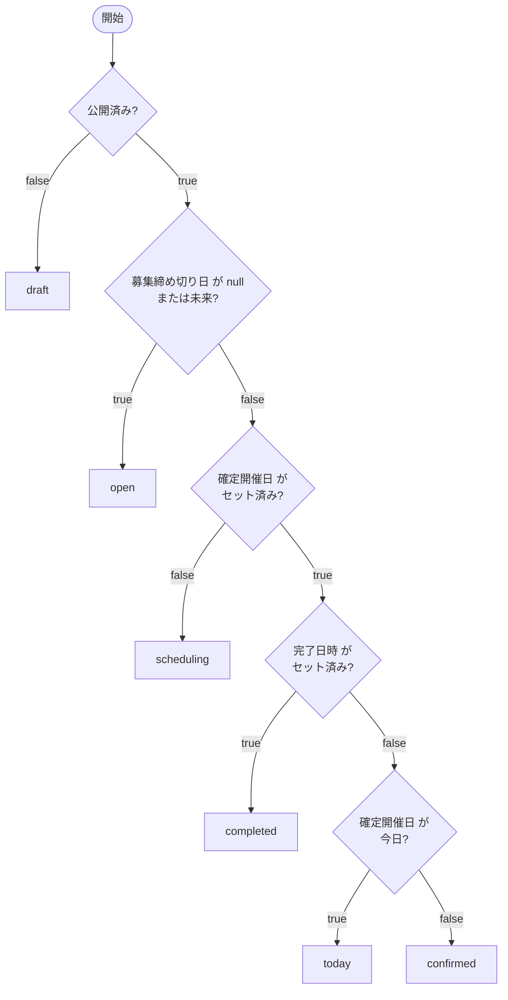

# ゲームセッション ステータス設計

ステータスは DB に保持せず、`getGameSessionStatus`（`packages/backend/src/game-session/domain/game-session-status.ts`）が毎回フィールドから導出する。

## 導出に使うフィールド

| 論理名 | 物理名 | 型 | 説明 |
|---|---|---|---|
| 公開済みフラグ | `is_published` | boolean | 公開済みかどうか |
| 募集締め切り日 | `open_until` | Date \| null | 募集締め切り日。null = 締め切りなし |
| 確定開催日 | `scheduled_at` | Date \| null | 確定した開催日。null = 未確定 |
| 完了日時 | `completed_at` | Date \| null | 完了日時。null = 未完了 |

## 導出フローチャート

## ステータス一覧

| ステータス | 意味 | 遷移条件 |
|---|---|---|
| `draft` | 下書き | 公開済みフラグ = false |
| `open` | 募集中 | 公開済み かつ 募集締め切り日 が null または未来 |
| `scheduling` | 日程調整中 | 公開済み かつ 募集締め切り日 が過去 かつ 確定開催日 が未設定 |
| `confirmed` | 開催確定 | 公開済み かつ 募集締め切り日 が過去 かつ 確定開催日 が未来 |
| `today` | 開催日当日 | 公開済み かつ 募集締め切り日 が過去 かつ 確定開催日 が今日 |
| `completed` | 完了 | 公開済み かつ 募集締め切り日 が過去 かつ 確定開催日 が設定済み かつ 完了日時 がセット済み |

## 設計上の注意点

- **`open` は 確定開催日 より優先される。** 募集締め切り日 が未来または null の間は、たとえ 確定開催日 が設定済みでも `open` を返す。開催日を直接指定して作成したセッションが公開直後に `confirmed` になるのを防ぐため。
- **ステータスは保存しない。** 常に上記フィールドから導出する。ステータスを直接更新する API は存在しない（`PATCH /api/game-sessions/:id/status` はフィールドを更新した結果としてステータスが変わる）。
- **募集締め切り日 が null = 締め切りなし = 募集中。** 候補日方式でも開催日直接指定方式でも、公開後は必ず `open` から始まる。
